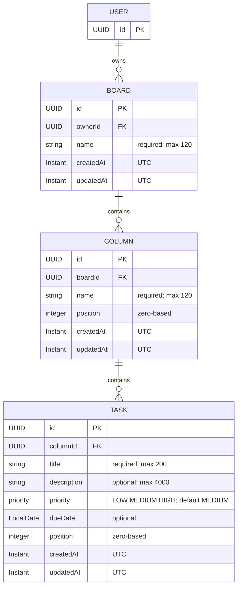

# TaskFlow Architecture

## Overview

TaskFlow is a full-stack application organized as a single repository. It separates the backend, frontend, infrastructure, and project documentation so each concern can evolve independently while remaining coordinated.

## Components and responsibilities

### Backend

The `backend/` directory contains the Java 21 and Spring Boot application. It is responsible for server-side business behavior, API delivery, data access, and integration with the PostgreSQL database.

#### Package conventions

- Backend code is organized primarily by feature. Each feature package owns its entity, repository, service, controller, DTOs, and mappers as needed.
- Controllers handle HTTP/API concerns and request validation. Services contain use cases and business orchestration. Repositories handle persistence access only. Entities represent persisted state, DTOs represent API contracts, and mappers translate between them.
- Feature packages are introduced only when their corresponding feature is implemented. Do not create empty feature packages or generic global `controller`, `service`, `repository`, `entity`, `dto`, or `mapper` packages.
- `shared` is reserved exclusively for genuinely cross-feature technical concerns. `shared.persistence` contains the persistence foundation; `shared.config`, `shared.error`, and `shared.web` are reserved for cross-cutting configuration, error handling, and HTTP/API behavior respectively.

#### Validation conventions

- TaskFlow uses Jakarta Bean Validation for HTTP request validation. Feature request DTOs own structural input constraints such as `@NotBlank`, `@Size`, and `@Pattern`; controllers invoke validation at the HTTP boundary with `@Valid`.
- Services enforce business rules, including uniqueness, existence, authorization, state transitions, and cross-record rules. Custom validators are introduced only when a concrete feature requires one.
- Validation failures return HTTP 400 Bad Request. The API error contract is client-safe and supports field-level errors where applicable.
- API errors include an HTTP status, stable error code, concise summary/message, request path, and applicable structured violations. They never expose stack traces, exception class names, SQL/database details, internal implementation details, or submitted sensitive values.
- Centralized exception translation is provided by `@RestControllerAdvice` in `shared.error`. It maps validation and bad-request failures to 400, missing resources to 404, conflicts to 409, and unexpected exceptions to 500.

#### Testing conventions

- Tests mirror the corresponding production package structure under `backend/src/test/java`. For example, tests for `com.taskflow.shared.error` belong in `com.taskflow.shared.error`.
- Unit tests verify isolated logic without loading the Spring application context. MVC tests use Spring MVC test support for HTTP behavior, controller boundaries, validation, exception handling, and JSON/API contracts. Integration or context tests load Spring only when application wiring or component integration requires it.
- Test classes use the `FooTest` name when their type is clear from context. Suffixes such as `FooMvcTest` and `FooIntegrationTest` are used only when they add useful clarity.
- Tests verify observable behavior and contracts rather than incidental implementation details. They must remain deterministic, isolated, and repeatable.
- `BackendApplicationTests` verifies application wiring and the Actuator health contract with the database-free `test` profile. This suite does not verify a live PostgreSQL connection, Flyway execution, or persistence round trips. Run the backend suite with `cd backend && ./mvnw test`.

The backend is a feature-oriented modular monolith. Each future feature is organized under `com.taskflow.<feature>` and may contain `api`, `application`, `domain`, and `persistence` packages. Public HTTP DTOs live in `<feature>.api.dto`; JPA entities are persistence details and must not be exposed by controllers.

Cross-cutting conventions live in `com.taskflow.shared`:

- `shared.web` defines reusable HTTP API conventions, including the `/api` endpoint prefix.
- `shared.error` provides RFC 9457 Problem Detail responses, including structured validation violations and stable application error codes.
- Mappers belong to their feature. MapStruct and shared mapper configuration are deferred until a concrete feature requires them.
- `shared.config` is reserved for narrowly scoped Spring configuration shared by more than one feature.

Future REST controllers use plural resources below `/api`, return resource DTOs directly for successful single-resource responses, and rely on standard HTTP status codes: `200 OK` for successful reads and updates, `201 Created` for creations, and `204 No Content` for successful deletions. Errors are returned as `application/problem+json`; validation and malformed requests use `400 Bad Request`, missing resources use `404 Not Found`, conflicts use `409 Conflict`, and unexpected failures use `500 Internal Server Error`. Problem responses expose `type`, `title`, `status`, `detail`, `instance`, and a stable application `code`. Validation failures additionally expose a `violations` array with `field`, `message`, and `code` values. Expected API failures use `ApiException` with a client-safe message and stable code; validation messages must never interpolate sensitive submitted values. Controllers must use `@Valid` for request-body validation; application services enforce business rules and own transaction boundaries. Spring Boot Actuator exposes health at `/actuator/health` only.

### Frontend

The `frontend/` directory contains the Angular application. It is responsible for the user-facing experience and communication with the backend through its exposed API.

#### Organization and boundaries

The frontend is organized primarily by feature area. Standalone Angular APIs remain the project standard.

The conceptual structure under `frontend/` is:

```text
src/app/
├── core/
├── shared/
├── features/
├── app.config.ts
├── app.routes.ts
├── app.ts
├── app.html
├── app.scss
└── app.spec.ts
```

The `app.*` component files remain at the application root. The `core/`, `shared/`, and `features/` directories are introduced only when real implementation requires them. Do not create empty directories or use `.gitkeep` files just to materialize this structure.

- `core/` contains application-wide technical infrastructure and cross-cutting concerns. Future examples include authentication/session infrastructure, route guards, HTTP interceptors, application configuration adapters, and global error handling. It must not become a generic dumping ground for services or contain feature-specific business behavior.
- `shared/` contains genuinely reusable, domain-agnostic building blocks, such as UI primitives, directives, pipes, pure helpers, or validators needed by more than one feature. It must not contain feature-specific business logic, feature-owned API clients, or application-wide mutable state. Introduce shared abstractions only after concrete reuse exists.
- `features/` contains business capabilities, such as future `auth` and `boards` features. Each feature owns its UI, route configuration, data access/API clients, models/contracts, and feature state. Authentication UI and use cases belong to the `auth` feature; application-wide authentication/session infrastructure belongs to `core/`.

Within a feature, organize code by cohesive sub-feature or use case rather than global technical type. Avoid generic top-level `components/`, `services/`, `models/`, `directives/`, or `pipes/` directories. Keep related component TypeScript, template, SCSS, and spec files together where practical; tests live next to the code under test.

#### Dependency direction

- Features may depend on `core` and `shared`.
- `core` may depend on `shared`, but must not depend on features.
- `shared` must not depend on `core` or features.
- Avoid direct feature-to-feature dependencies. Extract a genuinely shared contract only when required, while respecting the domain-agnostic boundary of `shared/`.

#### Data access and routing ownership

Application-wide HttpClient configuration belongs in root `app.config.ts`, using `provideHttpClient()` as the explicit configuration point for HTTP features. Future application-wide HTTP middleware belongs to `core/http/`; introduce that directory only when real implementation requires it. Interceptors use Angular functional interceptors (`HttpInterceptorFn`) and are introduced only for concrete cross-cutting behavior, never as no-op or pass-through placeholders.

Feature-specific API clients and data-access code remain owned by their feature. Do not create a generic global services directory or generic HTTP wrappers such as `ApiService`, `BaseHttpService`, or `HttpService`.

Root `app.routes.ts` composes top-level application routes. Each feature should own its route configuration when implemented, and future business features should be lazy-loaded where appropriate. These are ownership conventions only: routing implementation belongs to MS3.3 and is not introduced in MS3.2.

#### Environment configuration

Build-specific configuration belongs to `frontend/src/environments/`, using Angular CLI file replacements. `environment.ts` supplies production/default values; the development build replaces it with `environment.development.ts`. These files are client-visible configuration bundled into the application and must never contain secrets, credentials, passwords, or private keys.

Root `app.config.ts` adapts environment values into DI tokens. Feature code does not import environment files directly: future API clients inject `API_BASE_URL`, defined in `core/config/api-base-url.ts`. Both current environments use the relative `/api` base path. A generic configuration service or runtime configuration fetch is not needed for this single value.

The Angular development serve configuration references `frontend/proxy.conf.json`, which forwards `/api/**` to `http://localhost:8080` without rewriting the path. This preserves same-origin frontend requests without development-only backend CORS changes. The proxy target is development tooling configuration only; production hosting must route `/api` to the backend on the frontend's origin.

#### Naming and style

- Use kebab-case filenames with one primary concept per file, retaining role suffixes such as `.routes.ts` and `.spec.ts` where appropriate.
- Colocate `.spec.ts` tests with their source.
- Use names that describe the specific responsibility; avoid vague filenames such as `helpers.ts`, `utils.ts`, or `common.ts`.
- Prefer Angular `inject()` for dependency injection in new code.

#### UI ownership

Global `src/styles.scss` contains application-wide visual and reset foundations only. The root app component owns the minimal application shell: a skip link, application header, and main content landmark containing `RouterOutlet`. Root component styles own shell layout; feature-specific UI and styling stay with their feature.

#### Forms conventions

New TaskFlow forms use Angular Signal Forms from `@angular/forms/signals`. Use a typed `signal()` model, `form()` to create the form field tree, `FormField` to bind controls, and schema-based validation. Use `FormRoot` and Signal Forms submission APIs such as `submit()` where appropriate for the use case.

- Business forms belong to their feature/use case. Keep form models, validation rules, submission behavior, and form-specific UI with that feature, colocating strongly related files. Extract a separate model or schema file only when complexity justifies it.
- Structural client-side validation belongs with the feature form. Prefer Signal Forms validation/schema APIs and clear, user-safe validation messages. Introduce shared validators only after genuine cross-feature reuse exists. Server-side business validation remains authoritative and must also be handled when APIs are implemented.
- Use semantic native form controls whenever practical. Every control has an accessible label; associate validation messages programmatically with the relevant control where applicable. Do not convey invalid state through color alone. Surface errors at useful interaction points, such as touched or submitted state, rather than overwhelming users immediately. Submission must not rely solely on disabled buttons to communicate invalid state.
- Keep form state local to the owning feature unless a concrete requirement proves otherwise; never place mutable form state in `shared/`. When APIs are implemented, the owning feature maps server validation failures to appropriate field or general form errors, rather than delegating this to a generic global form service.
- Classic Reactive Forms are acceptable only when a concrete integration or compatibility requirement justifies them; they are not the default for new forms. Do not mix form paradigms within one form without a concrete reason. Template-driven forms are not a project convention.

Introduce form implementation only for a real use case. Do not create demo forms, fake login/registration forms, a speculative `FormErrorComponent`, generic form services, shared validators, form state stores, `FormBuilder` abstractions, wrapper libraries, or `shared/forms/` placeholders merely to establish the foundation.

#### Frontend testing conventions

Vitest, through the Angular CLI, remains the frontend test runner. Run `npm test` during development and `npm run test:ci` for a single non-watch run from `frontend/`.

- **Location and naming:** Use `.spec.ts` files colocated with the production code they verify. Test organization follows the same feature-oriented structure as source code.
- **Pure unit tests:** Test pure TypeScript logic without `TestBed` when Angular DI, templates, or framework behavior are not required. Do not load Angular infrastructure unnecessarily.
- **Components:** Use Angular `TestBed` when rendering or DI is part of the behavior. Prefer semantic DOM assertions that verify observable behavior and user-facing contracts, not private fields, incidental implementation details, or exact CSS structure.
- **Routing:** Use real Angular route configuration with `RouterTestingHarness` where appropriate. Verify resulting URLs, rendered components, and application behavior. Do not mock Angular Router merely to avoid navigation.
- **Services and dependencies:** Test isolated business/application logic with simple fakes or stubs when dependencies are needed. Use Vitest spies/mocks for interactions only when the interaction itself is part of the contract; avoid excessive mocking that mirrors implementation internals.
- **HTTP clients:** Future feature API client unit/integration tests must not hit a real network. Use `provideHttpClientTesting()` and `HttpTestingController` to assert request method, URL, relevant body/headers, response mapping, and expected failure behavior. Call `HttpTestingController.verify()` after each test to detect unexpected outstanding requests. When a test needs `provideHttpClient(...)` features such as interceptors, register those providers before `provideHttpClientTesting()` so the testing backend takes precedence.
- **Determinism:** Tests must be isolated, repeatable, and deterministic. Do not depend on real network services, machine-specific data, current wall-clock time, uncontrolled random values, or execution order. Control asynchronous behavior explicitly.
- **Scope and coverage:** Test public/observable contracts and meaningful edge cases, not solely line coverage. Do not set an arbitrary coverage percentage at the foundation stage; add a coverage policy when sufficient application code exists.
- **Test levels and infrastructure:** Unit, component, and integration-style Angular tests belong in the frontend unit suite. Defer end-to-end testing until real user workflows exist. Add custom test configuration, global setup, utilities, or additional testing dependencies only for a concrete requirement; do not create fake application functionality solely to establish testing infrastructure.

#### State management

Prefer Angular-native and local state mechanisms, such as signals, when appropriate. Feature state belongs to its feature; `shared/` does not own application-wide mutable state. Do not introduce NgRx or another state-management framework at the foundation stage. Add a dedicated state-management library only when concrete application complexity justifies it.

### Database

PostgreSQL is the application's persistent data store. Its use, local configuration, and related operational assets are kept separate from application source code.

#### Persistence conventions

- Persistent entities extend `BaseEntity` (`com.taskflow.shared.persistence`), which provides an application-generated random UUID primary key and `createdAt` / `updatedAt` audit fields.
- Audit values use `Instant`; the application clock, JSON configuration, and Hibernate JDBC timezone are all UTC. Database timestamp columns must use `TIMESTAMP WITH TIME ZONE` (`timestamptz`). MS4.4 moves the single UTC `Clock` bean to `shared.config.TimeConfiguration`, independent of persistence auditing; auditing and JWT infrastructure consume that same clock.
- JPA auditing is enabled by default. The database-free `test` profile disables it because that profile intentionally has no JPA metamodel.
- Hibernate validates mappings and never creates or updates the schema. Schema changes are introduced only through Flyway migrations in `backend/src/main/resources/db/migration`.
- Migration files use Flyway's versioned format: `V<version>__<description>.sql` (for example, `V1__create_users.sql`). Versions are ordered numerically; descriptions use lowercase words separated by underscores. Existing migrations are immutable.
- Flyway validates migration file names and has cleaning disabled in every application environment.

### Infrastructure

The `infra/` directory contains infrastructure definitions. Docker assets support local containerized development and execution. Directories for Terraform and CloudFormation are reserved for infrastructure definitions when those tools are adopted.

## Authentication architecture (MS4)

This section records the design established in MS4.1 and implemented in MS4.2–MS4.9, with final verification in MS4.10. The existing MS1–MS3 conventions above remain authoritative.

### Backend authentication and security boundaries

Authentication is server-authoritative. The backend authenticates requests and enforces authorization; frontend route guards are UX controls only and never replace either responsibility.

MS4.3 introduces an explicit Spring Security filter chain in `shared.security`: `/api/**` requires authentication, `GET /actuator/health` remains public, and other requests retain existing routing behavior. Form login, HTTP Basic, default logout, and saved-request caching are disabled. Authentication is stateless; generated-user auto-configuration is excluded, with no placeholder authentication provider or login session. MS4.4 enables native OAuth2 Resource Server Bearer JWT authentication. Missing, malformed, expired, or otherwise invalid access tokens receive the same safe `401` ProblemDetail and `WWW-Authenticate: Bearer`, without parser diagnostics or credential material.

MS4.5 uses Spring Security 6.5's SPA CSRF pattern: `CookieCsrfTokenRepository.withHttpOnlyFalse()` writes `XSRF-TOKEN`, and Angular supplies its raw value in `X-XSRF-TOKEN`. The request handler retains XOR/BREACH protection for request attributes and form parameters, resolves the SPA header through the plain handler, and loads deferred tokens to issue cookies. `GET /api/auth/csrf` is public and returns `204 No Content` without a custom token body. The XSRF cookie is JavaScript-readable, `Path=/`, `SameSite=Strict`, and has no Domain. Central `taskflow.security.cookies.secure` defaults to `true`; `TASKFLOW_COOKIE_SECURE=false` explicitly permits local HTTP development, and the test profile sets false.

CSRF remains required for unsafe methods, including public register/login and Bearer-authenticated requests. Missing/invalid CSRF produces safe `403 ACCESS_DENIED`. The small `CsrfFilter` matcher post-processor remains necessary to override Resource Server's automatic Bearer exemption; configuring the SPA cookie alone does not remove that exemption. It changes neither the repository nor the documented SPA token protocol. Successful controller-based register/login deliberately generates and saves a fresh CSRF cookie through the configured repository, because those flows bypass filter-based `CsrfAuthenticationStrategy`. The browser can immediately use the fresh cookie/header pair without reloading. No login or CSRF HttpSession is created.

TaskFlow uses short-lived signed JWT access tokens and longer-lived opaque refresh tokens:

- **Access tokens:** approximately 15 minutes of validity, returned after successful registration, login, and refresh. Angular holds the access token only in application memory and sends it to protected APIs as `Authorization: Bearer <token>`. Never persist it in `localStorage`, `sessionStorage`, or a JavaScript-readable persistent cookie.
- **JWT claims:** issued claims are `iss=taskflow`, `sub` as the stable TaskFlow user UUID string, `aud` containing `taskflow-api`, `iat`, `exp` exactly 15 minutes after issuance by default, and a new UUID `jti` per token. Timestamps use whole UTC seconds. JWT payloads are signed, not encrypted; no email, password/hash, refresh token, profile, or role/authority claims are issued. `AccessTokenService` accepts only the user UUID and returns an immutable token value plus `expiresAt`, without persistence dependencies.
- **JWT infrastructure:** use Spring Security OAuth2 Resource Server/JWT support and Spring Security `JwtEncoder` / `JwtDecoder`, with no custom JWT authentication filter or parser. MS4.4 uses HS256 because one backend trust boundary both issues and validates tokens. Spring Security 6.5's `NimbusJwtEncoder` is constructed with an `ImmutableSecret` JWK source; `NimbusJwtDecoder` is explicitly restricted to HS256. Both consume the same validated 32-byte HMAC key.
- **JWT configuration:** immutable `JwtProperties` under `shared.security.jwt` binds `taskflow.security.jwt` (`secret-base64`, `issuer`, `audience`, `access-token-ttl`), with defaults `taskflow`, `taskflow-api`, and `15m` for non-secret settings. Supply exactly 32 cryptographically random bytes as Base64 through `TASKFLOW_JWT_SECRET_BASE64`. Missing/blank, malformed Base64, or incorrect decoded length fails startup with safe messages. There is no usable production default or startup key generation. Signing material must never be logged or sent to Angular; only `application-test.yml` contains an explicit deterministic test-only key.
- **JWT validation:** verify the HS256 signature, require expiration, and apply Spring Security timestamp and issuer validators plus a dedicated audience validator. Timestamp validation uses the shared clock and Spring Security's default 60-second clock-skew tolerance for expiration and not-before checks. Invalid issuer, absent/wrong audience, expired tokens beyond that tolerance, and modified signatures are rejected. No application roles or authority claims are introduced; MS4.7 maps the validated UUID subject to a typed application identity.
- **Key rotation:** symmetric-key rotation and multi-key support are deferred. Changing the current signing secret may invalidate outstanding short-lived access tokens unless a future key-ring strategy is introduced.
- **Refresh tokens:** MS4.5 issues opaque values from 32 `SecureRandom` bytes (256 bits), encoded as URL-safe Base64 without padding. Only SHA-256 of the raw value, represented as 64 lowercase hex characters, is persisted. `auth.persistence` owns `refresh_tokens` (Flyway V2), with user UUID foreign key, unique token hash, expiry, nullable revocation timestamp, and inherited UUID/audit fields. The user foreign key cascades deletion; no database-generated UUID or timestamp defaults are used. TTL defaults to 30 days through `taskflow.security.refresh.ttl`; expiry uses the shared UTC clock. Raw refresh tokens are never logged, persisted, or returned in JSON.
- **Refresh cookie:** successful register/login/refresh sets `TASKFLOW_REFRESH` with `HttpOnly=true`, `SameSite=Strict`, `Path=/api/auth`, no Domain, and Max-Age matching the refresh TTL. `Secure` uses the same centralized production-safe cookie setting as XSRF. JavaScript must never read refresh tokens. The focused `RefreshCookie` component constructs both replacement and clearing cookies with identical scope/security attributes; clearing uses an empty value and `Max-Age=0`.
- **Rotation and revocation:** rotate refresh tokens on use. Successful rotation invalidates the previous token; validation and replacement must preserve this rule under concurrent requests. Logout revokes the applicable refresh token and clears its cookie.

Normal protected API mutations authenticate through the Authorization bearer header, so their backend authorization remains independent of browser cookies. Refresh/logout endpoints use browser-supplied cookies and remain CSRF protected. Neither frontend guards nor cookie attributes replace CSRF enforcement. Preserve the existing same-origin `/api` deployment and development-proxy conventions.

Logout also clears the frontend's in-memory session. With access-token deny lists deferred, revoking a refresh token does not revoke an already issued access JWT: it can remain valid until its short expiry. This is a deliberate boundary of the initial model.

### User identity and credentials

The initial user contains only the UUID primary key inherited from `BaseEntity`, email, password hash, and inherited audit timestamps. Do not add profile fields, roles, permissions, MFA fields, or preferences without a concrete requirement. Existing persistence, auditing, and Flyway conventions apply when user persistence is implemented.

Email normalization is consistent before persistence and authentication: trim and lowercase using locale-independent behavior (for example, Java `Locale.ROOT`). Persisted normalized email is unique, and all authentication lookups use the same normalization. MS4.2 establishes a maximum email length of 254 characters, reflected in the JPA mapping and Flyway schema; future API validation must enforce the same limit.

Passwords:

- Never persist or log plaintext passwords.
- MS4.3 uses Argon2id for new password hashes through Spring Security `DelegatingPasswordEncoder`, with encoding id `argon2id` (stored prefix `{argon2id}`). Parameters are salt length 16 bytes, hash length 32 bytes, parallelism 1, memory 19456 KiB (19 MiB), and iterations 2. Algorithm prefixes preserve future migration options; unknown or missing ids fail without a plaintext/noop fallback. This supersedes the preliminary `PasswordEncoderFactories.createDelegatingPasswordEncoder()` preference: its bcrypt default has a practical 72-byte input limit incompatible with TaskFlow's 128-character policy. Bouncy Castle supplies the Argon2 implementation.
- Registration accepts 15–128 characters without arbitrary uppercase/lowercase/number/symbol composition requirements. Login requires a nonempty password of at most 128 characters, without imposing registration's minimum.
- Never silently trim or alter password contents. Implementation review must verify that the selected encoder supports the full accepted password range without silent truncation or alteration.
- Validation errors must never echo submitted password values.

### Authentication API contract

MS4.5 implements public `GET /api/auth/csrf`, `POST /api/auth/register`, and `POST /api/auth/login`. MS4.6 adds only `POST /api/auth/refresh` and `POST /api/auth/logout` to the explicit authorization-layer permit list. All public POSTs remain CSRF protected; missing or invalid XSRF cookie/header pairs receive `403 ACCESS_DENIED` before the application operation executes. Refresh/logout work without an access JWT, including after its expiry: clients omit stale Bearer headers because explicitly supplied invalid Bearer credentials still fail Resource Server authentication. All other `/api/**` routes retain Bearer authentication. `GET /api/auth/me` is implemented in MS4.7 and remains Bearer protected; refresh/logout have no GET handlers.

Credential authentication belongs to `auth.security`: a repository-backed `UserDetailsService` normalizes email and creates a separate `TaskFlowUserPrincipal`, never returning `UserEntity` as `UserDetails`. Its durable identity is the user UUID, its authorities are empty, and credentials are erased after authentication. A standard `DaoAuthenticationProvider` with the existing Argon2id encoder is used through `AuthenticationManager`; login does not manually verify passwords or create a login session.

Registration validates email (maximum 254) and unchanged password contents (15–128), normalizes email, encodes the password outside the write transaction, then persists the user and initial refresh session in one transaction. The database `uk_users_email` constraint remains authoritative: `saveAndFlush` surfaces concurrent duplicates, and only that named constraint violation maps to `409 EMAIL_ALREADY_REGISTERED`. Other persistence failures remain safe server failures. Login verifies credentials before its write transaction, issues an access token for the principal UUID, and persists a new refresh session. If a presented browser refresh cookie identifies a stored session, that session is revoked in the same transaction; an unknown cookie does not block valid login. Each newly established session receives an independent random family UUID, including separate logins for the same user.

Successful register (`201`), login (`200`), and refresh (`200`) return `{ user: { id, email }, accessToken, accessTokenExpiresAt }`, with ISO-8601 expiry and no invented Location header. Refresh values are set only in cookies at the API boundary. Unknown email and wrong password share `401 INVALID_CREDENTIALS`, title `Authentication failed`, and detail `Invalid email or password.` Only bad-credential outcomes receive that mapping; infrastructure/internal authentication failures use the safe `500` contract. Database-free Spring tests supply test-only repository and transaction-manager mocks; real database transaction, migration, and constraint verification remains deferred.

MS4.6 makes refresh tokens single-use. A write transaction locks the family root first, then consumes the presented row through `findByTokenHashForUpdate` with `PESSIMISTIC_WRITE`. The root is the retained token with no incoming replacement link; its lock serializes ancestor replay against descendant rotation as well as concurrent use of the same token. The family lookup projects only the UUID so it cannot cache stale token state before locking. All session mutations follow this lock order. Rotation reads the current user by durable UUID, persists a fresh token hash with the same family and expiry of shared-clock now plus configured TTL, and marks the old row revoked with its replacement UUID. The old hash and history remain stored. A new access JWT and safe current-user response reach the controller only after the transaction commits.

A revoked token with a replacement link is replay evidence, even if it has since expired. Replay revokes every still-active token in that family, preserving earlier revocation timestamps and independent families for the same user. Invalid outcomes return normally from the transaction so family revocation commits before the HTTP error is constructed. Missing, malformed, unknown, expired, manually revoked, replayed, and missing-user sessions all return the same `401 SESSION_INVALID`, title `Session unavailable`, and detail `Your session is no longer valid. Please sign in again.`, and clear the refresh cookie. Infrastructure failures remain safe `500 INTERNAL_ERROR`; failed persistence/commit cannot release a successful response or replacement cookie.

Logout is an idempotent `204 No Content` operation: it locks and revokes the presented token if available, clears the refresh cookie, and exposes no session state. Missing, malformed, unknown, expired, or already revoked tokens also succeed. Normal logout does not invoke replay family revocation or revoke other browser sessions. It does not invalidate an existing access JWT, which may remain usable until its approximately 15-minute expiry; no JWT blacklist or access-token persistence is introduced. The custom controller removes CSRF state through the configured `CsrfTokenRepository` and then issues a fresh anonymous `XSRF-TOKEN` cookie for immediate subsequent login without a page reload or custom CSRF JSON.

Flyway V3 adds `family_id` nullable, backfills existing rows with their own IDs, then enforces NOT NULL. It adds nullable `replaced_by_token_id` with self-referencing `fk_refresh_tokens_replaced_by` and `idx_refresh_tokens_family_id`. V1/V2/V3 remain immutable. Database-free tests cover lifecycle behavior, mocked transaction outcomes, lock metadata, and HTTP cookie/header contracts through MockMvc. They do not prove browser cookie semantics, PostgreSQL migration execution, or simultaneous transaction/row-lock behavior.

The following action-oriented authentication endpoints are an explicit exception to the general plural-resource naming convention. They retain the `/api` prefix, DTO boundaries, validation conventions, and existing error contract. Authenticated-user DTOs expose only safe current-user fields; never serialize persistence entities or password hashes.

| Endpoint | Contract |
| --- | --- |
| `POST /api/auth/register` | Validate email/password, create the user, and automatically establish authentication. Return the authenticated user plus an access token and set the refresh-token HttpOnly cookie. Duplicate normalized email returns `409 Conflict` through the existing API error contract. |
| `POST /api/auth/login` | Authenticate normalized email/password, return the authenticated user plus an access token, and set/rotate the refresh cookie as appropriate. An unknown email and an incorrect password produce the same generic `401 Unauthorized` response; never identify which credential was wrong. |
| `POST /api/auth/refresh` | Read the HttpOnly refresh cookie and validate its stored hash, expiry, and revocation state. Rotate the refresh token, return a new access token and authenticated-user/session information as appropriate, and set the replacement cookie. Missing, invalid, expired, or revoked tokens produce a safe `401 Unauthorized` authentication failure. POST only. |
| `POST /api/auth/logout` | Revoke the presented refresh token when available and clear its cookie. Safe and idempotent from the client's perspective, including when no usable refresh token remains. Successful logout returns `204 No Content`. POST only. |
| `GET /api/auth/me` | Require a valid bearer access token and return the authenticated user's safe public/current-user representation. Never return password hashes or token material. |

Registration and login do not require an existing access token. Refresh and logout use the refresh-cookie contract rather than requiring a still-valid access JWT. These endpoints remain CSRF protected. Malformed credential request bodies remain validation failures; unusable refresh-cookie values use `SESSION_INVALID`, and the generic login `401` applies to credential authentication failures.

### Authenticated application identity (MS4.7)

The validated JWT `sub` is the durable TaskFlow user UUID. The decoder requires a nonblank subject in full UUID syntax, in addition to the existing signature, timestamp, issuer, and audience checks. Missing, blank, malformed, or shortened UUID subjects fail at the Resource Server boundary with the existing safe `401 AUTHENTICATION_REQUIRED` response; subject values and parser details are never exposed.

`shared.security.AuthenticatedUser` is an immutable UUID-only identity, exposed through `AuthenticatedUserProvider.currentUser()`. Its Spring Security adapter reads the already-authenticated `JwtAuthenticationToken` subject, without decoding the header, revalidating the JWT, querying persistence, trusting email claims, or making ownership decisions. Spring Security authentication objects and context access remain infrastructure concerns; current-user and future business application/domain code consume the typed identity or its UUID.

`CurrentUserService` resolves that UUID through `UserRepository` and returns the safe `CurrentUser(id, email)` application result. The API maps it to `CurrentUserResponse`, a standalone safe DTO also reused by authentication responses. `GET /api/auth/me` returns this representation with `200 OK`, requires a valid Bearer JWT, and needs neither a refresh cookie nor a CSRF header under normal GET semantics. A valid JWT whose persistence user is missing returns `401 SESSION_INVALID`, title `Session unavailable`, and detail `Your session is no longer valid. Please sign in again.`; unexpected persistence failures retain `500 INTERNAL_ERROR`. No password hash, token, refresh state, or audit fields are returned.

The authenticated UUID abstraction is the foundation for future Board/Task ownership checks. No ownership policies, application roles/authorities, method security, user-management API, or frontend authentication are introduced in MS4.7.

### Authentication error contract

Authentication and security failures remain compatible with TaskFlow's RFC 9457 `ProblemDetail` contract: `application/problem+json` with `type`, `title`, `status`, `detail`, `instance`, and a stable application `code`, plus safe structured violations where applicable. MS4.3 security authentication/denial handling preserves this contract for filter-chain failures through a custom authentication entry point (`AUTHENTICATION_REQUIRED`, 401) and access denied handler (`ACCESS_DENIED`, 403). Both use the same shared ProblemDetail construction as controller advice and serialize with the application-configured Jackson `ObjectMapper`, without exposing exception details.

| Status | Meaning |
| --- | --- |
| `400 Bad Request` | Malformed request or validation failure. |
| `401 Unauthorized` | Authentication required, invalid credentials, or missing/invalid/expired/revoked authentication token as applicable. |
| `403 Forbidden` | Access denied or missing/invalid CSRF, including on public unsafe endpoints. |
| `409 Conflict` | Registration conflicts with an existing normalized email. |
| `500 Internal Server Error` | Unexpected server failure with a safe public response. |

In particular, `401` and `403` responses must not leak stack traces, token parsing details, internal security classes, password hashes, signing information, or sensitive credential values. Invalid email and invalid password authentication failures share the same safe login response. The approved registration `409` does disclose an email conflict; generic login errors reduce enumeration through login but do not remove that registration disclosure.

### Angular authentication and session architecture

MS4.8 implements authentication contracts, the focused `AuthApi` client, and signal-based `AuthSessionService` under `frontend/src/app/features/auth/`. The client uses injected `API_BASE_URL` and the six backend auth operations, including bodyless CSRF/logout responses. It does not handle cookies or Authorization headers itself. No dependencies or JWT decoding library are needed; user and expiry come from backend responses.

Session state distinguishes `initializing`, `authenticated`, and `anonymous`. Authenticated state contains safe user data, access JWT, and expiry; anonymous state contains none of them. Signals are privately writable and expose readonly/computed views. Access JWTs exist in memory only; reload intentionally discards them. JavaScript never reads or deletes the server-owned HttpOnly refresh cookie.

Root `provideAppInitializer` composes session restoration once: GET `/api/auth/csrf` must complete before POST `/api/auth/refresh`. Success uses the returned user/token/expiry without calling `/me`. Expected `401 SESSION_INVALID` completes startup anonymously. Network/infrastructure failures also finish anonymously but set a safe `initializationUnavailable` flag; each bootstrap HTTP phase has a ten-second timeout, and bootstrap does not loop. This flag records startup failure, not a confirmed absence of server refresh state.

Root `provideHttpClient` explicitly configures Angular's built-in XSRF support with `XSRF-TOKEN` / `X-XSRF-TOKEN` and the functional auth interceptor. No custom cookie reading, XSRF token state, or global `withCredentials` is introduced. The same-origin `/api` deployment/proxy convention is unchanged.

The interceptor in `core/http` depends only on the narrow `AuthSessionBridge` contract. Root configuration binds its injection token to the feature implementation with `useExisting`; core never imports the auth feature. Bearer is attached only to the exact relative API base or its slash-delimited descendants. Absolute/external URLs, assets, and unrelated namespaces receive no TaskFlow Bearer. GET `/auth/csrf` and POST `/auth/register`, `/auth/login`, `/auth/refresh`, and `/auth/logout` are explicitly excluded by method/path; GET `/auth/me` receives Bearer.

A protected request that carried an access token and receives 401 can refresh and retry once. Concurrent failures share one in-flight refresh observable, cleared on completion/error; late failures from an older access token reuse an already-renewed token. Anonymous, lifecycle, external, and non-401 requests never start automatic recovery. The retry re-enters HttpClient with a copied request-local retry marker, so both Bearer attachment and Angular's built-in XSRF stage run again. Since backend refresh renews the XSRF cookie, the previous XSRF header is removed from the retry; Angular alone supplies its fresh value. Retry 401s propagate without another refresh loop.

Refresh success replaces memory state; structured `401 SESSION_INVALID` clears it and fails waiting callers. Infrastructure refresh failures propagate while preserving existing local state. Login/register success replaces state and failures remain observable for future forms. Logout clears state only after server success; failure preserves it and propagates, never claiming confirmed server revocation. A refresh started before a completed login/register/logout cannot overwrite the newer local session state. Cross-tab coordination is not introduced; the single-flight coordinator is scoped to the running application instance.

### Authentication UI and routing (MS4.9)

The auth feature owns `/login` and `/register`, with lazy standalone pages and useful page titles. Root routing composes these routes and retains the final wildcard Not Found route. Authenticated users visiting either anonymous-only auth page are redirected to `/`. MS5.5 replaces the previously empty authenticated root with a declarative redirect to the guarded `/boards` business landing; see the Board frontend section below.

Core functional guards depend only on the readonly `AuthStateReader` token (`status` and `isAuthenticated`). Root configuration binds it to `AuthSessionService` with `useExisting`, independently of the HTTP bridge. The routing contract exposes neither tokens nor mutation operations, and core does not import feature implementation. The existing application initializer completes CSRF → refresh before normal initial navigation. Guards never bootstrap, refresh, fetch a user, or make network requests; unexpected `initializing` state cancels navigation deterministically. Redirects return `UrlTree` values rather than navigating imperatively. Guards are navigation UX only: Spring Security remains authoritative, and future ownership rules must be enforced by the backend.

Anonymous protected navigation preserves the requested URL in the login `returnUrl` query parameter. Login validates that untrusted value as an application-local absolute path before navigation, falling back to `/` for missing, external, protocol-relative, malformed escape, backslash, or control/whitespace targets (including encoded separators). Local query strings and fragments are preserved.

Login and registration use typed signal models, Signal Forms schema validation, `FormField`, and `submit()` for touched/validation/submitting behavior. Both require an email of at most 254 characters and a password of at most 128 characters; only registration requires at least 15 characters. Credentials pass unchanged to the session use cases, without normalization, confirmation fields, extra login, refresh, or `/me` requests. Repeated concurrent submissions are prevented. Real forms provide explicit labels, email/password types, appropriate autocomplete, described validation messages, polite live errors, and disabled submitting buttons, using the existing visual baseline and focus outlines. Router links connect the auth pages.

Login maps only `401 INVALID_CREDENTIALS` to the general “Invalid email or password.” message. Registration maps only `409 EMAIL_ALREADY_REGISTERED` to a safe email-field submission error, which clears on editing that field. Other failures use fixed general messages and allow retry without changing credentials; arbitrary backend details are never rendered. The minimal auth ProblemDetail reader needs only the stable application `code`, alongside HTTP status.

The existing accessible shell retains its skip link, header, main landmark, and router outlet, and composes feature-owned current-email/logout controls. Logout prevents concurrent requests and navigates to `/login` only after confirmed server success. On failure, the session and authenticated UI remain intact and a safe live message permits retry. No token persistence, cookie access, JWT decoding, roles, or client authorization framework is added.


### Deferred scope and implementation sequence

The following are explicitly deferred until concrete requirements justify them:

- MFA.
- Password reset and email verification.
- OAuth/social login.
- Roles/admin authorization.
- Remember-me variants.
- Account lockout/rate limiting implementation.
- Breached-password API integration.
- Multi-device session management UI.
- Access-token deny lists.
- Authorization/ownership for Board/Task resources until their features exist.

The implemented MS4 sequence is architecture → user persistence → Spring Security → JWT → register/login → refresh/logout → typed current-user identity and `/me` → Angular auth foundation → auth UI/guards → final verification.

### Final verification and closure (MS4.10)

The authentication implementation is complete within the verified scope. Final checks passed: 85 backend tests, 84 frontend tests, and the Angular production build. Static review found no authentication defect requiring a code change; production credentials, frontend token persistence, package boundaries, DTO contracts, dependencies, and migration/entity alignment were reviewed. No implementation, dependency, or migration changes were needed.

Evidence boundaries remain explicit:

- Backend tests exercise real password encoding, JWT signing/validation, Spring Security and MVC contracts, with mocked repositories and transaction management. They verify persistence interactions, lock annotations/order, rotation/replay semantics, and commit-before-error control flow, not actual PostgreSQL locks, constraints, auditing, Flyway execution, or concurrent transactions.
- Angular tests exercise session/HTTP recovery, built-in XSRF handling in the test DOM, Signal Forms, guards, and routing. They do not prove real frontend/backend integration or browser enforcement of HttpOnly, Secure, SameSite, and cookie scope.
- No usable local PostgreSQL configuration was found during MS4.10; no real HTTP authentication smoke test or browser E2E test ran. PostgreSQL integration/concurrency and browser/container verification remain for later software-quality and infrastructure steps, without adding new infrastructure here.
- Production HTTPS uses Secure cookies by default; local HTTP requires the explicit cookie override. The refresh cookie remains HttpOnly and invisible to JavaScript; XSRF-TOKEN is intentionally readable by Angular. Reload discards the memory-only access JWT and bootstrap restores the session through CSRF then refresh. Cross-tab refresh coordination remains deferred; single-flight applies within one application instance.

The original roadmap's concrete private-resource ownership intent is retained with a refined sequence: `AuthenticatedUser` provides the completed UUID identity foundation, but no Board/Task resource exists yet. Ownership enforcement and cross-user access tests are required alongside the first real private Board/Task resources in MS5. No fake resource, placeholder ownership policy, or MS5 implementation was introduced to close authentication.

## Core TaskFlow domain (MS5.1)

MS5.1 established the approved domain model for implementation in MS5.2–MS5.4 without introducing production features. The MS5.2 and MS5.3 sections below record the implemented Board and Column backends; Task remains conceptual. The existing feature-oriented architecture, authentication, persistence foundation, and RFC 9457 ProblemDetail contract remain authoritative.

### Relationships and identifiers

The core relationship is User 1 → N Board, Board 1 → N Column, and Column 1 → N Task. User already exists from MS4. Each child has exactly one parent; a parent may have zero or more children. Board is the ownership root for these private resources. Column ownership derives from its Board; Task ownership derives through Task → Column → Board → User. Columns themselves represent workflow state, so there is no separate status enum.

All three resources inherit UUID `id`, `createdAt`, and `updatedAt` from the existing `BaseEntity` convention. Foreign keys use UUID. No numeric public IDs, sequential identifiers, slugs, or composite primary keys are introduced. Audit timestamps remain `Instant` in UTC, following the existing PostgreSQL `timestamptz` convention.

Do not duplicate user ownership on Column or Task unless a later implementation review identifies and documents a concrete persistence requirement. Task has neither a persisted `boardId` nor a persisted `userId`; its Column relation determines its Board, owner, and workflow state.

### Initial fields and structural constraints

Every resource includes the inherited UUID and audit fields described above. The following table lists its additional fields and approved constraints. The character limits are practical initial bounds to keep future API validation and PostgreSQL schema definitions aligned; no arbitrary regex or additional business validation is introduced.

| Resource | Field | Domain rule |
| --- | --- | --- |
| Board | owner/User relation | Required; exactly one owning User, referenced by UUID. |
| Board | name | Required, non-blank, maximum 120 characters. |
| Column | Board relation | Required; exactly one Board, referenced by UUID. |
| Column | name | Required, non-blank, maximum 120 characters. |
| Column | position | Required integer, at least zero, ordered within its Board. |
| Task | Column relation | Required; exactly one Column, referenced by UUID. |
| Task | title | Required, non-blank, maximum 200 characters. |
| Task | description | Optional/nullable, maximum 4000 characters when present. |
| Task | priority | Required; `LOW`, `MEDIUM`, or `HIGH`, default `MEDIUM`. |
| Task | dueDate | Optional/nullable `LocalDate`. |
| Task | position | Required integer, at least zero, ordered within its Column. |

Board has no description, color, icon, template, visibility, sharing, archive state, or collaborators in the initial model.

Priority is a domain decision only; no enum is implemented in MS5.1. MS5.10 owns richer priority API/UI, filtering, and sorting behavior. A due date denotes a calendar date rather than a scheduled instant: `2026-09-30` means due on that date, without timezone conversion semantics. It is distinct from technical `Instant` audit timestamps. MS5.11 owns detailed due-date behavior and UI.

### Conceptual ER diagram

The relation fields below describe conceptual UUID references, not final SQL names or JPA mappings. USER shows only the existing identity needed for this relationship; its authentication fields remain documented in MS4.



### Private-resource ownership and lookup direction

Every Board operation must scope access using the UUID supplied by `AuthenticatedUser`, including listing only that user's Boards and assigning that user as owner on creation. A user must never access another user's Board. Column and Task operations enforce ownership through the same Board chain, including the parent resource when creating a child and both source and destination when moving a Task. Backend enforcement is authoritative.

For authenticated requests, a Board, Column, or Task that does not exist and one owned by another user must produce the same resource-not-found behavior: `404 Not Found` with the same safe resource-specific ProblemDetail code and detail. Responses must not disclose another user's resource existence. Existing authentication and CSRF behavior remains unchanged.

Prefer ownership-aware repository lookups conceptually shaped like `findByIdAndOwnerId(...)`, or nested queries that scope Column/Task through Board to the authenticated owner. Avoid `findById(id)` followed by a separate owner comparison when a scoped query can express ownership safely. Exact repository signatures and cross-user access tests belong to MS5.2–MS5.4; MS5.1 adds no ownership code.

### Ordering and lifecycle

Column positions are integers within a Board; Task positions are integers within a Column. Positions are conceptually zero-based and contiguous (`0, 1, 2, ...`) after completed mutations. Later ordering/reordering operations must execute transactionally, preserving this invariant in every affected collection, including after deletion or a Task move. No floating-point positions, fractional indexing, LexoRank, or general ordering framework is introduced. Concrete concurrency and persistence mechanics are deferred to implementation; MS5.9 owns frontend drag and drop.

| Resource | Initial lifecycle |
| --- | --- |
| Board | Create, read, rename/update, delete. |
| Column | Create, read through Board, rename, reorder, delete if empty. |
| Task | Create, read, update, delete, reorder within Column, move between Columns in the same owned Board. |

A Task move requires source and destination Columns to belong to the same owned Board. Moving Tasks across Boards is outside the initial scope, even if both Boards have the same owner.

### Deletion and persistence lifecycle

| Resource | Approved deletion policy |
| --- | --- |
| Board | Explicit deletion removes its Columns and Tasks. The future frontend must require explicit destructive confirmation. |
| Column | Delete only when empty. Reject deletion of a non-empty Column with stable conflict code `COLUMN_NOT_EMPTY` and HTTP `409 Conflict` through the existing ProblemDetail contract. |
| Task | May be deleted directly, subject to ownership. |

Deleting a Column must not silently destroy user tasks. The empty-Column rule governs direct Column deletion at the application layer; explicit Board deletion intentionally removes its descendants.

The expected ownership lifecycle is User deletion → Board → Column → Task, and Board deletion → Column → Task. This records lifecycle intent without introducing a User deletion API. MS5.2–MS5.4 must translate it into concrete migrations and entity mappings, carefully coordinating database foreign-key/delete behavior, JPA cascades, and the application-level empty-Column rule. Do not rely solely on ORM cascade assumptions. Flyway remains the only schema-authoring mechanism and its schema constraints remain authoritative; no migrations are added or changed in MS5.1.

### API and frontend route direction

The intended API uses plural resources under `/api`, existing DTO boundaries, and the established HTTP/ProblemDetail conventions. These are future endpoint directions, not implemented controllers or finalized request/response contracts.

| Method | Path | Intent |
| --- | --- | --- |
| GET | `/api/boards` | List the authenticated user's Boards. |
| POST | `/api/boards` | Create a Board owned by the authenticated user. |
| GET | `/api/boards/{boardId}` | Read an owned Board. |
| PATCH | `/api/boards/{boardId}` | Rename/update an owned Board. |
| DELETE | `/api/boards/{boardId}` | Delete an owned Board and its descendants. |
| POST | `/api/boards/{boardId}/columns` | Create a Column in an owned Board. |
| PATCH | `/api/columns/{columnId}` | Update an owned Column. |
| DELETE | `/api/columns/{columnId}` | Delete an owned, empty Column. |
| POST | `/api/columns/{columnId}/tasks` | Create a Task in an owned Column. |
| GET | `/api/tasks/{taskId}` | Read an owned Task. |
| PUT | `/api/tasks/{taskId}` | Replace owned Task content (finalized in MS5.4; see below). |
| DELETE | `/api/tasks/{taskId}` | Delete an owned Task. |

Exact reorder/move endpoint contracts are deferred to the relevant backend and drag-and-drop steps. Do not introduce RPC-style endpoints such as `/createBoard`.

MS5.1 planned `/boards` and `/boards/:boardId` without adding Angular implementation. MS5.5 implements `/boards` and the root redirect; `/boards/:boardId` is implemented in MS5.6 below.

## Board backend (MS5.2)

MS5.2 implements only the Board backend under `com.taskflow.board`: `api` owns the controller and focused request/response DTOs, `application` owns `BoardService` and the safe `Board` result, `domain.BoardName` owns name normalization/invariants, and `persistence` owns `BoardEntity` and `BoardRepository`. No generic CRUD abstraction, mapper framework, or new dependency is introduced. A newly created Board is empty; Columns arrive in MS5.3. No Column/Task persistence, default Columns, or frontend implementation exists in this step.

### Persistence and ownership

`BoardEntity` maps to `boards` and extends `BaseEntity` for the UUID primary key and `Instant` UTC audit fields. Its only additional fields are required `ownerId` (UUID, not updatable after creation, no setter) and required `name` (maximum 120). It stores the stable owner UUID directly, without a `@ManyToOne` relation or dependency on `UserEntity`.

Flyway `V4__create_boards.sql` defines `id UUID PRIMARY KEY`, `owner_id UUID NOT NULL`, `name VARCHAR(120) NOT NULL`, and non-null `created_at` / `updated_at` as `TIMESTAMP WITH TIME ZONE`. `fk_boards_owner` references `users(id) ON DELETE CASCADE`; `idx_boards_owner_id` supports owner-scoped listing. `ck_boards_name_not_blank` rejects names made entirely of PostgreSQL POSIX whitespace. The application enforces normalized names; the database check is an additional blank-name guard, not a replacement for that policy. There are no database UUID or timestamp defaults. V1–V3 remain unchanged. V4 establishes only User → Board deletion; future Column/Task migrations will implement the remaining approved lifecycle.

Every `BoardService` operation obtains the current owner UUID through `AuthenticatedUserProvider`. Creation assigns that UUID; callers supply only the name and cannot transfer ownership. Listing uses `findAllByOwnerIdOrderByCreatedAtDescIdDesc`, giving deterministic newest-created-first ordering with descending UUID as the tie-breaker. Individual reads and renames resolve through `findByIdAndOwnerId`; MS5.3 changes deletion to the owner-scoped `findByIdAndOwnerIdForUpdate` lock described below. No unscoped read followed by an owner comparison is used.

Missing and cross-user Boards share HTTP `404`, code `BOARD_NOT_FOUND`, title `Board not found`, and detail `The requested board was not found.` The response follows the existing RFC 9457 contract without exposing owner information or adding IDs to the detail. `ApiException` now supports an explicit safe title while its existing constructor retains the previous default title and behavior for unrelated errors.

### Name policy, transactions, and API

`BoardName` uses Java `String.strip()` to remove leading/trailing Java whitespace, preserving case and interior whitespace. Create/rename request constructors normalize before Jakarta `@NotBlank` and `@Size(max = 120)` validation, so the bound applies to the normalized value. The entity applies the same normalization and rejects null, blank, or overlong values on creation and rename, including direct application calls. Length follows Java String/Bean Validation semantics (UTF-16 code units), which also fits PostgreSQL's 120-character bound. No lowercasing, interior-space collapsing, slug generation, or naming regex is applied.

`listBoards()` and `getBoard()` use read-only transactions. `createBoard()`, `renameBoard()`, and `deleteBoard()` use write transactions. Creation and rename call `saveAndFlush` before mapping the application result so generated UUID/audit fields, including an updated audit timestamp on rename, are available in the response. Transaction completion precedes controller success; persistence/commit failures retain safe server-error handling.

| Endpoint | Implemented contract |
| --- | --- |
| `GET /api/boards` | `200 OK`, JSON array containing only the authenticated user's Boards in the default order; `[]` when empty. No pagination or selectable sorting. |
| `POST /api/boards` | Accept `{ "name": "..." }`; return `201 Created`, `Location: /api/boards/{boardId}`, and the created Board. |
| `GET /api/boards/{boardId}` | Return the owned Board with `200 OK`, or the shared `404 BOARD_NOT_FOUND` contract. |
| `PATCH /api/boards/{boardId}` | Accept required `name` only; return the renamed Board with `200 OK`, or the shared `404 BOARD_NOT_FOUND` contract. No general merge-patch mechanism. |
| `DELETE /api/boards/{boardId}` | Delete after scoped lookup; return `204 No Content` with no body, or the shared `404 BOARD_NOT_FOUND` contract. |

Every Board response contains exactly `id`, `name`, `createdAt`, and `updatedAt`; the application result and response DTO never expose owner/authentication data, persistence entities, or future children. Both request DTOs reject unknown JSON fields, including owner, ID, and audit metadata, through the existing safe `400 MALFORMED_REQUEST` contract. Missing/null/blank or overlong normalized names return `400 VALIDATION_FAILED` with field violations. Malformed UUIDs and unreadable JSON retain `400 MALFORMED_REQUEST`.

The existing `/api/**` Bearer authentication and CSRF architecture is unchanged: unauthenticated list access returns `401 AUTHENTICATION_REQUIRED`, and POST/PATCH/DELETE without valid CSRF return `403 ACCESS_DENIED`. No Board-specific permit rules, roles, method-security annotations, or JWT handling are added.

### Verification boundary

Final MS5.2 verification: `cd backend && ./mvnw test` passed all 130 backend tests (45 Board tests), with zero failures, errors, or skipped tests. The successful run used approved execution outside the sandbox after Mockito agent attachment failed in a sandboxed run. Existing Mockito/JDK dynamic-agent warnings remain tooling warnings; no dependency or JVM configuration was changed.

Focused entity and service tests cover normalized names and boundaries, retained ownership, safe mapping after flush, owner-scoped queries, and missing/cross-user failures without unauthorized writes. MVC tests exercise real signed Bearer tokens, security filters, identity resolution, Board service, controller, and ProblemDetail translation with repository mocks. They verify CRUD statuses, Location/body contracts, validation, rejected client metadata, CSRF, and User B receiving the same public 404 for User A's Board as for a missing Board (apart from the request-specific `instance` path).

The shared database-free test fixture supplies a Board repository mock. Board MVC tests explicitly enable transaction advice in test-only configuration, using the existing mock transaction manager to verify read-only/write intent and failure-before-success behavior. These tests do not execute PostgreSQL queries, prove row-level security (TaskFlow does not use PostgreSQL RLS), validate actual JPA auditing/locking, or prove real commits/cascades. No usable local database configuration was found: datasource environment variables were unset and the Docker Compose file remains empty. V4/entity alignment was reviewed statically; actual PostgreSQL migration execution and persistence round trips remain future integration verification. No H2, Testcontainers, or production test-profile workaround is added.

## Column backend (MS5.3)

The implemented feature lives under `com.taskflow.column`: `api.ColumnController` and focused `api.dto` contracts, `application.ColumnService` and the safe `Column` result, `domain.ColumnName`, and `persistence.ColumnEntity` / `ColumnRepository`. There are no new dependencies, generic ordering abstractions, Task implementations, or frontend changes.

### Persistence and ownership

`ColumnEntity` extends `BaseEntity` and stores only its Board relation, name, and integer position. The unidirectional child-to-parent relation is `@ManyToOne(fetch = LAZY, optional = false)`, with `board_id` non-null and not updatable. There is no Board replacement method, no `BoardEntity.columns` collection, no duplicated `ownerId`, and no relation to User. Ownership derives exclusively through Column → Board → authenticated User. Every service operation obtains the owner UUID from `AuthenticatedUserProvider`.

`ColumnName` independently applies `String.strip()`, preserving case and interior whitespace. Null, blank, or normalized names longer than 120 UTF-16 code units are rejected. Request DTOs normalize before Bean Validation; entities enforce the policy for direct application calls too. Position assignment rejects negative values.

`V5__create_columns.sql` creates `columns` with UUID primary key, required UUID `board_id`, `name VARCHAR(120)`, required `position INTEGER`, and required `TIMESTAMP WITH TIME ZONE` audit fields. The FK references `boards(id) ON DELETE CASCADE`. Checks require non-negative positions and supplement application name validation with the same POSIX non-blank guard as V4. `idx_columns_board_position_id` supports deterministic ordered reads. `uq_columns_board_position` enforces `UNIQUE (board_id, position) DEFERRABLE INITIALLY DEFERRED`: intermediate duplicate positions during multi-row updates are allowed, but the final transaction state must be unique. UUIDs and timestamps have no database defaults. V1–V4 are unchanged.

### Ordering, transactions, and concurrency protocol

Each Board's positions remain zero-based and contiguous, `0..N-1`, after successful create, delete, or reorder. Create counts under the parent lock and appends at N. List first resolves the owned Board, then reads by position ascending with UUID ascending as a deterministic tie-breaker.

`BoardRepository.findByIdAndOwnerIdForUpdate` uses an explicit owner-scoped JPQL query with `@Lock(PESSIMISTIC_WRITE)`. Column create, delete, reorder, and Board deletion acquire this same parent Board lock inside their write transactions. Board deletion is the only existing Board service behavior changed.

Direct Column mutations first discover the parent UUID using an owner-scoped scalar query. They then lock that owned Board and perform a fresh owner-scoped Column entity lookup. No Column entity is loaded into the persistence context before the lock, avoiding stale positions after a concurrent reorder or delete. If the parent or Column disappeared while waiting, direct endpoints still return `COLUMN_NOT_FOUND`. Rename also follows this protocol so a stale entity update cannot overwrite a concurrent position change or a reorder overwrite a concurrent name change.

Delete schedules the entity deletion and invokes one focused bulk compaction query for positions greater than the deleted position. `flushAutomatically` flushes the deletion first; the query decrements later positions and explicitly sets `updatedAt` from the shared UTC Clock because bulk DML bypasses JPA auditing. `clearAutomatically` discards stale managed state afterwards; it does not release the transaction's database lock. No per-shifted-row lookup or generic ordering framework is used.

Reorder validates the entire submitted membership before changing any entity, assigns positions in submitted order, flushes once, and maps the canonical ordered result. Create and rename map after `saveAndFlush` to include generated identity/audit values. List is read-only transactional; every mutation is write transactional. Transaction completion precedes controller success, including deferred uniqueness validation at commit.

### API and error contracts

| Endpoint | Contract |
| --- | --- |
| `GET /api/boards/{boardId}/columns` | Resolve Board ownership first; return `200` with ordered array or `[]`. |
| `POST /api/boards/{boardId}/columns` | Accept name only; append and return `201` with created Column. No Location header because there is no direct Column GET. |
| `PATCH /api/columns/{columnId}` | Accept name only; return `200` with renamed Column, retaining Board and position. |
| `DELETE /api/columns/{columnId}` | Delete and compact in one transaction; return `204` with no body. |
| `PUT /api/boards/{boardId}/columns/order` | Accept `{ "columnIds": ["uuid", "uuid"] }` as the complete ordered representation; return `200` with the canonical ordered Column array. |

Responses contain exactly `id`, `name`, `position`, `createdAt`, and `updatedAt`. Requests reject unknown fields, including ownership, parent, position, ID, and audit metadata. Reorder requires a non-null list of non-null UUIDs; business membership validation remains in the service. Invalid names or structural nulls return `400 VALIDATION_FAILED`; malformed JSON/UUIDs and unknown fields return `400 MALFORMED_REQUEST`.

For an owned Board, reorder must contain every current Column exactly once, with no duplicates, omissions, additions, or foreign Columns. Empty order is valid only for an empty Board. Repeating the same order is idempotent. Invalid membership returns `409 COLUMN_ORDER_CONFLICT`, title `Column order conflict`, detail `The submitted column order does not match the board's current columns.` No supplied UUID's existence or ownership is disclosed.

Missing and cross-user parent Boards share the existing `404 BOARD_NOT_FOUND` contract. Missing and cross-user Columns share `404 COLUMN_NOT_FOUND`, title `Column not found`, detail `The requested column was not found.` The existing ProblemDetail infrastructure is reused; unexpected persistence failures remain safe `500 INTERNAL_ERROR`. All endpoints retain MS4 Bearer authentication and unsafe-method CSRF protection unchanged.

Task persistence does not exist in MS5.3, so all existing Columns are structurally empty and may be deleted. The approved `409 COLUMN_NOT_EMPTY` rule remains mandatory and becomes enforceable in MS5.4 when Task persistence exists. No placeholder task-count check is introduced. Explicit Board deletion removes Columns through the V5 FK cascade.

### Verification boundary

Final MS5.3 verification: `cd backend && ./mvnw test` passed all 214 backend tests (84 added), with zero failures, errors, or skipped tests. The sandboxed run compiled but failed on Mockito agent attachment; the approved run outside the sandbox passed. Existing Mockito/JDK dynamic-agent and class-sharing warnings remain tooling warnings; no build configuration changed.

The shared database-free fixture now mocks `ColumnRepository`. Entity/service tests cover name and position invariants, immutable parent identity, lock-before-read/write ordering, parent/child disappearance, exact reorder membership, canonical/idempotent order, and safe ownership failures. Static repository contracts cover the parent lock metadata and bulk compaction's predicate, timestamp, flush, and clearing behavior. MVC tests use real Bearer tokens, security filters, service transaction advice, controllers, and error translation with repository/transaction-manager mocks. They cover all endpoint statuses, safe response fields, validation, CSRF, cross-user equivalence, transaction intent, and persistence/commit failure propagation.

These checks do not execute PostgreSQL. Actual V5 execution, entity/query round trips, audit behavior, non-blank/position/deferred uniqueness constraints, FK cascades, bulk compaction results, and simultaneous transaction locking remain integration verification boundaries. Mockito tests verify protocol and metadata, not real database concurrency. No H2, Testcontainers, dependency changes, or conditional production test wiring are introduced.

## Task backend (MS5.4)

MS5.4 implements the Task backend under `com.taskflow.task`: `api.TaskController` and focused `api.dto` requests/responses, `application.TaskService` and safe `Task` results, `domain.TaskTitle`, `TaskDescription`, and `TaskPriority`, and `persistence.TaskEntity` / `TaskRepository`. No frontend, dependency, security configuration, or later product feature changes are included.

### Persistence, ownership, and content policies

`TaskEntity` extends `BaseEntity` and stores only Column, title, nullable description, required priority, nullable dueDate, and non-negative position. The unidirectional `@ManyToOne(fetch = LAZY, optional = false)` relation uses required `column_id`; it can change through placement. There is no reverse Task collection on Column, duplicated Board/owner state, User relation, status, or version field. Ownership and workflow state derive through Task → Column → Board → authenticated User. All use cases obtain the current UUID from `AuthenticatedUserProvider` and use scoped repository queries.

`V6__create_tasks.sql` creates `tasks` with UUID primary key, required UUID `column_id`, `title VARCHAR(200) NOT NULL`, nullable `description VARCHAR(4000)`, textual `priority VARCHAR(6) NOT NULL`, nullable `due_date DATE`, required integer position, and required timestamptz audit fields. Checks enforce non-negative positions, allowed priority names, and a PostgreSQL POSIX non-blank title guard. `UNIQUE (column_id, position) DEFERRABLE INITIALLY DEFERRED` permits temporary duplicates during transactional resequencing while requiring unique final positions. The `(column_id, position, id)` index supports ordered reads. The FK to `columns(id) ON DELETE CASCADE` completes explicit Board → Column → Task deletion. UUIDs and timestamps have no database defaults. V1–V5 are unchanged.

`TaskTitle` strips leading/trailing Java whitespace, preserves case and interior whitespace, and rejects null, blank, or normalized values longer than 200 UTF-16 code units. `TaskDescription` strips edges, maps null/blank to null, preserves case, interior spacing and newlines, and limits normalized values to 4000 UTF-16 code units. DTO constructors normalize before Jakarta validation; entities enforce the same invariants for direct application calls. No Markdown processing is performed.

`TaskPriority` contains LOW, MEDIUM, HIGH and persists with `EnumType.STRING`; omitted/null priority on creation defaults to MEDIUM. Full update requires an explicit valid priority. JSON uses the exact enum names and rejects numeric ordinals. `LocalDate dueDate` persists as nullable DATE without timezone conversion, overdue computation, or reminders. MS5.10 extends priority **product behavior**; MS5.11 extends due-date **product behavior**. Their basic CRUD persistence/API semantics are implemented here.

### API and errors

| Endpoint | Contract |
| --- | --- |
| `GET /api/columns/{columnId}/tasks` | Resolve owned Column; return `200` ordered Task array or `[]`. Order is position ascending, then UUID ascending. |
| `POST /api/columns/{columnId}/tasks` | Accept title, optional description/priority/dueDate; append at N under the Board lock. Return `201`, `Location: /api/tasks/{taskId}`, and Task body. |
| `GET /api/tasks/{taskId}` | Owner-scoped lookup; return `200` and Task body. |
| `PUT /api/tasks/{taskId}` | Replace complete mutable content: required title/priority, nullable description/dueDate. Return `200` and Task body. |
| `DELETE /api/tasks/{taskId}` | Delete and compact source positions to 0..N-1; return `204` with no body. |
| `PUT /api/tasks/{taskId}/placement` | Accept required columnId and non-negative integer position; reorder/move within the same owned Board, returning `200` and moved Task body. |

MS5.4 refines the conceptual MS5.1 PATCH direction to **full PUT content replacement**. Null (including omitted nullable content fields) clears description/dueDate; this avoids patch-presence infrastructure needed to distinguish omission from explicit null in PATCH. Content update cannot change Column or position. Placement exclusively owns those fields. Create/update reject parent, position, ownership, identity, audit, and other unknown fields; placement accepts only columnId/position.

Task responses contain exactly id, columnId, title, description, priority, dueDate, position, createdAt, updatedAt. They expose no owner, Board, User, persistence entity, or Hibernate state. Invalid normalized content or structurally missing required fields returns `400 VALIDATION_FAILED`; malformed JSON, UUID, priority, date, and unknown fields return the established `400 MALFORMED_REQUEST`. Existing authentication and unsafe-method CSRF protections remain unchanged; unexpected repository/commit failures remain safe `500 INTERNAL_ERROR`.

Missing and cross-user Tasks share `404 TASK_NOT_FOUND`, title `Task not found`, detail `The requested task was not found.` Missing/cross-user parent Columns retain `404 COLUMN_NOT_FOUND`. A placement target must resolve by target Column UUID **and source Board UUID and authenticated owner**; nonexistent, other-Board (even owned), and other-user targets all yield the same safe `COLUMN_NOT_FOUND`.

Placement removes the Task from its source collection before inserting at the submitted target index. Valid indices are 0 through the resulting target collection size inclusive. For the same Column, [A, B, C] with A placed at 2 becomes [B, C, A]. Cross-Column movement compacts the source and inserts/resequences the destination. An unchanged current placement is valid. An out-of-range index returns `409 TASK_PLACEMENT_CONFLICT`, title `Task placement conflict`, detail `The requested task position is not valid for the target column.` Structural negative API positions fail validation. No collection count is disclosed.

### Shared mutation lock and Column boundary

Create, full content update, delete, and placement each run in one write transaction using the existing owner-scoped Board `PESSIMISTIC_WRITE` lookup. Each first discovers the owned Board identity with a scalar query, locks it, then re-fetches/revalidates the Column or Task within that Board. No Task entity is managed before locking. Content updates also lock so a stale entity cannot overwrite a concurrent Column/position change. Board deletion and Column structural mutations already participate in this same protocol; there are no independent Column row locks.

Under the lock, create loads current ordered Tasks and appends at N. Delete and placement explicitly resequence affected managed collections in memory and flush. Same-Column placement loads one collection; cross-Column placement handles both collections in one transaction. Content updates save/flush content fields only. Mapping follows flush, and transaction completion precedes controller success, including deferred constraint checks at commit. List/get are read-only transactions.

Direct Column deletion now enforces `409 COLUMN_NOT_EMPTY`, title `Column not empty`, detail `The column must be empty before it can be deleted.` After the existing Board lock and Column revalidation, `ColumnService` calls the narrow Column-owned `ColumnTaskPresence.hasTasks(columnId)` application contract. Task's `TaskColumnPresence` implements it with `TaskRepository.existsByColumn_Id`, so Column does not depend on Task persistence internals. A non-empty Column is neither deleted nor compacted, and no Task IDs/counts are exposed. Empty Column deletion retains the existing compaction behavior. The shared Board lock coordinates this presence check with Task creation/movement; explicit Board deletion still cascades through the database.

### Verification boundary

Final MS5.4 verification: `cd backend && ./mvnw test` passed all 342 backend tests (128 added), with zero failures, errors, or skipped tests. The sandboxed run compiled but hit the existing Mockito agent-attachment restriction; approved execution outside the sandbox passed. Existing Mockito/JDK dynamic-agent and class-sharing warnings remain tooling warnings. `git diff --check` passed.

The database-free fixture now mocks TaskRepository. Added policy/entity, service, static persistence-contract, and MVC/security tests cover normalization boundaries, basic priority/date CRUD, safe DTOs, ordered mutations, lock-before-refetch protocol, same-Board targeting, cross-user/missing equivalence for all six Task endpoints, Column non-empty enforcement, transaction intent, and persistence/commit failure propagation. MVC tests use real signed Bearer tokens, security filters, services and transaction advice, with repository/transaction-manager mocks.

Actual PostgreSQL V6 execution, JPA/query round trips, auditing, FK cascade behavior, deferred uniqueness, rollback of persisted resequencing, and simultaneous transaction locking remain deferred integration verification. Static mapping/SQL checks and Mockito protocol tests do not prove PostgreSQL execution or concurrency. No H2, Testcontainers, new dependencies, or production wiring workarounds are introduced.

## Board list frontend (MS5.5)

The feature under `frontend/src/app/features/boards/` owns the Board contracts, thin `BoardApi`, page-scoped `BoardListState`, Board list page, reusable feature-local Board name form, styles, tests, and routes. Board-specific code stays outside core, shared, and App. The minimal known-code ProblemDetail matcher now lives in `core/http/http-problem.ts`; auth keeps its existing helper import through a re-export. Only known status/code combinations map to fixed safe messages; arbitrary server details and violations are never rendered.

`/boards` is the first authenticated business landing, guarded by `authenticatedGuard`, lazily loading the list with title **Boards | TaskFlow**. Root uses Angular's declarative redirect to `/boards`; anonymous root or Board-list access reaches `/login?returnUrl=%2Fboards`. Login/register, auth-only redirects, wildcard Not Found, and the existing shell landmarks/user controls remain intact. The brand remains static, avoiding an authenticated destination on anonymous pages. There is no full navigation bar; MS5.6 adds Board-name workspace links.

`BoardApi` uses HttpClient and injected API_BASE_URL for GET/POST `/api/boards`, PATCH/DELETE `/api/boards/{id}`. Create and rename send only `name`. Board responses contain only string `id`, `name`, `createdAt`, and `updatedAt`; DELETE accepts bodyless 204. Existing global Bearer, refresh recovery, and XSRF infrastructure remains responsible for HTTP security. Board data has no browser persistence, manual authentication requests, or date/UUID parsing.

The page initiates one list load per activation. State exposes readonly signals for Boards, loading, load error, and stale-resource notice. Loading takes precedence over error/content; successful empty lists show first-use guidance and the visible create action. Failed loads show a safe error and Retry, retaining the last confirmed list in memory but hiding it until a successful retry. Server list order remains authoritative, with no frontend sorting.

Create/rename share a small Signal Form using required, maxLength 120, and blank-only validation. Submission trims outer whitespace while preserving case and interior whitespace. Signal Forms submission state prevents duplicates and disables submit/cancel during a request. Server failure retains the user's input with fixed safe feedback; success closes the form, so reopening create starts empty. Only one rename editor is open at a time, initialized from the current name; other Boards remain viewable and can be deleted independently.

Successful create prepends the complete server-returned Board. Successful rename replaces precisely that Board with its full response in the same position. Explicit inline delete confirmation names the Board, explains permanent deletion of the board and its contents, and offers **Delete board** and **Cancel**. A scoped pending flag prevents duplicate deletion; only confirmed 204 removes the Board locally. These normal mutations do not issue a follow-up GET.

Both rename and delete `404 BOARD_NOT_FOUND` show **This board is no longer available.**, close the affected controls, and reload the authoritative list without implying successful deletion. Failed reconciliation uses the normal load-error/Retry surface. Load sequencing ignores superseded responses; a mutation completing during a GET starts a newer reconciliation GET so an older snapshot cannot overwrite its confirmed update. Existing list controls stay mounted but hidden during loading/errors to preserve an unrelated pending rename's submission lifecycle; controls for resources absent after a successful reload are cleared.

The UI uses semantic headings and list items, labelled inputs with associated visible validation, real text buttons, accessible loading/error announcements, and keyboard-accessible inline confirmation. New name forms focus their labelled input after rendering; existing focus styles are retained. Feature-local SCSS supplies restrained cards, action hierarchy, destructive styling, and responsive layout without a UI library or dependency changes.

Final MS5.5 verification: `cd frontend && npm run test:ci` passed all **151 frontend tests** across 13 files (63 new Board API/state/component tests and four additional routing cases; the existing auth suite remains green). `npm run build` succeeded without warnings, and `git diff --check` passed. API tests use Angular HttpClient testing; rendered component and routing tests use mocked server responses. A live backend/browser end-to-end run was not performed. Board workspace `/boards/:boardId`, Column/Task frontend and Kanban were deferred at this MS5.5 checkpoint; MS5.6 below implements read-only access. Drag/drop remains deferred. No backend changes are part of this step.

## Board workspace frontend (MS5.6)

The read-only workspace lives under `features/boards/board-workspace/`, with a standalone page, local HTML/SCSS, page-scoped signal state, and focused tests. The feature-owned `/boards/:boardId` route uses authenticatedGuard, lazily loads BoardWorkspace, and sets title **Board | TaskFlow**. It activates immediately without a resolver or business-data guard. Board-list names are now real RouterLinks, separate from the unchanged create/rename/delete controls.

The page observes ActivatedRoute.paramMap. Distinct boardId values feed switchMap, cancelling the previous pipeline on route changes; Retry reloads the current Board. Page destruction unsubscribes. A readonly discriminated signal exposes loading, ready, not-found, or error; only ready carries the Board and ordered WorkspaceColumn entries containing separate Column and Task DTOs. Loading and failures clear prior content, so neither another Board nor a partial result appears authoritative.

BoardApi adds getBoard using GET `/api/boards/{boardId}` and the existing Board model. Read-only boundaries live in `features/columns/` (Column model and listColumns) and `features/tasks/` (Task model and listTasks). Their response contracts match the backend, including the Task priority literal union and nullable description/dueDate. Global authentication, refresh, and XSRF infrastructure remain authoritative; there is no workspace persistence or manual auth request.

Loading proceeds Board → Columns → parallel Tasks per Column. forkJoin preserves original Column response order regardless of Task completion order; Task arrays retain server order without sorting or recalculating positions. Zero Columns complete successfully without Task requests. The 1 Board + 1 Column-list + N Task-list read pattern is accepted for current scope; no aggregate endpoint or backend changes are introduced.

Loading announces **Loading board…**. Board or Column-list `404 BOARD_NOT_FOUND` maps through the existing safe HTTP Problem helper to **Board not found** and **This board is no longer available.**, with a normal Back to boards link and no automatic redirect. Task-list `COLUMN_NOT_FOUND` is a reloadable whole-workspace failure, as are unexpected/network/server errors: **We couldn't load this board.** and Retry. Retry reruns Board → Columns → Tasks; there is no partial ready board, automatic retry loop, or backend-detail disclosure.

Ready content has the Board name as h1, labelled semantic Column sections with h2 headings, and task lists in DOM/server order. Task cards intentionally show titles only. Empty Boards show **This board has no columns yet.**; empty Columns show **No tasks yet.** Desktop/tablet lanes have stable widths within a keyboard-focusable horizontal scrolling region; narrow screens stack lanes vertically using local CSS. Long names wrap, native links/buttons and existing focus styles remain, and loading/error messages are announced. No new navbar or design system is introduced.

Column mutations remain MS5.7, Task CRUD MS5.8, drag/drop MS5.9, priority presentation MS5.10, and due-date presentation MS5.11. No mutation controls, placement behavior, CDK, dependencies, or backend changes are included.

Final MS5.6 verification: all **173 frontend tests** across 17 files passed (22 net additional tests), including existing auth and MS5.5 Board CRUD coverage. Focused HTTP/state/component/router tests cover read endpoints, pipeline sequencing, empty states, parallel completion ordering, safe failures, full Retry, route reuse and cancellation at every loading stage, and page teardown. The production build succeeded without warnings; git diff --check passed. Routing and rendering were verified with Angular test harnesses and mocked HTTP, not a live backend/browser end-to-end session.

## Column UI (MS5.7)

The Column feature now owns ColumnManagement, ColumnControls, and a separate ColumnNameForm Signal Form. BoardWorkspace still owns Board/Column/Task loading and projects its unchanged read-only Task template into the Column lanes. Column DTOs remain exact backend contracts; page editing flags and Task arrays are separate. ColumnApi adds typed create (POST Board columns), rename (PATCH Column), delete (DELETE Column), and reorder (PUT Board columns/order) operations without transport-level business error handling or manual authentication headers.

ColumnNameForm validates required, non-blank names of at most 120 characters. Submission trims only outer whitespace, preserving case and interior spaces. Create and rename focus the labelled input, prevent duplicate pending submissions, retain text on safe failures, and close on success. Add column is available on an empty Board without creating default lanes. Confirmed create appends the canonical returned Column with an empty Task array; confirmed rename replaces only Column metadata in place, retaining its Task array. Neither normally reloads the workspace.

Delete opens an inline named confirmation before any request, with Delete column and Cancel buttons. Local Tasks never disable the delete action: the backend remains authoritative. A 409 COLUMN_NOT_EMPTY retains the entire workspace and announces **This column must be empty before it can be deleted.** Only confirmed 204 removes the target and compacts survivor Column positions to their array indexes, retaining Task arrays without reloading them.

Each lane has real Move left / Move right buttons, named for its Column; native disabled states enforce first/last boundaries. Reorder sends the complete final columnIds list. The displayed order remains unchanged until success, when canonical returned Column metadata/order is combined with existing Task arrays by Column id. Missing, unknown, or duplicate response membership triggers the existing full workspace loader instead of constructing inconsistent lanes. COLUMN_ORDER_CONFLICT announces **Columns changed on the server. Reloading the board.** during reconciliation and reloads without retrying the stale order request. These keyboard controls remain useful when MS5.9 later adds drag/drop over the same persistence contract.

Column writes are serialized within the current workspace, using one page-scoped pending operation; this prevents overlapping append/delete/reorder responses from invalidating one another. Column action controls are temporarily disabled during a write, while navigation and the rest of the application remain available. Generic mutation failures leave the valid workspace visible with operation-specific accessible feedback. COLUMN_NOT_FOUND invokes the existing Board → Columns → parallel Tasks loader; BOARD_NOT_FOUND switches to the established safe not-found state. A reconciliation that discovers a missing Board uses that same state.

Every load/route change and page destruction advances a workspace generation. Each mutation captures that generation before sending and checks it before applying either success or failure. Old results cannot modify a newer route or reload, clear a newer pending operation, or expose stale errors in the current controls. The loader retains MS5.6 switchMap cancellation; no second loading pipeline or global mutation infrastructure is introduced. Pending writes may finish on the server after navigation, but their stale client results are ignored.

The existing wide-screen horizontal lanes and narrow-screen vertical stack remain; subordinate action controls wrap. Inputs have labels, confirmations use keyboard-operable native buttons, mutation errors use alert/live regions, and global focus styles remain. Task cards still display titles only: no TaskApi mutations, Task forms, priority/due-date expansion, pointer reordering, drag attributes, CDK, dependencies, or backend changes. Task CRUD remains MS5.8 and drag/drop remains MS5.9.

Final MS5.7 verification: all **226 frontend tests** across 20 files passed (53 additional tests). Coverage includes exact mutation HTTP contracts, Column Signal Form validation/submission, canonical state changes, Task-array preservation, confirmation/non-empty feedback, complete-order pessimistic persistence, malformed membership reconciliation, and late success/error responses for all four operations. Existing auth, MS5.5 Board CRUD, and MS5.6 workspace loading/cancellation tests remain green. The production build succeeded without warnings and git diff --check passed. Verification used Angular component/router tests and mocked HTTP; no live backend/browser end-to-end run was performed.

## Repository boundaries

- `docs/` records architecture decisions and project direction.
- `.github/workflows/` is reserved for continuous integration and delivery automation.
- `scripts/` holds repeatable development and operational automation.
- `.agents/` holds repository context and guidance for AI-assisted work.
