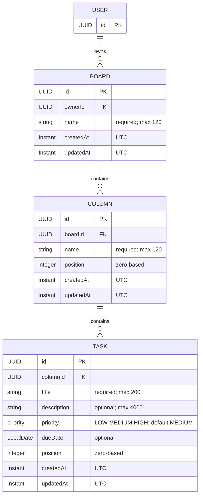

# TaskFlow Architecture

## Overview

Milestone sections retain implementation-time evidence. The final MacroStep 8
verification section records current IaC status; earlier deferrals are historical.

TaskFlow is a full-stack application organized as a single repository. It separates the backend, frontend, infrastructure, and project documentation so each concern can evolve independently while remaining coordinated.

## Components and responsibilities

### Backend

The `backend/` directory contains the Java 21 and Spring Boot application. It is responsible for server-side business behavior, API delivery, data access, and integration with the PostgreSQL database.

#### Package conventions

- Backend code is organized primarily by feature. Each feature package owns its entity, repository, service, controller, DTOs, and mappers as needed.
- Controllers handle HTTP/API concerns and request validation. Services contain use cases and business orchestration. Repositories handle persistence access only. Entities represent persisted state, DTOs represent API contracts, and mappers translate between them.
- Feature packages are introduced only when their corresponding feature is implemented. Do not create empty feature packages or generic global `controller`, `service`, `repository`, `entity`, `dto`, or `mapper` packages.
- `shared` is reserved exclusively for genuinely cross-feature technical concerns. `shared.persistence` contains the persistence foundation; `shared.config`, `shared.error`, and `shared.web` are reserved for cross-cutting configuration, error handling, and HTTP/API behavior respectively.

#### Validation conventions

- TaskFlow uses Jakarta Bean Validation for HTTP request validation. Feature request DTOs own structural input constraints such as `@NotBlank`, `@Size`, and `@Pattern`; controllers invoke validation at the HTTP boundary with `@Valid`.
- Services enforce business rules, including uniqueness, existence, authorization, state transitions, and cross-record rules. Custom validators are introduced only when a concrete feature requires one.
- Validation failures return HTTP 400 Bad Request. The API error contract is client-safe and supports field-level errors where applicable.
- API errors include an HTTP status, stable error code, concise summary/message, request path, and applicable structured violations. They never expose stack traces, exception class names, SQL/database details, internal implementation details, or submitted sensitive values.
- Centralized exception translation is provided by `@RestControllerAdvice` in `shared.error`. It maps validation and bad-request failures to 400, missing resources to 404, conflicts to 409, and unexpected exceptions to 500.

#### Testing conventions

- Tests mirror the corresponding production package structure under `backend/src/test/java`. For example, tests for `com.taskflow.shared.error` belong in `com.taskflow.shared.error`.
- Unit tests verify isolated logic without loading the Spring application context. MVC tests use Spring MVC test support for HTTP behavior, controller boundaries, validation, exception handling, and JSON/API contracts. Integration or context tests load Spring only when application wiring or component integration requires it.
- Test classes use the `FooTest` name when their type is clear from context. Suffixes such as `FooMvcTest` and `FooIntegrationTest` are used only when they add useful clarity.
- Tests verify observable behavior and contracts rather than incidental implementation details. They must remain deterministic, isolated, and repeatable.
- `BackendApplicationTests` verifies application wiring and the Actuator health contract with the database-free `test` profile. This suite does not verify a live PostgreSQL connection, Flyway execution, or persistence round trips. Run the backend suite with `cd backend && ./mvnw test`.

The backend is a feature-oriented modular monolith. Each future feature is organized under `com.taskflow.<feature>` and may contain `api`, `application`, `domain`, and `persistence` packages. Public HTTP DTOs live in `<feature>.api.dto`; JPA entities are persistence details and must not be exposed by controllers.

Cross-cutting conventions live in `com.taskflow.shared`:

- `shared.web` defines reusable HTTP API conventions, including the `/api` endpoint prefix.
- `shared.error` provides RFC 9457 Problem Detail responses, including structured validation violations and stable application error codes.
- Mappers belong to their feature. MapStruct and shared mapper configuration are deferred until a concrete feature requires them.
- `shared.config` is reserved for narrowly scoped Spring configuration shared by more than one feature.

Future REST controllers use plural resources below `/api`, return resource DTOs directly for successful single-resource responses, and rely on standard HTTP status codes: `200 OK` for successful reads and updates, `201 Created` for creations, and `204 No Content` for successful deletions. Errors are returned as `application/problem+json`; validation and malformed requests use `400 Bad Request`, missing resources use `404 Not Found`, conflicts use `409 Conflict`, and unexpected failures use `500 Internal Server Error`. Problem responses expose `type`, `title`, `status`, `detail`, `instance`, and a stable application `code`. Validation failures additionally expose a `violations` array with `field`, `message`, and `code` values. Expected API failures use `ApiException` with a client-safe message and stable code; validation messages must never interpolate sensitive submitted values. Controllers must use `@Valid` for request-body validation; application services enforce business rules and own transaction boundaries. Spring Boot Actuator exposes health at `/actuator/health` only.

### Frontend

The `frontend/` directory contains the Angular application. It is responsible for the user-facing experience and communication with the backend through its exposed API.

#### Organization and boundaries

The frontend is organized primarily by feature area. Standalone Angular APIs remain the project standard.

The conceptual structure under `frontend/` is:

```text
src/app/
├── core/
├── shared/
├── features/
├── app.config.ts
├── app.routes.ts
├── app.ts
├── app.html
├── app.scss
└── app.spec.ts
```

The `app.*` component files remain at the application root. The `core/`, `shared/`, and `features/` directories are introduced only when real implementation requires them. Do not create empty directories or use `.gitkeep` files just to materialize this structure.

- `core/` contains application-wide technical infrastructure and cross-cutting concerns. Future examples include authentication/session infrastructure, route guards, HTTP interceptors, application configuration adapters, and global error handling. It must not become a generic dumping ground for services or contain feature-specific business behavior.
- `shared/` contains genuinely reusable, domain-agnostic building blocks, such as UI primitives, directives, pipes, pure helpers, or validators needed by more than one feature. It must not contain feature-specific business logic, feature-owned API clients, or application-wide mutable state. Introduce shared abstractions only after concrete reuse exists.
- `features/` contains business capabilities, such as future `auth` and `boards` features. Each feature owns its UI, route configuration, data access/API clients, models/contracts, and feature state. Authentication UI and use cases belong to the `auth` feature; application-wide authentication/session infrastructure belongs to `core/`.

Within a feature, organize code by cohesive sub-feature or use case rather than global technical type. Avoid generic top-level `components/`, `services/`, `models/`, `directives/`, or `pipes/` directories. Keep related component TypeScript, template, SCSS, and spec files together where practical; tests live next to the code under test.

#### Dependency direction

- Features may depend on `core` and `shared`.
- `core` may depend on `shared`, but must not depend on features.
- `shared` must not depend on `core` or features.
- Avoid direct feature-to-feature dependencies. Extract a genuinely shared contract only when required, while respecting the domain-agnostic boundary of `shared/`.

#### Data access and routing ownership

Application-wide HttpClient configuration belongs in root `app.config.ts`, using `provideHttpClient()` as the explicit configuration point for HTTP features. Future application-wide HTTP middleware belongs to `core/http/`; introduce that directory only when real implementation requires it. Interceptors use Angular functional interceptors (`HttpInterceptorFn`) and are introduced only for concrete cross-cutting behavior, never as no-op or pass-through placeholders.

Feature-specific API clients and data-access code remain owned by their feature. Do not create a generic global services directory or generic HTTP wrappers such as `ApiService`, `BaseHttpService`, or `HttpService`.

Root `app.routes.ts` composes top-level application routes. Each feature should own its route configuration when implemented, and future business features should be lazy-loaded where appropriate. These are ownership conventions only: routing implementation belongs to MS3.3 and is not introduced in MS3.2.

#### Environment configuration

Build-specific configuration belongs to `frontend/src/environments/`, using Angular CLI file replacements. `environment.ts` supplies production/default values; the development build replaces it with `environment.development.ts`. These files are client-visible configuration bundled into the application and must never contain secrets, credentials, passwords, or private keys.

Root `app.config.ts` adapts environment values into DI tokens. Feature code does not import environment files directly: future API clients inject `API_BASE_URL`, defined in `core/config/api-base-url.ts`. Both current environments use the relative `/api` base path. A generic configuration service or runtime configuration fetch is not needed for this single value.

The Angular development serve configuration references `frontend/proxy.conf.json`, which forwards `/api/**` to `http://localhost:8080` without rewriting the path. This preserves same-origin frontend requests without development-only backend CORS changes. The proxy target is development tooling configuration only; production hosting must route `/api` to the backend on the frontend's origin.

#### Naming and style

- Use kebab-case filenames with one primary concept per file, retaining role suffixes such as `.routes.ts` and `.spec.ts` where appropriate.
- Colocate `.spec.ts` tests with their source.
- Use names that describe the specific responsibility; avoid vague filenames such as `helpers.ts`, `utils.ts`, or `common.ts`.
- Prefer Angular `inject()` for dependency injection in new code.

#### UI ownership

Global `src/styles.scss` contains application-wide visual and reset foundations only. The root app component owns the minimal application shell: a skip link, application header, and main content landmark containing `RouterOutlet`. Root component styles own shell layout; feature-specific UI and styling stay with their feature.

#### Forms conventions

New TaskFlow forms use Angular Signal Forms from `@angular/forms/signals`. Use a typed `signal()` model, `form()` to create the form field tree, `FormField` to bind controls, and schema-based validation. Use `FormRoot` and Signal Forms submission APIs such as `submit()` where appropriate for the use case.

- Business forms belong to their feature/use case. Keep form models, validation rules, submission behavior, and form-specific UI with that feature, colocating strongly related files. Extract a separate model or schema file only when complexity justifies it.
- Structural client-side validation belongs with the feature form. Prefer Signal Forms validation/schema APIs and clear, user-safe validation messages. Introduce shared validators only after genuine cross-feature reuse exists. Server-side business validation remains authoritative and must also be handled when APIs are implemented.
- Use semantic native form controls whenever practical. Every control has an accessible label; associate validation messages programmatically with the relevant control where applicable. Do not convey invalid state through color alone. Surface errors at useful interaction points, such as touched or submitted state, rather than overwhelming users immediately. Submission must not rely solely on disabled buttons to communicate invalid state.
- Keep form state local to the owning feature unless a concrete requirement proves otherwise; never place mutable form state in `shared/`. When APIs are implemented, the owning feature maps server validation failures to appropriate field or general form errors, rather than delegating this to a generic global form service.
- Classic Reactive Forms are acceptable only when a concrete integration or compatibility requirement justifies them; they are not the default for new forms. Do not mix form paradigms within one form without a concrete reason. Template-driven forms are not a project convention.

Introduce form implementation only for a real use case. Do not create demo forms, fake login/registration forms, a speculative `FormErrorComponent`, generic form services, shared validators, form state stores, `FormBuilder` abstractions, wrapper libraries, or `shared/forms/` placeholders merely to establish the foundation.

#### Frontend testing conventions

Vitest, through the Angular CLI, remains the frontend test runner. Run `npm test` during development and `npm run test:ci` for a single non-watch run from `frontend/`.

- **Location and naming:** Use `.spec.ts` files colocated with the production code they verify. Test organization follows the same feature-oriented structure as source code.
- **Pure unit tests:** Test pure TypeScript logic without `TestBed` when Angular DI, templates, or framework behavior are not required. Do not load Angular infrastructure unnecessarily.
- **Components:** Use Angular `TestBed` when rendering or DI is part of the behavior. Prefer semantic DOM assertions that verify observable behavior and user-facing contracts, not private fields, incidental implementation details, or exact CSS structure.
- **Routing:** Use real Angular route configuration with `RouterTestingHarness` where appropriate. Verify resulting URLs, rendered components, and application behavior. Do not mock Angular Router merely to avoid navigation.
- **Services and dependencies:** Test isolated business/application logic with simple fakes or stubs when dependencies are needed. Use Vitest spies/mocks for interactions only when the interaction itself is part of the contract; avoid excessive mocking that mirrors implementation internals.
- **HTTP clients:** Future feature API client unit/integration tests must not hit a real network. Use `provideHttpClientTesting()` and `HttpTestingController` to assert request method, URL, relevant body/headers, response mapping, and expected failure behavior. Call `HttpTestingController.verify()` after each test to detect unexpected outstanding requests. When a test needs `provideHttpClient(...)` features such as interceptors, register those providers before `provideHttpClientTesting()` so the testing backend takes precedence.
- **Determinism:** Tests must be isolated, repeatable, and deterministic. Do not depend on real network services, machine-specific data, current wall-clock time, uncontrolled random values, or execution order. Control asynchronous behavior explicitly.
- **Scope and coverage:** Test public/observable contracts and meaningful edge cases, not solely line coverage. Do not set an arbitrary coverage percentage at the foundation stage; add a coverage policy when sufficient application code exists.
- **Test levels and infrastructure:** Unit, component, and integration-style Angular tests belong in the frontend unit suite. Defer end-to-end testing until real user workflows exist. Add custom test configuration, global setup, utilities, or additional testing dependencies only for a concrete requirement; do not create fake application functionality solely to establish testing infrastructure.

#### State management

Prefer Angular-native and local state mechanisms, such as signals, when appropriate. Feature state belongs to its feature; `shared/` does not own application-wide mutable state. Do not introduce NgRx or another state-management framework at the foundation stage. Add a dedicated state-management library only when concrete application complexity justifies it.

### Database

PostgreSQL is the application's persistent data store. Its use, local configuration, and related operational assets are kept separate from application source code.

#### Persistence conventions

- Persistent entities extend `BaseEntity` (`com.taskflow.shared.persistence`), which provides an application-generated random UUID primary key and `createdAt` / `updatedAt` audit fields.
- Audit values use `Instant`; the application clock, JSON configuration, and Hibernate JDBC timezone are all UTC. Database timestamp columns must use `TIMESTAMP WITH TIME ZONE` (`timestamptz`). MS4.4 moves the single UTC `Clock` bean to `shared.config.TimeConfiguration`, independent of persistence auditing; auditing and JWT infrastructure consume that same clock.
- JPA auditing is enabled by default. The database-free `test` profile disables it because that profile intentionally has no JPA metamodel.
- Hibernate validates mappings and never creates or updates the schema. Schema changes are introduced only through Flyway migrations in `backend/src/main/resources/db/migration`.
- Migration files use Flyway's versioned format: `V<version>__<description>.sql` (for example, `V1__create_users.sql`). Versions are ordered numerically; descriptions use lowercase words separated by underscores. Existing migrations are immutable.
- Flyway validates migration file names and has cleaning disabled in every application environment.

### Infrastructure

The `infra/` directory contains infrastructure definitions. Docker assets support local containerized development and execution. `infra/terraform/` contains the reference root module foundation; CloudFormation remains reserved for MS8.8.

## Authentication architecture (MS4)

This section records the design established in MS4.1 and implemented in MS4.2–MS4.9, with final verification in MS4.10. The existing MS1–MS3 conventions above remain authoritative.

### Backend authentication and security boundaries

Authentication is server-authoritative. The backend authenticates requests and enforces authorization; frontend route guards are UX controls only and never replace either responsibility.

MS4.3 introduces an explicit Spring Security filter chain in `shared.security`: `/api/**` requires authentication, `GET /actuator/health` remains public, and other requests retain existing routing behavior. Form login, HTTP Basic, default logout, and saved-request caching are disabled. Authentication is stateless; generated-user auto-configuration is excluded, with no placeholder authentication provider or login session. MS4.4 enables native OAuth2 Resource Server Bearer JWT authentication. Missing, malformed, expired, or otherwise invalid access tokens receive the same safe `401` ProblemDetail and `WWW-Authenticate: Bearer`, without parser diagnostics or credential material.

MS4.5 uses Spring Security 6.5's SPA CSRF pattern: `CookieCsrfTokenRepository.withHttpOnlyFalse()` writes `XSRF-TOKEN`, and Angular supplies its raw value in `X-XSRF-TOKEN`. The request handler retains XOR/BREACH protection for request attributes and form parameters, resolves the SPA header through the plain handler, and loads deferred tokens to issue cookies. `GET /api/auth/csrf` is public and returns `204 No Content` without a custom token body. The XSRF cookie is JavaScript-readable, `Path=/`, `SameSite=Strict`, and has no Domain. Central `taskflow.security.cookies.secure` defaults to `true`; `TASKFLOW_COOKIE_SECURE=false` explicitly permits local HTTP development, and the test profile sets false.

CSRF remains required for unsafe methods, including public register/login and Bearer-authenticated requests. Missing/invalid CSRF produces safe `403 ACCESS_DENIED`. The small `CsrfFilter` matcher post-processor remains necessary to override Resource Server's automatic Bearer exemption; configuring the SPA cookie alone does not remove that exemption. It changes neither the repository nor the documented SPA token protocol. Successful controller-based register/login deliberately generates and saves a fresh CSRF cookie through the configured repository, because those flows bypass filter-based `CsrfAuthenticationStrategy`. The browser can immediately use the fresh cookie/header pair without reloading. No login or CSRF HttpSession is created.

TaskFlow uses short-lived signed JWT access tokens and longer-lived opaque refresh tokens:

- **Access tokens:** approximately 15 minutes of validity, returned after successful registration, login, and refresh. Angular holds the access token only in application memory and sends it to protected APIs as `Authorization: Bearer <token>`. Never persist it in `localStorage`, `sessionStorage`, or a JavaScript-readable persistent cookie.
- **JWT claims:** issued claims are `iss=taskflow`, `sub` as the stable TaskFlow user UUID string, `aud` containing `taskflow-api`, `iat`, `exp` exactly 15 minutes after issuance by default, and a new UUID `jti` per token. Timestamps use whole UTC seconds. JWT payloads are signed, not encrypted; no email, password/hash, refresh token, profile, or role/authority claims are issued. `AccessTokenService` accepts only the user UUID and returns an immutable token value plus `expiresAt`, without persistence dependencies.
- **JWT infrastructure:** use Spring Security OAuth2 Resource Server/JWT support and Spring Security `JwtEncoder` / `JwtDecoder`, with no custom JWT authentication filter or parser. MS4.4 uses HS256 because one backend trust boundary both issues and validates tokens. Spring Security 6.5's `NimbusJwtEncoder` is constructed with an `ImmutableSecret` JWK source; `NimbusJwtDecoder` is explicitly restricted to HS256. Both consume the same validated 32-byte HMAC key.
- **JWT configuration:** immutable `JwtProperties` under `shared.security.jwt` binds `taskflow.security.jwt` (`secret-base64`, `issuer`, `audience`, `access-token-ttl`), with defaults `taskflow`, `taskflow-api`, and `15m` for non-secret settings. Supply exactly 32 cryptographically random bytes as Base64 through `TASKFLOW_JWT_SECRET_BASE64`. Missing/blank, malformed Base64, or incorrect decoded length fails startup with safe messages. There is no usable production default or startup key generation. Signing material must never be logged or sent to Angular; only `application-test.yml` contains an explicit deterministic test-only key.
- **JWT validation:** verify the HS256 signature, require expiration, and apply Spring Security timestamp and issuer validators plus a dedicated audience validator. Timestamp validation uses the shared clock and Spring Security's default 60-second clock-skew tolerance for expiration and not-before checks. Invalid issuer, absent/wrong audience, expired tokens beyond that tolerance, and modified signatures are rejected. No application roles or authority claims are introduced; MS4.7 maps the validated UUID subject to a typed application identity.
- **Key rotation:** symmetric-key rotation and multi-key support are deferred. Changing the current signing secret may invalidate outstanding short-lived access tokens unless a future key-ring strategy is introduced.
- **Refresh tokens:** MS4.5 issues opaque values from 32 `SecureRandom` bytes (256 bits), encoded as URL-safe Base64 without padding. Only SHA-256 of the raw value, represented as 64 lowercase hex characters, is persisted. `auth.persistence` owns `refresh_tokens` (Flyway V2), with user UUID foreign key, unique token hash, expiry, nullable revocation timestamp, and inherited UUID/audit fields. The user foreign key cascades deletion; no database-generated UUID or timestamp defaults are used. TTL defaults to 30 days through `taskflow.security.refresh.ttl`; expiry uses the shared UTC clock. Raw refresh tokens are never logged, persisted, or returned in JSON.
- **Refresh cookie:** successful register/login/refresh sets `TASKFLOW_REFRESH` with `HttpOnly=true`, `SameSite=Strict`, `Path=/api/auth`, no Domain, and Max-Age matching the refresh TTL. `Secure` uses the same centralized production-safe cookie setting as XSRF. JavaScript must never read refresh tokens. The focused `RefreshCookie` component constructs both replacement and clearing cookies with identical scope/security attributes; clearing uses an empty value and `Max-Age=0`.
- **Rotation and revocation:** rotate refresh tokens on use. Successful rotation invalidates the previous token; validation and replacement must preserve this rule under concurrent requests. Logout revokes the applicable refresh token and clears its cookie.

Normal protected API mutations authenticate through the Authorization bearer header, so their backend authorization remains independent of browser cookies. Refresh/logout endpoints use browser-supplied cookies and remain CSRF protected. Neither frontend guards nor cookie attributes replace CSRF enforcement. Preserve the existing same-origin `/api` deployment and development-proxy conventions.

Logout also clears the frontend's in-memory session. With access-token deny lists deferred, revoking a refresh token does not revoke an already issued access JWT: it can remain valid until its short expiry. This is a deliberate boundary of the initial model.

### User identity and credentials

The initial user contains only the UUID primary key inherited from `BaseEntity`, email, password hash, and inherited audit timestamps. Do not add profile fields, roles, permissions, MFA fields, or preferences without a concrete requirement. Existing persistence, auditing, and Flyway conventions apply when user persistence is implemented.

Email normalization is consistent before persistence and authentication: trim and lowercase using locale-independent behavior (for example, Java `Locale.ROOT`). Persisted normalized email is unique, and all authentication lookups use the same normalization. MS4.2 establishes a maximum email length of 254 characters, reflected in the JPA mapping and Flyway schema; future API validation must enforce the same limit.

Passwords:

- Never persist or log plaintext passwords.
- MS4.3 uses Argon2id for new password hashes through Spring Security `DelegatingPasswordEncoder`, with encoding id `argon2id` (stored prefix `{argon2id}`). Parameters are salt length 16 bytes, hash length 32 bytes, parallelism 1, memory 19456 KiB (19 MiB), and iterations 2. Algorithm prefixes preserve future migration options; unknown or missing ids fail without a plaintext/noop fallback. This supersedes the preliminary `PasswordEncoderFactories.createDelegatingPasswordEncoder()` preference: its bcrypt default has a practical 72-byte input limit incompatible with TaskFlow's 128-character policy. Bouncy Castle supplies the Argon2 implementation.
- Registration accepts 15–128 characters without arbitrary uppercase/lowercase/number/symbol composition requirements. Login requires a nonempty password of at most 128 characters, without imposing registration's minimum.
- Never silently trim or alter password contents. Implementation review must verify that the selected encoder supports the full accepted password range without silent truncation or alteration.
- Validation errors must never echo submitted password values.

### Authentication API contract

MS4.5 implements public `GET /api/auth/csrf`, `POST /api/auth/register`, and `POST /api/auth/login`. MS4.6 adds only `POST /api/auth/refresh` and `POST /api/auth/logout` to the explicit authorization-layer permit list. All public POSTs remain CSRF protected; missing or invalid XSRF cookie/header pairs receive `403 ACCESS_DENIED` before the application operation executes. Refresh/logout work without an access JWT, including after its expiry: clients omit stale Bearer headers because explicitly supplied invalid Bearer credentials still fail Resource Server authentication. All other `/api/**` routes retain Bearer authentication. `GET /api/auth/me` is implemented in MS4.7 and remains Bearer protected; refresh/logout have no GET handlers.

Credential authentication belongs to `auth.security`: a repository-backed `UserDetailsService` normalizes email and creates a separate `TaskFlowUserPrincipal`, never returning `UserEntity` as `UserDetails`. Its durable identity is the user UUID, its authorities are empty, and credentials are erased after authentication. A standard `DaoAuthenticationProvider` with the existing Argon2id encoder is used through `AuthenticationManager`; login does not manually verify passwords or create a login session.

Registration validates email (maximum 254) and unchanged password contents (15–128), normalizes email, encodes the password outside the write transaction, then persists the user and initial refresh session in one transaction. The database `uk_users_email` constraint remains authoritative: `saveAndFlush` surfaces concurrent duplicates, and only that named constraint violation maps to `409 EMAIL_ALREADY_REGISTERED`. Other persistence failures remain safe server failures. Login verifies credentials before its write transaction, issues an access token for the principal UUID, and persists a new refresh session. If a presented browser refresh cookie identifies a stored session, that session is revoked in the same transaction; an unknown cookie does not block valid login. Each newly established session receives an independent random family UUID, including separate logins for the same user.

Successful register (`201`), login (`200`), and refresh (`200`) return `{ user: { id, email }, accessToken, accessTokenExpiresAt }`, with ISO-8601 expiry and no invented Location header. Refresh values are set only in cookies at the API boundary. Unknown email and wrong password share `401 INVALID_CREDENTIALS`, title `Authentication failed`, and detail `Invalid email or password.` Only bad-credential outcomes receive that mapping; infrastructure/internal authentication failures use the safe `500` contract. Database-free Spring tests supply test-only repository and transaction-manager mocks; real database transaction, migration, and constraint verification remains deferred.

MS4.6 makes refresh tokens single-use. A write transaction locks the family root first, then consumes the presented row through `findByTokenHashForUpdate` with `PESSIMISTIC_WRITE`. The root is the retained token with no incoming replacement link; its lock serializes ancestor replay against descendant rotation as well as concurrent use of the same token. The family lookup projects only the UUID so it cannot cache stale token state before locking. All session mutations follow this lock order. Rotation reads the current user by durable UUID, persists a fresh token hash with the same family and expiry of shared-clock now plus configured TTL, and marks the old row revoked with its replacement UUID. The old hash and history remain stored. A new access JWT and safe current-user response reach the controller only after the transaction commits.

A revoked token with a replacement link is replay evidence, even if it has since expired. Replay revokes every still-active token in that family, preserving earlier revocation timestamps and independent families for the same user. Invalid outcomes return normally from the transaction so family revocation commits before the HTTP error is constructed. Missing, malformed, unknown, expired, manually revoked, replayed, and missing-user sessions all return the same `401 SESSION_INVALID`, title `Session unavailable`, and detail `Your session is no longer valid. Please sign in again.`, and clear the refresh cookie. Infrastructure failures remain safe `500 INTERNAL_ERROR`; failed persistence/commit cannot release a successful response or replacement cookie.

Logout is an idempotent `204 No Content` operation: it locks and revokes the presented token if available, clears the refresh cookie, and exposes no session state. Missing, malformed, unknown, expired, or already revoked tokens also succeed. Normal logout does not invoke replay family revocation or revoke other browser sessions. It does not invalidate an existing access JWT, which may remain usable until its approximately 15-minute expiry; no JWT blacklist or access-token persistence is introduced. The custom controller removes CSRF state through the configured `CsrfTokenRepository` and then issues a fresh anonymous `XSRF-TOKEN` cookie for immediate subsequent login without a page reload or custom CSRF JSON.

Flyway V3 adds `family_id` nullable, backfills existing rows with their own IDs, then enforces NOT NULL. It adds nullable `replaced_by_token_id` with self-referencing `fk_refresh_tokens_replaced_by` and `idx_refresh_tokens_family_id`. V1/V2/V3 remain immutable. Database-free tests cover lifecycle behavior, mocked transaction outcomes, lock metadata, and HTTP cookie/header contracts through MockMvc. They do not prove browser cookie semantics, PostgreSQL migration execution, or simultaneous transaction/row-lock behavior.

The following action-oriented authentication endpoints are an explicit exception to the general plural-resource naming convention. They retain the `/api` prefix, DTO boundaries, validation conventions, and existing error contract. Authenticated-user DTOs expose only safe current-user fields; never serialize persistence entities or password hashes.

| Endpoint | Contract |
| --- | --- |
| `POST /api/auth/register` | Validate email/password, create the user, and automatically establish authentication. Return the authenticated user plus an access token and set the refresh-token HttpOnly cookie. Duplicate normalized email returns `409 Conflict` through the existing API error contract. |
| `POST /api/auth/login` | Authenticate normalized email/password, return the authenticated user plus an access token, and set/rotate the refresh cookie as appropriate. An unknown email and an incorrect password produce the same generic `401 Unauthorized` response; never identify which credential was wrong. |
| `POST /api/auth/refresh` | Read the HttpOnly refresh cookie and validate its stored hash, expiry, and revocation state. Rotate the refresh token, return a new access token and authenticated-user/session information as appropriate, and set the replacement cookie. Missing, invalid, expired, or revoked tokens produce a safe `401 Unauthorized` authentication failure. POST only. |
| `POST /api/auth/logout` | Revoke the presented refresh token when available and clear its cookie. Safe and idempotent from the client's perspective, including when no usable refresh token remains. Successful logout returns `204 No Content`. POST only. |
| `GET /api/auth/me` | Require a valid bearer access token and return the authenticated user's safe public/current-user representation. Never return password hashes or token material. |

Registration and login do not require an existing access token. Refresh and logout use the refresh-cookie contract rather than requiring a still-valid access JWT. These endpoints remain CSRF protected. Malformed credential request bodies remain validation failures; unusable refresh-cookie values use `SESSION_INVALID`, and the generic login `401` applies to credential authentication failures.

### Authenticated application identity (MS4.7)

The validated JWT `sub` is the durable TaskFlow user UUID. The decoder requires a nonblank subject in full UUID syntax, in addition to the existing signature, timestamp, issuer, and audience checks. Missing, blank, malformed, or shortened UUID subjects fail at the Resource Server boundary with the existing safe `401 AUTHENTICATION_REQUIRED` response; subject values and parser details are never exposed.

`shared.security.AuthenticatedUser` is an immutable UUID-only identity, exposed through `AuthenticatedUserProvider.currentUser()`. Its Spring Security adapter reads the already-authenticated `JwtAuthenticationToken` subject, without decoding the header, revalidating the JWT, querying persistence, trusting email claims, or making ownership decisions. Spring Security authentication objects and context access remain infrastructure concerns; current-user and future business application/domain code consume the typed identity or its UUID.

`CurrentUserService` resolves that UUID through `UserRepository` and returns the safe `CurrentUser(id, email)` application result. The API maps it to `CurrentUserResponse`, a standalone safe DTO also reused by authentication responses. `GET /api/auth/me` returns this representation with `200 OK`, requires a valid Bearer JWT, and needs neither a refresh cookie nor a CSRF header under normal GET semantics. A valid JWT whose persistence user is missing returns `401 SESSION_INVALID`, title `Session unavailable`, and detail `Your session is no longer valid. Please sign in again.`; unexpected persistence failures retain `500 INTERNAL_ERROR`. No password hash, token, refresh state, or audit fields are returned.

The authenticated UUID abstraction is the foundation for future Board/Task ownership checks. No ownership policies, application roles/authorities, method security, user-management API, or frontend authentication are introduced in MS4.7.

### Authentication error contract

Authentication and security failures remain compatible with TaskFlow's RFC 9457 `ProblemDetail` contract: `application/problem+json` with `type`, `title`, `status`, `detail`, `instance`, and a stable application `code`, plus safe structured violations where applicable. MS4.3 security authentication/denial handling preserves this contract for filter-chain failures through a custom authentication entry point (`AUTHENTICATION_REQUIRED`, 401) and access denied handler (`ACCESS_DENIED`, 403). Both use the same shared ProblemDetail construction as controller advice and serialize with the application-configured Jackson `ObjectMapper`, without exposing exception details.

| Status | Meaning |
| --- | --- |
| `400 Bad Request` | Malformed request or validation failure. |
| `401 Unauthorized` | Authentication required, invalid credentials, or missing/invalid/expired/revoked authentication token as applicable. |
| `403 Forbidden` | Access denied or missing/invalid CSRF, including on public unsafe endpoints. |
| `409 Conflict` | Registration conflicts with an existing normalized email. |
| `500 Internal Server Error` | Unexpected server failure with a safe public response. |

In particular, `401` and `403` responses must not leak stack traces, token parsing details, internal security classes, password hashes, signing information, or sensitive credential values. Invalid email and invalid password authentication failures share the same safe login response. The approved registration `409` does disclose an email conflict; generic login errors reduce enumeration through login but do not remove that registration disclosure.

### Angular authentication and session architecture

MS4.8 implements authentication contracts, the focused `AuthApi` client, and signal-based `AuthSessionService` under `frontend/src/app/features/auth/`. The client uses injected `API_BASE_URL` and the six backend auth operations, including bodyless CSRF/logout responses. It does not handle cookies or Authorization headers itself. No dependencies or JWT decoding library are needed; user and expiry come from backend responses.

Session state distinguishes `initializing`, `authenticated`, and `anonymous`. Authenticated state contains safe user data, access JWT, and expiry; anonymous state contains none of them. Signals are privately writable and expose readonly/computed views. Access JWTs exist in memory only; reload intentionally discards them. JavaScript never reads or deletes the server-owned HttpOnly refresh cookie.

Root `provideAppInitializer` composes session restoration once: GET `/api/auth/csrf` must complete before POST `/api/auth/refresh`. Success uses the returned user/token/expiry without calling `/me`. Expected `401 SESSION_INVALID` completes startup anonymously. Network/infrastructure failures also finish anonymously but set a safe `initializationUnavailable` flag; each bootstrap HTTP phase has a ten-second timeout, and bootstrap does not loop. This flag records startup failure, not a confirmed absence of server refresh state.

Root `provideHttpClient` explicitly configures Angular's built-in XSRF support with `XSRF-TOKEN` / `X-XSRF-TOKEN` and the functional auth interceptor. No custom cookie reading, XSRF token state, or global `withCredentials` is introduced. The same-origin `/api` deployment/proxy convention is unchanged.

The interceptor in `core/http` depends only on the narrow `AuthSessionBridge` contract. Root configuration binds its injection token to the feature implementation with `useExisting`; core never imports the auth feature. Bearer is attached only to the exact relative API base or its slash-delimited descendants. Absolute/external URLs, assets, and unrelated namespaces receive no TaskFlow Bearer. GET `/auth/csrf` and POST `/auth/register`, `/auth/login`, `/auth/refresh`, and `/auth/logout` are explicitly excluded by method/path; GET `/auth/me` receives Bearer.

A protected request that carried an access token and receives 401 can refresh and retry once. Concurrent failures share one in-flight refresh observable, cleared on completion/error; late failures from an older access token reuse an already-renewed token. Anonymous, lifecycle, external, and non-401 requests never start automatic recovery. The retry re-enters HttpClient with a copied request-local retry marker, so both Bearer attachment and Angular's built-in XSRF stage run again. Since backend refresh renews the XSRF cookie, the previous XSRF header is removed from the retry; Angular alone supplies its fresh value. Retry 401s propagate without another refresh loop.

Refresh success replaces memory state; structured `401 SESSION_INVALID` clears it and fails waiting callers. Infrastructure refresh failures propagate while preserving existing local state. Login/register success replaces state and failures remain observable for future forms. Logout clears state only after server success; failure preserves it and propagates, never claiming confirmed server revocation. A refresh started before a completed login/register/logout cannot overwrite the newer local session state. Cross-tab coordination is not introduced; the single-flight coordinator is scoped to the running application instance.

### Authentication UI and routing (MS4.9)

The auth feature owns `/login` and `/register`, with lazy standalone pages and useful page titles. Root routing composes these routes and retains the final wildcard Not Found route. Authenticated users visiting either anonymous-only auth page are redirected to `/`. MS5.5 replaces the previously empty authenticated root with a declarative redirect to the guarded `/boards` business landing; see the Board frontend section below.

Core functional guards depend only on the readonly `AuthStateReader` token (`status` and `isAuthenticated`). Root configuration binds it to `AuthSessionService` with `useExisting`, independently of the HTTP bridge. The routing contract exposes neither tokens nor mutation operations, and core does not import feature implementation. The existing application initializer completes CSRF → refresh before normal initial navigation. Guards never bootstrap, refresh, fetch a user, or make network requests; unexpected `initializing` state cancels navigation deterministically. Redirects return `UrlTree` values rather than navigating imperatively. Guards are navigation UX only: Spring Security remains authoritative, and future ownership rules must be enforced by the backend.

Anonymous protected navigation preserves the requested URL in the login `returnUrl` query parameter. Login validates that untrusted value as an application-local absolute path before navigation, falling back to `/` for missing, external, protocol-relative, malformed escape, backslash, or control/whitespace targets (including encoded separators). Local query strings and fragments are preserved.

Login and registration use typed signal models, Signal Forms schema validation, `FormField`, and `submit()` for touched/validation/submitting behavior. Both require an email of at most 254 characters and a password of at most 128 characters; only registration requires at least 15 characters. Credentials pass unchanged to the session use cases, without normalization, confirmation fields, extra login, refresh, or `/me` requests. Repeated concurrent submissions are prevented. Real forms provide explicit labels, email/password types, appropriate autocomplete, described validation messages, polite live errors, and disabled submitting buttons, using the existing visual baseline and focus outlines. Router links connect the auth pages.

Login maps only `401 INVALID_CREDENTIALS` to the general “Invalid email or password.” message. Registration maps only `409 EMAIL_ALREADY_REGISTERED` to a safe email-field submission error, which clears on editing that field. Other failures use fixed general messages and allow retry without changing credentials; arbitrary backend details are never rendered. The minimal auth ProblemDetail reader needs only the stable application `code`, alongside HTTP status.

The existing accessible shell retains its skip link, header, main landmark, and router outlet, and composes feature-owned current-email/logout controls. Logout prevents concurrent requests and navigates to `/login` only after confirmed server success. On failure, the session and authenticated UI remain intact and a safe live message permits retry. No token persistence, cookie access, JWT decoding, roles, or client authorization framework is added.


### Deferred scope and implementation sequence

The following are explicitly deferred until concrete requirements justify them:

- MFA.
- Password reset and email verification.
- OAuth/social login.
- Roles/admin authorization.
- Remember-me variants.
- Account lockout/rate limiting implementation.
- Breached-password API integration.
- Multi-device session management UI.
- Access-token deny lists.
- Authorization/ownership for Board/Task resources until their features exist.

The implemented MS4 sequence is architecture → user persistence → Spring Security → JWT → register/login → refresh/logout → typed current-user identity and `/me` → Angular auth foundation → auth UI/guards → final verification.

### Final verification and closure (MS4.10)

The authentication implementation is complete within the verified scope. Final checks passed: 85 backend tests, 84 frontend tests, and the Angular production build. Static review found no authentication defect requiring a code change; production credentials, frontend token persistence, package boundaries, DTO contracts, dependencies, and migration/entity alignment were reviewed. No implementation, dependency, or migration changes were needed.

Evidence boundaries remain explicit:

- Backend tests exercise real password encoding, JWT signing/validation, Spring Security and MVC contracts, with mocked repositories and transaction management. They verify persistence interactions, lock annotations/order, rotation/replay semantics, and commit-before-error control flow, not actual PostgreSQL locks, constraints, auditing, Flyway execution, or concurrent transactions.
- Angular tests exercise session/HTTP recovery, built-in XSRF handling in the test DOM, Signal Forms, guards, and routing. They do not prove real frontend/backend integration or browser enforcement of HttpOnly, Secure, SameSite, and cookie scope.
- No usable local PostgreSQL configuration was found during MS4.10; no real HTTP authentication smoke test or browser E2E test ran. PostgreSQL integration/concurrency and browser/container verification remain for later software-quality and infrastructure steps, without adding new infrastructure here.
- Production HTTPS uses Secure cookies by default; local HTTP requires the explicit cookie override. The refresh cookie remains HttpOnly and invisible to JavaScript; XSRF-TOKEN is intentionally readable by Angular. Reload discards the memory-only access JWT and bootstrap restores the session through CSRF then refresh. Cross-tab refresh coordination remains deferred; single-flight applies within one application instance.

The original roadmap's concrete private-resource ownership intent is retained with a refined sequence: `AuthenticatedUser` provides the completed UUID identity foundation, but no Board/Task resource exists yet. Ownership enforcement and cross-user access tests are required alongside the first real private Board/Task resources in MS5. No fake resource, placeholder ownership policy, or MS5 implementation was introduced to close authentication.

## Core TaskFlow domain (MS5.1)

MS5.1 established the approved domain model for implementation in MS5.2–MS5.4 without introducing production features. The MS5.2 and MS5.3 sections below record the implemented Board and Column backends; Task remains conceptual. The existing feature-oriented architecture, authentication, persistence foundation, and RFC 9457 ProblemDetail contract remain authoritative.

### Relationships and identifiers

The core relationship is User 1 → N Board, Board 1 → N Column, and Column 1 → N Task. User already exists from MS4. Each child has exactly one parent; a parent may have zero or more children. Board is the ownership root for these private resources. Column ownership derives from its Board; Task ownership derives through Task → Column → Board → User. Columns themselves represent workflow state, so there is no separate status enum.

All three resources inherit UUID `id`, `createdAt`, and `updatedAt` from the existing `BaseEntity` convention. Foreign keys use UUID. No numeric public IDs, sequential identifiers, slugs, or composite primary keys are introduced. Audit timestamps remain `Instant` in UTC, following the existing PostgreSQL `timestamptz` convention.

Do not duplicate user ownership on Column or Task unless a later implementation review identifies and documents a concrete persistence requirement. Task has neither a persisted `boardId` nor a persisted `userId`; its Column relation determines its Board, owner, and workflow state.

### Initial fields and structural constraints

Every resource includes the inherited UUID and audit fields described above. The following table lists its additional fields and approved constraints. The character limits are practical initial bounds to keep future API validation and PostgreSQL schema definitions aligned; no arbitrary regex or additional business validation is introduced.

| Resource | Field | Domain rule |
| --- | --- | --- |
| Board | owner/User relation | Required; exactly one owning User, referenced by UUID. |
| Board | name | Required, non-blank, maximum 120 characters. |
| Column | Board relation | Required; exactly one Board, referenced by UUID. |
| Column | name | Required, non-blank, maximum 120 characters. |
| Column | position | Required integer, at least zero, ordered within its Board. |
| Task | Column relation | Required; exactly one Column, referenced by UUID. |
| Task | title | Required, non-blank, maximum 200 characters. |
| Task | description | Optional/nullable, maximum 4000 characters when present. |
| Task | priority | Required; `LOW`, `MEDIUM`, or `HIGH`, default `MEDIUM`. |
| Task | dueDate | Optional/nullable `LocalDate`. |
| Task | position | Required integer, at least zero, ordered within its Column. |

Board has no description, color, icon, template, visibility, sharing, archive state, or collaborators in the initial model.

Priority is a domain decision only; no enum is implemented in MS5.1. MS5.10 owns richer priority API/UI, filtering, and sorting behavior. A due date denotes a calendar date rather than a scheduled instant: `2026-09-30` means due on that date, without timezone conversion semantics. It is distinct from technical `Instant` audit timestamps. MS5.11 owns detailed due-date behavior and UI.

### Conceptual ER diagram

The relation fields below describe conceptual UUID references, not final SQL names or JPA mappings. USER shows only the existing identity needed for this relationship; its authentication fields remain documented in MS4.



### Private-resource ownership and lookup direction

Every Board operation must scope access using the UUID supplied by `AuthenticatedUser`, including listing only that user's Boards and assigning that user as owner on creation. A user must never access another user's Board. Column and Task operations enforce ownership through the same Board chain, including the parent resource when creating a child and both source and destination when moving a Task. Backend enforcement is authoritative.

For authenticated requests, a Board, Column, or Task that does not exist and one owned by another user must produce the same resource-not-found behavior: `404 Not Found` with the same safe resource-specific ProblemDetail code and detail. Responses must not disclose another user's resource existence. Existing authentication and CSRF behavior remains unchanged.

Prefer ownership-aware repository lookups conceptually shaped like `findByIdAndOwnerId(...)`, or nested queries that scope Column/Task through Board to the authenticated owner. Avoid `findById(id)` followed by a separate owner comparison when a scoped query can express ownership safely. Exact repository signatures and cross-user access tests belong to MS5.2–MS5.4; MS5.1 adds no ownership code.

### Ordering and lifecycle

Column positions are integers within a Board; Task positions are integers within a Column. Positions are conceptually zero-based and contiguous (`0, 1, 2, ...`) after completed mutations. Later ordering/reordering operations must execute transactionally, preserving this invariant in every affected collection, including after deletion or a Task move. No floating-point positions, fractional indexing, LexoRank, or general ordering framework is introduced. Concrete concurrency and persistence mechanics are deferred to implementation; MS5.9 owns frontend drag and drop.

| Resource | Initial lifecycle |
| --- | --- |
| Board | Create, read, rename/update, delete. |
| Column | Create, read through Board, rename, reorder, delete if empty. |
| Task | Create, read, update, delete, reorder within Column, move between Columns in the same owned Board. |

A Task move requires source and destination Columns to belong to the same owned Board. Moving Tasks across Boards is outside the initial scope, even if both Boards have the same owner.

### Deletion and persistence lifecycle

| Resource | Approved deletion policy |
| --- | --- |
| Board | Explicit deletion removes its Columns and Tasks. The future frontend must require explicit destructive confirmation. |
| Column | Delete only when empty. Reject deletion of a non-empty Column with stable conflict code `COLUMN_NOT_EMPTY` and HTTP `409 Conflict` through the existing ProblemDetail contract. |
| Task | May be deleted directly, subject to ownership. |

Deleting a Column must not silently destroy user tasks. The empty-Column rule governs direct Column deletion at the application layer; explicit Board deletion intentionally removes its descendants.

The expected ownership lifecycle is User deletion → Board → Column → Task, and Board deletion → Column → Task. This records lifecycle intent without introducing a User deletion API. MS5.2–MS5.4 must translate it into concrete migrations and entity mappings, carefully coordinating database foreign-key/delete behavior, JPA cascades, and the application-level empty-Column rule. Do not rely solely on ORM cascade assumptions. Flyway remains the only schema-authoring mechanism and its schema constraints remain authoritative; no migrations are added or changed in MS5.1.

### API and frontend route direction

The intended API uses plural resources under `/api`, existing DTO boundaries, and the established HTTP/ProblemDetail conventions. These are future endpoint directions, not implemented controllers or finalized request/response contracts.

| Method | Path | Intent |
| --- | --- | --- |
| GET | `/api/boards` | List the authenticated user's Boards. |
| POST | `/api/boards` | Create a Board owned by the authenticated user. |
| GET | `/api/boards/{boardId}` | Read an owned Board. |
| PATCH | `/api/boards/{boardId}` | Rename/update an owned Board. |
| DELETE | `/api/boards/{boardId}` | Delete an owned Board and its descendants. |
| POST | `/api/boards/{boardId}/columns` | Create a Column in an owned Board. |
| PATCH | `/api/columns/{columnId}` | Update an owned Column. |
| DELETE | `/api/columns/{columnId}` | Delete an owned, empty Column. |
| POST | `/api/columns/{columnId}/tasks` | Create a Task in an owned Column. |
| GET | `/api/tasks/{taskId}` | Read an owned Task. |
| PUT | `/api/tasks/{taskId}` | Replace owned Task content (finalized in MS5.4; see below). |
| DELETE | `/api/tasks/{taskId}` | Delete an owned Task. |

Exact reorder/move endpoint contracts are deferred to the relevant backend and drag-and-drop steps. Do not introduce RPC-style endpoints such as `/createBoard`.

MS5.1 planned `/boards` and `/boards/:boardId` without adding Angular implementation. MS5.5 implements `/boards` and the root redirect; `/boards/:boardId` is implemented in MS5.6 below.

## Board backend (MS5.2)

MS5.2 implements only the Board backend under `com.taskflow.board`: `api` owns the controller and focused request/response DTOs, `application` owns `BoardService` and the safe `Board` result, `domain.BoardName` owns name normalization/invariants, and `persistence` owns `BoardEntity` and `BoardRepository`. No generic CRUD abstraction, mapper framework, or new dependency is introduced. A newly created Board is empty; Columns arrive in MS5.3. No Column/Task persistence, default Columns, or frontend implementation exists in this step.

### Persistence and ownership

`BoardEntity` maps to `boards` and extends `BaseEntity` for the UUID primary key and `Instant` UTC audit fields. Its only additional fields are required `ownerId` (UUID, not updatable after creation, no setter) and required `name` (maximum 120). It stores the stable owner UUID directly, without a `@ManyToOne` relation or dependency on `UserEntity`.

Flyway `V4__create_boards.sql` defines `id UUID PRIMARY KEY`, `owner_id UUID NOT NULL`, `name VARCHAR(120) NOT NULL`, and non-null `created_at` / `updated_at` as `TIMESTAMP WITH TIME ZONE`. `fk_boards_owner` references `users(id) ON DELETE CASCADE`; `idx_boards_owner_id` supports owner-scoped listing. `ck_boards_name_not_blank` rejects names made entirely of PostgreSQL POSIX whitespace. The application enforces normalized names; the database check is an additional blank-name guard, not a replacement for that policy. There are no database UUID or timestamp defaults. V1–V3 remain unchanged. V4 establishes only User → Board deletion; future Column/Task migrations will implement the remaining approved lifecycle.

Every `BoardService` operation obtains the current owner UUID through `AuthenticatedUserProvider`. Creation assigns that UUID; callers supply only the name and cannot transfer ownership. Listing uses `findAllByOwnerIdOrderByCreatedAtDescIdDesc`, giving deterministic newest-created-first ordering with descending UUID as the tie-breaker. Individual reads and renames resolve through `findByIdAndOwnerId`; MS5.3 changes deletion to the owner-scoped `findByIdAndOwnerIdForUpdate` lock described below. No unscoped read followed by an owner comparison is used.

Missing and cross-user Boards share HTTP `404`, code `BOARD_NOT_FOUND`, title `Board not found`, and detail `The requested board was not found.` The response follows the existing RFC 9457 contract without exposing owner information or adding IDs to the detail. `ApiException` now supports an explicit safe title while its existing constructor retains the previous default title and behavior for unrelated errors.

### Name policy, transactions, and API

`BoardName` uses Java `String.strip()` to remove leading/trailing Java whitespace, preserving case and interior whitespace. Create/rename request constructors normalize before Jakarta `@NotBlank` and `@Size(max = 120)` validation, so the bound applies to the normalized value. The entity applies the same normalization and rejects null, blank, or overlong values on creation and rename, including direct application calls. Length follows Java String/Bean Validation semantics (UTF-16 code units), which also fits PostgreSQL's 120-character bound. No lowercasing, interior-space collapsing, slug generation, or naming regex is applied.

`listBoards()` and `getBoard()` use read-only transactions. `createBoard()`, `renameBoard()`, and `deleteBoard()` use write transactions. Creation and rename call `saveAndFlush` before mapping the application result so generated UUID/audit fields, including an updated audit timestamp on rename, are available in the response. Transaction completion precedes controller success; persistence/commit failures retain safe server-error handling.

| Endpoint | Implemented contract |
| --- | --- |
| `GET /api/boards` | `200 OK`, JSON array containing only the authenticated user's Boards in the default order; `[]` when empty. No pagination or selectable sorting. |
| `POST /api/boards` | Accept `{ "name": "..." }`; return `201 Created`, `Location: /api/boards/{boardId}`, and the created Board. |
| `GET /api/boards/{boardId}` | Return the owned Board with `200 OK`, or the shared `404 BOARD_NOT_FOUND` contract. |
| `PATCH /api/boards/{boardId}` | Accept required `name` only; return the renamed Board with `200 OK`, or the shared `404 BOARD_NOT_FOUND` contract. No general merge-patch mechanism. |
| `DELETE /api/boards/{boardId}` | Delete after scoped lookup; return `204 No Content` with no body, or the shared `404 BOARD_NOT_FOUND` contract. |

Every Board response contains exactly `id`, `name`, `createdAt`, and `updatedAt`; the application result and response DTO never expose owner/authentication data, persistence entities, or future children. Both request DTOs reject unknown JSON fields, including owner, ID, and audit metadata, through the existing safe `400 MALFORMED_REQUEST` contract. Missing/null/blank or overlong normalized names return `400 VALIDATION_FAILED` with field violations. Malformed UUIDs and unreadable JSON retain `400 MALFORMED_REQUEST`.

The existing `/api/**` Bearer authentication and CSRF architecture is unchanged: unauthenticated list access returns `401 AUTHENTICATION_REQUIRED`, and POST/PATCH/DELETE without valid CSRF return `403 ACCESS_DENIED`. No Board-specific permit rules, roles, method-security annotations, or JWT handling are added.

### Verification boundary

Final MS5.2 verification: `cd backend && ./mvnw test` passed all 130 backend tests (45 Board tests), with zero failures, errors, or skipped tests. The successful run used approved execution outside the sandbox after Mockito agent attachment failed in a sandboxed run. Existing Mockito/JDK dynamic-agent warnings remain tooling warnings; no dependency or JVM configuration was changed.

Focused entity and service tests cover normalized names and boundaries, retained ownership, safe mapping after flush, owner-scoped queries, and missing/cross-user failures without unauthorized writes. MVC tests exercise real signed Bearer tokens, security filters, identity resolution, Board service, controller, and ProblemDetail translation with repository mocks. They verify CRUD statuses, Location/body contracts, validation, rejected client metadata, CSRF, and User B receiving the same public 404 for User A's Board as for a missing Board (apart from the request-specific `instance` path).

The shared database-free test fixture supplies a Board repository mock. Board MVC tests explicitly enable transaction advice in test-only configuration, using the existing mock transaction manager to verify read-only/write intent and failure-before-success behavior. These tests do not execute PostgreSQL queries, prove row-level security (TaskFlow does not use PostgreSQL RLS), validate actual JPA auditing/locking, or prove real commits/cascades. No usable local database configuration was found: datasource environment variables were unset and the Docker Compose file remains empty. V4/entity alignment was reviewed statically; actual PostgreSQL migration execution and persistence round trips remain future integration verification. No H2, Testcontainers, or production test-profile workaround is added.

## Column backend (MS5.3)

The implemented feature lives under `com.taskflow.column`: `api.ColumnController` and focused `api.dto` contracts, `application.ColumnService` and the safe `Column` result, `domain.ColumnName`, and `persistence.ColumnEntity` / `ColumnRepository`. There are no new dependencies, generic ordering abstractions, Task implementations, or frontend changes.

### Persistence and ownership

`ColumnEntity` extends `BaseEntity` and stores only its Board relation, name, and integer position. The unidirectional child-to-parent relation is `@ManyToOne(fetch = LAZY, optional = false)`, with `board_id` non-null and not updatable. There is no Board replacement method, no `BoardEntity.columns` collection, no duplicated `ownerId`, and no relation to User. Ownership derives exclusively through Column → Board → authenticated User. Every service operation obtains the owner UUID from `AuthenticatedUserProvider`.

`ColumnName` independently applies `String.strip()`, preserving case and interior whitespace. Null, blank, or normalized names longer than 120 UTF-16 code units are rejected. Request DTOs normalize before Bean Validation; entities enforce the policy for direct application calls too. Position assignment rejects negative values.

`V5__create_columns.sql` creates `columns` with UUID primary key, required UUID `board_id`, `name VARCHAR(120)`, required `position INTEGER`, and required `TIMESTAMP WITH TIME ZONE` audit fields. The FK references `boards(id) ON DELETE CASCADE`. Checks require non-negative positions and supplement application name validation with the same POSIX non-blank guard as V4. `idx_columns_board_position_id` supports deterministic ordered reads. `uq_columns_board_position` enforces `UNIQUE (board_id, position) DEFERRABLE INITIALLY DEFERRED`: intermediate duplicate positions during multi-row updates are allowed, but the final transaction state must be unique. UUIDs and timestamps have no database defaults. V1–V4 are unchanged.

### Ordering, transactions, and concurrency protocol

Each Board's positions remain zero-based and contiguous, `0..N-1`, after successful create, delete, or reorder. Create counts under the parent lock and appends at N. List first resolves the owned Board, then reads by position ascending with UUID ascending as a deterministic tie-breaker.

`BoardRepository.findByIdAndOwnerIdForUpdate` uses an explicit owner-scoped JPQL query with `@Lock(PESSIMISTIC_WRITE)`. Column create, delete, reorder, and Board deletion acquire this same parent Board lock inside their write transactions. Board deletion is the only existing Board service behavior changed.

Direct Column mutations first discover the parent UUID using an owner-scoped scalar query. They then lock that owned Board and perform a fresh owner-scoped Column entity lookup. No Column entity is loaded into the persistence context before the lock, avoiding stale positions after a concurrent reorder or delete. If the parent or Column disappeared while waiting, direct endpoints still return `COLUMN_NOT_FOUND`. Rename also follows this protocol so a stale entity update cannot overwrite a concurrent position change or a reorder overwrite a concurrent name change.

Delete schedules the entity deletion and invokes one focused bulk compaction query for positions greater than the deleted position. `flushAutomatically` flushes the deletion first; the query decrements later positions and explicitly sets `updatedAt` from the shared UTC Clock because bulk DML bypasses JPA auditing. `clearAutomatically` discards stale managed state afterwards; it does not release the transaction's database lock. No per-shifted-row lookup or generic ordering framework is used.

Reorder validates the entire submitted membership before changing any entity, assigns positions in submitted order, flushes once, and maps the canonical ordered result. Create and rename map after `saveAndFlush` to include generated identity/audit values. List is read-only transactional; every mutation is write transactional. Transaction completion precedes controller success, including deferred uniqueness validation at commit.

### API and error contracts

| Endpoint | Contract |
| --- | --- |
| `GET /api/boards/{boardId}/columns` | Resolve Board ownership first; return `200` with ordered array or `[]`. |
| `POST /api/boards/{boardId}/columns` | Accept name only; append and return `201` with created Column. No Location header because there is no direct Column GET. |
| `PATCH /api/columns/{columnId}` | Accept name only; return `200` with renamed Column, retaining Board and position. |
| `DELETE /api/columns/{columnId}` | Delete and compact in one transaction; return `204` with no body. |
| `PUT /api/boards/{boardId}/columns/order` | Accept `{ "columnIds": ["uuid", "uuid"] }` as the complete ordered representation; return `200` with the canonical ordered Column array. |

Responses contain exactly `id`, `name`, `position`, `createdAt`, and `updatedAt`. Requests reject unknown fields, including ownership, parent, position, ID, and audit metadata. Reorder requires a non-null list of non-null UUIDs; business membership validation remains in the service. Invalid names or structural nulls return `400 VALIDATION_FAILED`; malformed JSON/UUIDs and unknown fields return `400 MALFORMED_REQUEST`.

For an owned Board, reorder must contain every current Column exactly once, with no duplicates, omissions, additions, or foreign Columns. Empty order is valid only for an empty Board. Repeating the same order is idempotent. Invalid membership returns `409 COLUMN_ORDER_CONFLICT`, title `Column order conflict`, detail `The submitted column order does not match the board's current columns.` No supplied UUID's existence or ownership is disclosed.

Missing and cross-user parent Boards share the existing `404 BOARD_NOT_FOUND` contract. Missing and cross-user Columns share `404 COLUMN_NOT_FOUND`, title `Column not found`, detail `The requested column was not found.` The existing ProblemDetail infrastructure is reused; unexpected persistence failures remain safe `500 INTERNAL_ERROR`. All endpoints retain MS4 Bearer authentication and unsafe-method CSRF protection unchanged.

Task persistence does not exist in MS5.3, so all existing Columns are structurally empty and may be deleted. The approved `409 COLUMN_NOT_EMPTY` rule remains mandatory and becomes enforceable in MS5.4 when Task persistence exists. No placeholder task-count check is introduced. Explicit Board deletion removes Columns through the V5 FK cascade.

### Verification boundary

Final MS5.3 verification: `cd backend && ./mvnw test` passed all 214 backend tests (84 added), with zero failures, errors, or skipped tests. The sandboxed run compiled but failed on Mockito agent attachment; the approved run outside the sandbox passed. Existing Mockito/JDK dynamic-agent and class-sharing warnings remain tooling warnings; no build configuration changed.

The shared database-free fixture now mocks `ColumnRepository`. Entity/service tests cover name and position invariants, immutable parent identity, lock-before-read/write ordering, parent/child disappearance, exact reorder membership, canonical/idempotent order, and safe ownership failures. Static repository contracts cover the parent lock metadata and bulk compaction's predicate, timestamp, flush, and clearing behavior. MVC tests use real Bearer tokens, security filters, service transaction advice, controllers, and error translation with repository/transaction-manager mocks. They cover all endpoint statuses, safe response fields, validation, CSRF, cross-user equivalence, transaction intent, and persistence/commit failure propagation.

These checks do not execute PostgreSQL. Actual V5 execution, entity/query round trips, audit behavior, non-blank/position/deferred uniqueness constraints, FK cascades, bulk compaction results, and simultaneous transaction locking remain integration verification boundaries. Mockito tests verify protocol and metadata, not real database concurrency. No H2, Testcontainers, dependency changes, or conditional production test wiring are introduced.

## Task backend (MS5.4)

MS5.4 implements the Task backend under `com.taskflow.task`: `api.TaskController` and focused `api.dto` requests/responses, `application.TaskService` and safe `Task` results, `domain.TaskTitle`, `TaskDescription`, and `TaskPriority`, and `persistence.TaskEntity` / `TaskRepository`. No frontend, dependency, security configuration, or later product feature changes are included.

### Persistence, ownership, and content policies

`TaskEntity` extends `BaseEntity` and stores only Column, title, nullable description, required priority, nullable dueDate, and non-negative position. The unidirectional `@ManyToOne(fetch = LAZY, optional = false)` relation uses required `column_id`; it can change through placement. There is no reverse Task collection on Column, duplicated Board/owner state, User relation, status, or version field. Ownership and workflow state derive through Task → Column → Board → authenticated User. All use cases obtain the current UUID from `AuthenticatedUserProvider` and use scoped repository queries.

`V6__create_tasks.sql` creates `tasks` with UUID primary key, required UUID `column_id`, `title VARCHAR(200) NOT NULL`, nullable `description VARCHAR(4000)`, textual `priority VARCHAR(6) NOT NULL`, nullable `due_date DATE`, required integer position, and required timestamptz audit fields. Checks enforce non-negative positions, allowed priority names, and a PostgreSQL POSIX non-blank title guard. `UNIQUE (column_id, position) DEFERRABLE INITIALLY DEFERRED` permits temporary duplicates during transactional resequencing while requiring unique final positions. The `(column_id, position, id)` index supports ordered reads. The FK to `columns(id) ON DELETE CASCADE` completes explicit Board → Column → Task deletion. UUIDs and timestamps have no database defaults. V1–V5 are unchanged.

`TaskTitle` strips leading/trailing Java whitespace, preserves case and interior whitespace, and rejects null, blank, or normalized values longer than 200 UTF-16 code units. `TaskDescription` strips edges, maps null/blank to null, preserves case, interior spacing and newlines, and limits normalized values to 4000 UTF-16 code units. DTO constructors normalize before Jakarta validation; entities enforce the same invariants for direct application calls. No Markdown processing is performed.

`TaskPriority` contains LOW, MEDIUM, HIGH and persists with `EnumType.STRING`; omitted/null priority on creation defaults to MEDIUM. Full update requires an explicit valid priority. JSON uses the exact enum names and rejects numeric ordinals. `LocalDate dueDate` persists as nullable DATE without timezone conversion, overdue computation, or reminders. MS5.10 extends priority **product behavior**; MS5.11 extends due-date **product behavior**. Their basic CRUD persistence/API semantics are implemented here.

### API and errors

| Endpoint | Contract |
| --- | --- |
| `GET /api/columns/{columnId}/tasks` | Resolve owned Column; return `200` ordered Task array or `[]`. Order is position ascending, then UUID ascending. |
| `POST /api/columns/{columnId}/tasks` | Accept title, optional description/priority/dueDate; append at N under the Board lock. Return `201`, `Location: /api/tasks/{taskId}`, and Task body. |
| `GET /api/tasks/{taskId}` | Owner-scoped lookup; return `200` and Task body. |
| `PUT /api/tasks/{taskId}` | Replace complete mutable content: required title/priority, nullable description/dueDate. Return `200` and Task body. |
| `DELETE /api/tasks/{taskId}` | Delete and compact source positions to 0..N-1; return `204` with no body. |
| `PUT /api/tasks/{taskId}/placement` | Accept required columnId and non-negative integer position; reorder/move within the same owned Board, returning `200` and moved Task body. |

MS5.4 refines the conceptual MS5.1 PATCH direction to **full PUT content replacement**. Null (including omitted nullable content fields) clears description/dueDate; this avoids patch-presence infrastructure needed to distinguish omission from explicit null in PATCH. Content update cannot change Column or position. Placement exclusively owns those fields. Create/update reject parent, position, ownership, identity, audit, and other unknown fields; placement accepts only columnId/position.

Task responses contain exactly id, columnId, title, description, priority, dueDate, position, createdAt, updatedAt. They expose no owner, Board, User, persistence entity, or Hibernate state. Invalid normalized content or structurally missing required fields returns `400 VALIDATION_FAILED`; malformed JSON, UUID, priority, date, and unknown fields return the established `400 MALFORMED_REQUEST`. Existing authentication and unsafe-method CSRF protections remain unchanged; unexpected repository/commit failures remain safe `500 INTERNAL_ERROR`.

Missing and cross-user Tasks share `404 TASK_NOT_FOUND`, title `Task not found`, detail `The requested task was not found.` Missing/cross-user parent Columns retain `404 COLUMN_NOT_FOUND`. A placement target must resolve by target Column UUID **and source Board UUID and authenticated owner**; nonexistent, other-Board (even owned), and other-user targets all yield the same safe `COLUMN_NOT_FOUND`.

Placement removes the Task from its source collection before inserting at the submitted target index. Valid indices are 0 through the resulting target collection size inclusive. For the same Column, [A, B, C] with A placed at 2 becomes [B, C, A]. Cross-Column movement compacts the source and inserts/resequences the destination. An unchanged current placement is valid. An out-of-range index returns `409 TASK_PLACEMENT_CONFLICT`, title `Task placement conflict`, detail `The requested task position is not valid for the target column.` Structural negative API positions fail validation. No collection count is disclosed.

### Shared mutation lock and Column boundary

Create, full content update, delete, and placement each run in one write transaction using the existing owner-scoped Board `PESSIMISTIC_WRITE` lookup. Each first discovers the owned Board identity with a scalar query, locks it, then re-fetches/revalidates the Column or Task within that Board. No Task entity is managed before locking. Content updates also lock so a stale entity cannot overwrite a concurrent Column/position change. Board deletion and Column structural mutations already participate in this same protocol; there are no independent Column row locks.

Under the lock, create loads current ordered Tasks and appends at N. Delete and placement explicitly resequence affected managed collections in memory and flush. Same-Column placement loads one collection; cross-Column placement handles both collections in one transaction. Content updates save/flush content fields only. Mapping follows flush, and transaction completion precedes controller success, including deferred constraint checks at commit. List/get are read-only transactions.

Direct Column deletion now enforces `409 COLUMN_NOT_EMPTY`, title `Column not empty`, detail `The column must be empty before it can be deleted.` After the existing Board lock and Column revalidation, `ColumnService` calls the narrow Column-owned `ColumnTaskPresence.hasTasks(columnId)` application contract. Task's `TaskColumnPresence` implements it with `TaskRepository.existsByColumn_Id`, so Column does not depend on Task persistence internals. A non-empty Column is neither deleted nor compacted, and no Task IDs/counts are exposed. Empty Column deletion retains the existing compaction behavior. The shared Board lock coordinates this presence check with Task creation/movement; explicit Board deletion still cascades through the database.

### Verification boundary

Final MS5.4 verification: `cd backend && ./mvnw test` passed all 342 backend tests (128 added), with zero failures, errors, or skipped tests. The sandboxed run compiled but hit the existing Mockito agent-attachment restriction; approved execution outside the sandbox passed. Existing Mockito/JDK dynamic-agent and class-sharing warnings remain tooling warnings. `git diff --check` passed.

The database-free fixture now mocks TaskRepository. Added policy/entity, service, static persistence-contract, and MVC/security tests cover normalization boundaries, basic priority/date CRUD, safe DTOs, ordered mutations, lock-before-refetch protocol, same-Board targeting, cross-user/missing equivalence for all six Task endpoints, Column non-empty enforcement, transaction intent, and persistence/commit failure propagation. MVC tests use real signed Bearer tokens, security filters, services and transaction advice, with repository/transaction-manager mocks.

Actual PostgreSQL V6 execution, JPA/query round trips, auditing, FK cascade behavior, deferred uniqueness, rollback of persisted resequencing, and simultaneous transaction locking remain deferred integration verification. Static mapping/SQL checks and Mockito protocol tests do not prove PostgreSQL execution or concurrency. No H2, Testcontainers, new dependencies, or production wiring workarounds are introduced.

## Board list frontend (MS5.5)

The feature under `frontend/src/app/features/boards/` owns the Board contracts, thin `BoardApi`, page-scoped `BoardListState`, Board list page, reusable feature-local Board name form, styles, tests, and routes. Board-specific code stays outside core, shared, and App. The minimal known-code ProblemDetail matcher now lives in `core/http/http-problem.ts`; auth keeps its existing helper import through a re-export. Only known status/code combinations map to fixed safe messages; arbitrary server details and violations are never rendered.

`/boards` is the first authenticated business landing, guarded by `authenticatedGuard`, lazily loading the list with title **Boards | TaskFlow**. Root uses Angular's declarative redirect to `/boards`; anonymous root or Board-list access reaches `/login?returnUrl=%2Fboards`. Login/register, auth-only redirects, wildcard Not Found, and the existing shell landmarks/user controls remain intact. The brand remains static, avoiding an authenticated destination on anonymous pages. There is no full navigation bar; MS5.6 adds Board-name workspace links.

`BoardApi` uses HttpClient and injected API_BASE_URL for GET/POST `/api/boards`, PATCH/DELETE `/api/boards/{id}`. Create and rename send only `name`. Board responses contain only string `id`, `name`, `createdAt`, and `updatedAt`; DELETE accepts bodyless 204. Existing global Bearer, refresh recovery, and XSRF infrastructure remains responsible for HTTP security. Board data has no browser persistence, manual authentication requests, or date/UUID parsing.

The page initiates one list load per activation. State exposes readonly signals for Boards, loading, load error, and stale-resource notice. Loading takes precedence over error/content; successful empty lists show first-use guidance and the visible create action. Failed loads show a safe error and Retry, retaining the last confirmed list in memory but hiding it until a successful retry. Server list order remains authoritative, with no frontend sorting.

Create/rename share a small Signal Form using required, maxLength 120, and blank-only validation. Submission trims outer whitespace while preserving case and interior whitespace. Signal Forms submission state prevents duplicates and disables submit/cancel during a request. Server failure retains the user's input with fixed safe feedback; success closes the form, so reopening create starts empty. Only one rename editor is open at a time, initialized from the current name; other Boards remain viewable and can be deleted independently.

Successful create prepends the complete server-returned Board. Successful rename replaces precisely that Board with its full response in the same position. Explicit inline delete confirmation names the Board, explains permanent deletion of the board and its contents, and offers **Delete board** and **Cancel**. A scoped pending flag prevents duplicate deletion; only confirmed 204 removes the Board locally. These normal mutations do not issue a follow-up GET.

Both rename and delete `404 BOARD_NOT_FOUND` show **This board is no longer available.**, close the affected controls, and reload the authoritative list without implying successful deletion. Failed reconciliation uses the normal load-error/Retry surface. Load sequencing ignores superseded responses; a mutation completing during a GET starts a newer reconciliation GET so an older snapshot cannot overwrite its confirmed update. Existing list controls stay mounted but hidden during loading/errors to preserve an unrelated pending rename's submission lifecycle; controls for resources absent after a successful reload are cleared.

The UI uses semantic headings and list items, labelled inputs with associated visible validation, real text buttons, accessible loading/error announcements, and keyboard-accessible inline confirmation. New name forms focus their labelled input after rendering; existing focus styles are retained. Feature-local SCSS supplies restrained cards, action hierarchy, destructive styling, and responsive layout without a UI library or dependency changes.

Final MS5.5 verification: `cd frontend && npm run test:ci` passed all **151 frontend tests** across 13 files (63 new Board API/state/component tests and four additional routing cases; the existing auth suite remains green). `npm run build` succeeded without warnings, and `git diff --check` passed. API tests use Angular HttpClient testing; rendered component and routing tests use mocked server responses. A live backend/browser end-to-end run was not performed. Board workspace `/boards/:boardId`, Column/Task frontend and Kanban were deferred at this MS5.5 checkpoint; MS5.6 below implements read-only access. Drag/drop remains deferred. No backend changes are part of this step.

## Board workspace frontend (MS5.6)

The read-only workspace lives under `features/boards/board-workspace/`, with a standalone page, local HTML/SCSS, page-scoped signal state, and focused tests. The feature-owned `/boards/:boardId` route uses authenticatedGuard, lazily loads BoardWorkspace, and sets title **Board | TaskFlow**. It activates immediately without a resolver or business-data guard. Board-list names are now real RouterLinks, separate from the unchanged create/rename/delete controls.

The page observes ActivatedRoute.paramMap. Distinct boardId values feed switchMap, cancelling the previous pipeline on route changes; Retry reloads the current Board. Page destruction unsubscribes. A readonly discriminated signal exposes loading, ready, not-found, or error; only ready carries the Board and ordered WorkspaceColumn entries containing separate Column and Task DTOs. Loading and failures clear prior content, so neither another Board nor a partial result appears authoritative.

BoardApi adds getBoard using GET `/api/boards/{boardId}` and the existing Board model. Read-only boundaries live in `features/columns/` (Column model and listColumns) and `features/tasks/` (Task model and listTasks). Their response contracts match the backend, including the Task priority literal union and nullable description/dueDate. Global authentication, refresh, and XSRF infrastructure remain authoritative; there is no workspace persistence or manual auth request.

Loading proceeds Board → Columns → parallel Tasks per Column. forkJoin preserves original Column response order regardless of Task completion order; Task arrays retain server order without sorting or recalculating positions. Zero Columns complete successfully without Task requests. The 1 Board + 1 Column-list + N Task-list read pattern is accepted for current scope; no aggregate endpoint or backend changes are introduced.

Loading announces **Loading board…**. Board or Column-list `404 BOARD_NOT_FOUND` maps through the existing safe HTTP Problem helper to **Board not found** and **This board is no longer available.**, with a normal Back to boards link and no automatic redirect. Task-list `COLUMN_NOT_FOUND` is a reloadable whole-workspace failure, as are unexpected/network/server errors: **We couldn't load this board.** and Retry. Retry reruns Board → Columns → Tasks; there is no partial ready board, automatic retry loop, or backend-detail disclosure.

Ready content has the Board name as h1, labelled semantic Column sections with h2 headings, and task lists in DOM/server order. Task cards intentionally show titles only. Empty Boards show **This board has no columns yet.**; empty Columns show **No tasks yet.** Desktop/tablet lanes have stable widths within a keyboard-focusable horizontal scrolling region; narrow screens stack lanes vertically using local CSS. Long names wrap, native links/buttons and existing focus styles remain, and loading/error messages are announced. No new navbar or design system is introduced.

Column mutations remain MS5.7, Task CRUD MS5.8, drag/drop MS5.9, priority presentation MS5.10, and due-date presentation MS5.11. No mutation controls, placement behavior, CDK, dependencies, or backend changes are included.

Final MS5.6 verification: all **173 frontend tests** across 17 files passed (22 net additional tests), including existing auth and MS5.5 Board CRUD coverage. Focused HTTP/state/component/router tests cover read endpoints, pipeline sequencing, empty states, parallel completion ordering, safe failures, full Retry, route reuse and cancellation at every loading stage, and page teardown. The production build succeeded without warnings; git diff --check passed. Routing and rendering were verified with Angular test harnesses and mocked HTTP, not a live backend/browser end-to-end session.

## Column UI (MS5.7)

The Column feature now owns ColumnManagement, ColumnControls, and a separate ColumnNameForm Signal Form. BoardWorkspace still owns Board/Column/Task loading and projects its unchanged read-only Task template into the Column lanes. Column DTOs remain exact backend contracts; page editing flags and Task arrays are separate. ColumnApi adds typed create (POST Board columns), rename (PATCH Column), delete (DELETE Column), and reorder (PUT Board columns/order) operations without transport-level business error handling or manual authentication headers.

ColumnNameForm validates required, non-blank names of at most 120 characters. Submission trims only outer whitespace, preserving case and interior spaces. Create and rename focus the labelled input, prevent duplicate pending submissions, retain text on safe failures, and close on success. Add column is available on an empty Board without creating default lanes. Confirmed create appends the canonical returned Column with an empty Task array; confirmed rename replaces only Column metadata in place, retaining its Task array. Neither normally reloads the workspace.

Delete opens an inline named confirmation before any request, with Delete column and Cancel buttons. Local Tasks never disable the delete action: the backend remains authoritative. A 409 COLUMN_NOT_EMPTY retains the entire workspace and announces **This column must be empty before it can be deleted.** Only confirmed 204 removes the target and compacts survivor Column positions to their array indexes, retaining Task arrays without reloading them.

Each lane has real Move left / Move right buttons, named for its Column; native disabled states enforce first/last boundaries. Reorder sends the complete final columnIds list. The displayed order remains unchanged until success, when canonical returned Column metadata/order is combined with existing Task arrays by Column id. Missing, unknown, or duplicate response membership triggers the existing full workspace loader instead of constructing inconsistent lanes. COLUMN_ORDER_CONFLICT announces **Columns changed on the server. Reloading the board.** during reconciliation and reloads without retrying the stale order request. These keyboard controls remain useful when MS5.9 later adds drag/drop over the same persistence contract.

Column writes are serialized within the current workspace, using one page-scoped pending operation; this prevents overlapping append/delete/reorder responses from invalidating one another. Column action controls are temporarily disabled during a write, while navigation and the rest of the application remain available. Generic mutation failures leave the valid workspace visible with operation-specific accessible feedback. COLUMN_NOT_FOUND invokes the existing Board → Columns → parallel Tasks loader; BOARD_NOT_FOUND switches to the established safe not-found state. A reconciliation that discovers a missing Board uses that same state.

Every load/route change and page destruction advances a workspace generation. Each mutation captures that generation before sending and checks it before applying either success or failure. Old results cannot modify a newer route or reload, clear a newer pending operation, or expose stale errors in the current controls. The loader retains MS5.6 switchMap cancellation; no second loading pipeline or global mutation infrastructure is introduced. Pending writes may finish on the server after navigation, but their stale client results are ignored.

The existing wide-screen horizontal lanes and narrow-screen vertical stack remain; subordinate action controls wrap. Inputs have labels, confirmations use keyboard-operable native buttons, mutation errors use alert/live regions, and global focus styles remain. Task cards still display titles only: no TaskApi mutations, Task forms, priority/due-date expansion, pointer reordering, drag attributes, CDK, dependencies, or backend changes. Task CRUD remains MS5.8 and drag/drop remains MS5.9.

Final MS5.7 verification: all **226 frontend tests** across 20 files passed (53 additional tests). Coverage includes exact mutation HTTP contracts, Column Signal Form validation/submission, canonical state changes, Task-array preservation, confirmation/non-empty feedback, complete-order pessimistic persistence, malformed membership reconciliation, and late success/error responses for all four operations. Existing auth, MS5.5 Board CRUD, and MS5.6 workspace loading/cancellation tests remain green. The production build succeeded without warnings and git diff --check passed. Verification used Angular component/router tests and mocked HTTP; no live backend/browser end-to-end run was performed.

## Task CRUD UI (MS5.8)

The Task feature owns TaskManagement, per-lane TaskList controls, a reusable TaskForm Signal Form, an inline TaskDetails panel, local styles, and tests. BoardWorkspace remains the canonical composition owner of Board, Columns, and Task arrays. TaskApi now supports getTask, createTask, updateTask, and deleteTask alongside listTasks. The typed create/update requests contain only title, nullable description, priority (optional only in the create transport contract), and nullable dueDate. Update uses full-content PUT. There is no frontend placement method.

Each lane, including an empty one, offers Add task. One create form and one selected Task detail surface are allowed per workspace. Task cards remain restrained title summaries with real buttons to open details. Details derive the selected Task by ID from current workspace state, show description as escaped plain text with line breaks, priority as plain text, and the date string when present. Opening details issues no extra GET. The direct-read API is available but unused by this flow. Edit initializes the shared form from current canonical content; success immediately updates the selected details. Reloads close detail/edit/create surfaces, avoiding detached stale data; deleting a Column also clears any create selection for that lane.

TaskForm uses labelled title, description textarea, native priority select, and optional date input. Create visibly defaults to MEDIUM. Title is required, non-blank, and limited to 200 characters; description is optional with a 4000-character limit. Submission trims title edges while preserving case/interior spaces, and trims description edges while preserving internal whitespace/line breaks; empty or blank description becomes null. Priority accepts LOW/MEDIUM/HIGH. Due dates remain YYYY-MM-DD strings, with empty input becoming null and no Date/timezone conversion. Edit submits all mutable content, allowing description and dueDate to be cleared. Pending submissions prevent duplicates and disable Cancel; generic failures retain the form input.

Normal successful create appends the canonical Task only to its target Column. A mismatched returned columnId, non-append position, or duplicate ID triggers the existing full workspace loader. Update replaces exactly the matching Task in place with canonical metadata; unexpected identity, columnId, or position causes reconciliation rather than a silent move. Neither normal create nor update refetches Tasks. Delete requires an inline confirmation naming the Task and explaining permanent deletion. Only confirmed 204 removes the target and compacts surviving positions in that Column to array indexes; other lanes retain their Task arrays.

The minimal core HTTP Problem helper extracts validation field names only from 400 VALIDATION_FAILED responses. Task-owned mapping supplies fixed safe messages for title, description, priority, and dueDate. Form fields expose linked live feedback and aria-invalid; unknown/malformed violations receive safe general form feedback. Arbitrary backend detail, messages, unknown field names, and raw JSON are not rendered. MALFORMED_REQUEST and generic failures use operation-specific safe messages without replacing the valid workspace. TASK_NOT_FOUND announces **This task is no longer available.**, invalidates the selected surface, and reloads Board → Columns → parallel Tasks. COLUMN_NOT_FOUND also reconciles through that existing loader.

The MS5.7 pending-write slot now lives in page-scoped BoardWorkspaceState and is shared by ColumnManagement and TaskManagement. One Column or Task write may run per active workspace generation; both features disable their mutation controls while either is pending, while application navigation stays available. This prevents Task creation/edit/deletion racing a Column deletion or reorder without a queue or general lock manager. Each write captures the existing generation and checks it before applying success or failure. Route changes, reloads, and page destruction invalidate late results; identity-based release prevents an old completion from clearing a newer pending write. Requests may complete on the server after navigation, but stale client results are ignored.

Controls use native buttons, associated labels, meaningful headings, linked validation, and alert/live feedback. Forms focus the title with the existing Angular-native pattern; inline details avoid dialog/focus-trap complexity. Existing horizontal lanes, mobile vertical stacking, wrapping controls, and visible focus styles remain. Column deletion still requires backend approval and retains COLUMN_NOT_EMPTY feedback; users can now explicitly delete Tasks first. There is no forced/cascading UI deletion.

Task movement, placement controls, drag/drop, and CDK remain MS5.9. Priority data editing is included, while badges/colors/filtering/sorting remain MS5.10. Due-date data editing is included, while overdue/relative/timezone/product semantics remain MS5.11. No backend, auth infrastructure, or dependency changes are part of MS5.8.

Final MS5.8 verification: all **318 frontend tests** across 24 files passed (92 additional tests). Added coverage verifies CRUD transport bodies, form limits/normalization/defaults, safe known/unknown validation field handling, inline details, explicit deletion, canonical append/update/delete compaction, unexpected response reconciliation, shared Column/Task write exclusion, and late success/error results after route changes, reloads, and destruction. Existing auth, Board CRUD, workspace loading/cancellation, and Column CRUD/reorder suites remain green. The production build succeeded without warnings and git diff --check passed. Production source review found no new persistence, manual auth/XSRF headers, placement calls, drag/drop, dependencies, or backend changes. Verification used Angular tests and mocked HTTP; no live backend/browser end-to-end session was performed.

## Task drag and drop (MS5.9)

The frontend adds exactly pinned `@angular/cdk@22.1.6` for drag/drop, compatible with the existing Angular 22.1 release line. Angular core/CLI and unrelated dependency versions remain unchanged; no Material or wrapper library is added. TaskList renders one typed CdkDropList per Column, including empty Columns with a dashed, minimum-height drop area. A CdkDropListGroup in the ready Board workspace connects only that Board's lists. Task cards use CdkDrag, stable Task ID tracking, and a small non-button CdkDragHandle grip separate from the real View task button. Columns are not draggable; their Move left/right controls remain available.

TaskApi.placeTask sends only `{ columnId, position }` to `PUT /api/tasks/{taskId}/placement` and receives the canonical moved Task. Full PUT content updates remain separate. The final CDK drop index uses the existing backend remove-then-insert semantics without adjustment. An exact same-container/same-index drop does nothing, including leaving existing feedback untouched. A small pure Task placement planner validates coordinates and current workspace membership, clones only affected Task arrays, moves the Task, and resequences affected positions to contiguous 0..N-1. API DTOs never carry drag metadata. CDK cannot mutate canonical arrays; BoardWorkspaceState remains their sole state owner.

Task movement is deliberately optimistic: TaskManagement captures the generation and affected immutable lane snapshot, takes the existing shared write token, and immediately publishes the planned state before starting HTTP. Same-Column reorder resequences one collection; cross-Column movement resequences both. Task content and timestamps remain unchanged. Normal success validates response ID, target Column, and position, then replaces only the moved Task with the canonical response while retaining local order and every other Task's content. Normal success does not reload the workspace.

Generic/network/server failures restore the exact affected lane snapshot, keep the ready workspace visible, and announce **We couldn't move the task. Please try again.** A 409 TASK_PLACEMENT_CONFLICT restores the snapshot, announces **Tasks changed on the server. Reloading the board.**, and reloads Board → Columns → Tasks without resending the stale command. TASK_NOT_FOUND restores the snapshot, closes stale details/edit state, announces **This task is no longer available.**, and fully reloads. COLUMN_NOT_FOUND similarly restores and reloads with safe stale-content feedback, without ownership information. Inconsistent successful response identity/placement (including an absent response) also rolls back and fully reconciles. A reconciliation BOARD_NOT_FOUND uses the existing workspace not-found state.

Placement uses the same page-scoped pending write mechanism as Column and Task CRUD: CDK lists/drags and all Task/Column mutation submissions are disabled while a write is pending, with handler-level exclusion as well. No second drag lock, queue, or concurrent placement is introduced. The existing generation checks protect success, rollback, feedback, reconciliation, and destruction; route changes and reloads invalidate earlier placement outcomes. Finishing an old request cannot release a newer generation's write token. The existing reactive loader still cancels obsolete workspace reads. A drop carrying obsolete lane-array references is rejected before HTTP.

Selected Task details remain derived by ID from the canonical workspace. The detail component now has one stable workspace-level host below the lanes, keyed by Task ID, so movement across lanes does not recreate it or discard an unsent edit draft. Details reflect optimistic placement, canonical success, and rollback; open create/edit forms alone do not prohibit dragging. Their submissions participate in the shared pending state.

Feature-local styling provides a grip, preview shadow, dashed insertion placeholder, and restrained CDK transitions with reduced-motion support. DOM Task ordering follows canonical workspace arrays; normal button semantics, focus styles, and details/edit/delete keyboard access remain. Pointer drag/drop does **not** provide a complete keyboard Task placement workflow; that limitation remains explicit. No backend files change. Real-browser pointer end-to-end verification is deferred to a later acceptance/deployment boundary; unit/component tests exercise typed drop events and actual application bindings without adding a browser automation framework. Priority presentation, due-date UX, search/filter/sort, and all MS5.10+ work remain out of scope.

Final MS5.9 verification: **369 frontend tests** across 25 files passed (**51 added**), including placement transport, pure reorder/move planning, optimistic timing, exact rollback, safe conflict/not-found and inconsistent-success reconciliation, shared write exclusion, route/reload/destruction races, CDK structure, empty targets, and selected details/draft coherence. Existing auth, Board CRUD, workspace loading/cancellation, Column CRUD/reorder, and Task CRUD/details/validation suites remain green. The production build passed without warnings (the sandboxed invocation aborted without diagnostics; the approved unsandboxed rerun succeeded). `npm ls @angular/cdk` confirms **22.1.6**. Dependency review found only CDK additions and required dev-to-runtime metadata changes for existing parse5/entities versions. `git diff --check` passed. Production source review found no added storage or manual auth/XSRF handling; placement references remain in the Task feature.

## Priority product UI (MS5.10)

Static inspection confirms the existing MS5.4 foundation is sufficient: TaskPriority has exactly LOW, MEDIUM, HIGH; TaskEntity uses EnumType.STRING; V6 defines non-null textual priority with the same allowed-value constraint. TaskResponse includes priority, create accepts an optional priority and defaults missing/null values to MEDIUM in the entity, and update requires priority. Existing Task CRUD already creates, reads, and updates priority. MS5.10 adds no migration, endpoint, query parameter, backend change, or dependency; V1–V6 and CDK 22.1.6 remain unchanged.

The Task feature owns one human-label mapping (Low, Medium, High) and a tiny reusable TaskPriorityIndicator for cards and details. Text remains visible regardless of color, with a screen-reader Priority prefix and restrained contrasting styles. The existing form reuses these labels while retaining uppercase enum option/transport values and the visible Medium create default. Native labeled Priority filter and Task order controls sit separately from structural mutations and wrap on narrow screens.

TaskPriorityView is provided by the Board page, outside canonical BoardWorkspaceState. Its defaults are ALL priorities and MANUAL order. The only filters are ALL/HIGH/MEDIUM/LOW; the only orders are MANUAL/PRIORITY_HIGH_TO_LOW/PRIORITY_LOW_TO_HIGH. No settings are persisted in storage or URL parameters. Distinct Board route IDs reset both controls before loading the new workspace; same-Board retries/reconciliation preserve settings and reapply the projection to refreshed canonical data.

The small pure projectTasksByPriority function filters each Column independently into a new render array, then sorts that copy when requested using explicit ranks HIGH=3, MEDIUM=2, LOW=1 and ascending canonical Task.position for equal priorities. Equal positions retain original array order. Manual mode preserves exact canonical array order. Task.position is the persisted manual Kanban order; Priority order is a temporary UI projection. Filtering/sorting never mutates canonical arrays, Task objects, columnId, or position and makes no HTTP calls. Changing priority does not change placement; changing placement does not change priority. Clearing the controls restores manual ordering immediately without a reload.

All Columns remain visible. Actual empty collections say **No tasks yet.**; nonempty collections hidden by the filter say **No tasks match this priority.** Selected details remain derived by ID from canonical state even if their card is hidden, and changing view controls preserves forms. Successful content edits recompute the projection: a HIGH-to-LOW update disappears under HIGH filtering while details show canonical Low. Created Tasks always enter canonical state and appear only if matching the filter, in the chosen presentation order; nonmatching success is not an error and does not reset controls. Deletion still removes only a confirmed canonical Task.

Task dragging is enabled only for ALL + MANUAL with no existing shared pending write. Both CdkDrag/CdkDropList disabled bindings and the TaskManagement drop handler enforce this condition. Projected indexes cannot safely represent canonical placement indexes, so projected views announce **Task movement is available in manual order with all priorities visible.** as status guidance, associated with the controls. Drop-list data remains canonical; the projection never calls placement. Existing Column Move left/right and Task create/edit/delete operations remain available under projection, subject to the existing shared write coordination. Existing MS5.9 optimistic placement, rollback, and generation safety remain unchanged in canonical view.

MS5.11 still owns due-date product behavior; MS5.12 owns Search; MS5.13 will generalize filters; MS5.14 will generalize sorting. No combined-filter, general-sort, or keyboard drag framework is introduced. Real-browser pointer verification remains the previously deferred MS5.9 acceptance boundary.

Final MS5.10 verification: **396 frontend tests** across 27 files passed (**27 added**). Coverage includes immutable pure projections, explicit ranking/stable ties, all human-readable indicators, native control defaults, filtered empty lanes, canonical-order restoration without HTTP, defensive projected-drop exclusion, hidden selected details and drafts, filtered create/edit/delete behavior, route reset, same-Board reload preservation, and shared write coordination. Existing auth, Board CRUD, workspace loading/cancellation, Column CRUD/reorder, Task CRUD/details/validation, and MS5.9 drag/drop regressions remain green. The production build passed without warnings and `git diff --check` passed. Changed-source inspection found no storage or manual auth/XSRF handling, no position mutations caused by priority, and no new placement calls. Backend and dependency diffs are empty; the backend suite was not rerun because its production code is unchanged.

## Due-date product UI (MS5.11)

Static inspection reuses the existing MS5.4/MS5.8 foundation: TaskEntity has nullable LocalDate dueDate, V6 stores nullable DATE, and create/update/TaskResponse carry LocalDate directly. Updating content supports both setting and clearing the date. There is no timestamp conversion. No migration, endpoint, backend query parameter, persisted overdue property, backend change, or dependency is required; V1–V6 remain unchanged. Native date inputs and their create/edit/clear contracts remain intact.

A dueDate is a calendar date transported as YYYY-MM-DD or null, retained as string | null in canonical frontend Task DTOs. It is not midnight UTC or another instant and is never converted between timezones. Technical createdAt/updatedAt Instants are unrelated. For UI classification, today means the browser's current local civil date, constructed from local year/month/day components rather than toISOString. No user timezone preference is added. Normalized date strings compare directly: null → NO_DUE_DATE; before today → OVERDUE; equal today → DUE_TODAY; after today → UPCOMING. A Task remains due today throughout that local calendar day. There is no completion property: overdue is strictly dueDate < today regardless of Column, with no inference from Done/Completed/Finished names.

Task-owned helpers parse and validate explicit date components, including leap days. formatDueDate uses native Intl.DateTimeFormat with browser locale by default and an optional deterministic test locale. An explicitly constructed UTC date is used only as a formatting carrier with timeZone UTC, preserving the stored year/month/day instead of parsing an ISO string and formatting it in local time. No date library or month-name table is introduced.

A page-provided TaskLocalDay signal schedules the next local calendar midnight using native timing and recalculates the next deadline after each refresh, allowing local day lengths to vary. Focus and visibility events also refresh/reschedule after clock changes, sleep, or browser backgrounding. The timer and listeners are removed on destruction. Both card/details classification and the active Due-date projection react to this signal without HTTP or canonical Task mutations. Suspended tabs catch up when their timer runs or the page regains visibility/focus.

TaskDueIndicator is shared by cards and details. Dated cards say Overdue, Due today, or Due followed by a localized date in a semantic time element carrying the unchanged calendar date. Overdue and due-today use distinct restrained styling with explicit text, never color alone. Null dates omit card metadata; details say No due date. Priority indicators remain intact. The native labeled Due date select joins the existing responsive controls with All due dates, Overdue, Due today, Upcoming, and No due date options.

The concrete second filter dimension justifies renaming TaskPriorityView/TaskPriorityControls to TaskView/TaskViewControls. One page-scoped owner holds Priority filter, Due-date filter, and the existing Task order. Until MS5.13, selecting any non-ALL Priority filter resets Due date to ALL, and selecting any non-ALL Due-date filter resets Priority to ALL; selecting ALL does not clear the other dimension. There is no combined filtering, dynamic registry, or query DSL. Existing Priority sorting may coexist with Due-date filtering and retains canonical-position ties; no Due-date sort or date ranges are added.

Each Column projects from its canonical collection into new arrays; no Task position, columnId, dueDate, content, or canonical array order is changed by view controls or the clock. Actual empty lanes say **No tasks yet.**; nonempty filtered lanes say **No tasks match the current filter.** All Columns remain visible. Hidden selected details and unsent forms remain canonical-ID based. Canonical create/edit responses automatically recompute the projection, including overdue-to-future edits, setting/clearing a date, and matching/nonmatching creates, without resetting filters or making extra GET/placement calls.

Drag availability now requires Priority ALL + Due date ALL + MANUAL order + no existing shared pending write. CDK disabled bindings and the TaskManagement drop guard both enforce this. Filter/sort projection shows **Task movement is available in manual order with all filters cleared.**; a pending network write alone does not show this guidance. Canonical MS5.9 placement semantics, rollback, and race protection remain unchanged. Board route changes reset all view controls; same-Board reload/reconciliation preserves them and reapplies projections to refreshed data.

MS5.12 Search, MS5.13 combined Filters, and MS5.14 general Sorting (including due-date sorting) remain deferred. No completion model, timezone preference, relative-day categories, date range controls, or backend filtering is introduced.

Final MS5.11 verification: **450 frontend tests** across 30 files passed (**54 added**). Deterministic coverage includes date-only classification/month-year-leap boundaries, local-vs-UTC today, controlled localized formatting, indicators, midnight/focus/visibility refresh and cleanup, immutable due projections, exclusive filter dimensions, Priority-sort coexistence, projected-drop guards, filtered-empty lanes, date create/set/clear edits under filters, hidden details/drafts, midnight projection/detail recomputation, and route/reload semantics. All existing auth, Board, Column, Task CRUD/details/forms, Priority, and canonical drag/drop regressions remain green. The production build passed without warnings and `git diff --check` passed. Backend, migration, API, canonical Task model, native date form, and dependency diffs are empty; no backend suite rerun was needed. Source review found no added storage, manual auth/XSRF handling, due-driven position mutation, or placement call from date filtering.

## Task Search (MS5.12)

`GET /api/boards/{boardId}/tasks/search?q=...` returns the existing safe `TaskResponse[]`. `TaskService.searchTasks` runs in a read-only transaction, obtains the UUID through `AuthenticatedUserProvider`, and establishes Board ownership before validating or searching. Missing and cross-user Boards both return the existing safe `404 BOARD_NOT_FOUND`, including for blank queries. The repository query independently constrains both Board id and owner id through Task → Column → Board. Authentication remains required; this safe GET needs no CSRF token. Existing malformed UUID and unexpected-error handling returns safe `MALFORMED_REQUEST` and `INTERNAL_ERROR` responses.

Search trims query edges, preserves case and interior whitespace, returns `[]` without a Task query for blank input, and rejects normalized queries longer than 200 characters with `400 INVALID_SEARCH_QUERY`. Parameterized JPQL matches only title or nullable description using `lower(...) LIKE lower(:pattern) ESCAPE '!'`. The application escapes `!`, `%`, and `_` before surrounding the pattern with substring wildcards; backslash is literal because `!` is the explicit escape character. Null descriptions do not match. Results order by Column.position, Task.position, then Task.id, all ascending. No relevance ranking, tokenization, schema migration, index, extension, or search engine is added. Leading-wildcard scans are a conscious small-workload trade-off; MS6.8 should revisit query plans and indexing using measurements.

The page-scoped `TaskView` owns a focused `TaskSearch` instance, connected by BoardWorkspace to its existing workspace lifecycle. Search holds raw input, normalized query, idle/loading/ready/error status, and successful result IDs only. Search response objects never replace canonical workspace Tasks. Each lane projects canonical Tasks through Search membership, then the existing Priority order; clearing Search immediately restores canonical membership without a workspace GET. Search and non-ALL Priority/Due filters are mutually exclusive: nonblank input clears both filters immediately, and selecting either business filter clears Search. The existing three Task-order modes are unchanged and may coexist with Search.

Input changes use a 300 ms RxJS timer within switchMap; normalized equality suppresses duplicate input requests. A new query immediately cancels the preceding debounce/request. Blank input cancels immediately without HTTP. Retry and successful Task create/edit/delete refreshes run immediately, bypassing debounce. Previous successful membership stays visible during debounce/loading or transport failure; before the first result, canonical Tasks remain visible. Searching is announced as status, failures as a safe alert with Retry search, and successful zero matches explicitly say **No tasks match your search.** at workspace and lane level. Search never substitutes a workspace loading/error screen for a generic transport failure. Overlong input gets safe inline guidance. Native labelled Search, Clear, and Retry controls use existing wrapping feature-local styles.

Unknown result IDs trigger one complete workspace reconciliation while preserving the query, followed by one Search rerun after readiness. A second inconsistent result produces a retryable Search error, preventing automatic reload loops; explicit Retry, changed query, or a later successful Task write starts a new bounded attempt. `BOARD_NOT_FOUND` from Search instead invalidates the workspace through its existing not-found path. Board navigation clears Search; same-Board reload preserves it. Workspace generation and request revision checks reject stale success/error responses even before lifecycle effects cancel their subscriptions; page destruction unsubscribes through `takeUntilDestroyed`.

Canonical CRUD updates happen before refreshing Search membership. A matching create appears after refresh; a nonmatching create remains canonical but hidden. Title or description edits can remove membership after refresh while details continue to derive current canonical content. Confirmed deletion removes the canonical Task and compacts positions as before, then refreshes membership. No normal Search refresh reloads the Board. Active Search also makes TaskView.manual false, disabling CDK bindings and the existing defensive drop handler; temporary pending writes alone do not produce projection guidance. Search never changes Task content, placement, or canonical array ordering. No URL or browser persistence is added.

Verification uses database-free service/query-contract tests and authenticated MVC tests, plus deterministic frontend fake-timer/HTTP/component tests. These prove application scoping, bound query structure, escape policy, public contracts, cancellation, projection, mutation coherence, and route/reload handling; they do **not** prove PostgreSQL LIKE execution or query plans. Live PostgreSQL search semantics remain the MS6.4 integration boundary, with performance review deferred to MS6.8. General combined Filters (MS5.13), general Sorting (MS5.14), and dashboard statistics (MS5.15) have not started in this change.

Final MS5.12 verification: **351 backend tests** passed (**9 added**) and **478 frontend tests** across 31 files passed (**28 added**). Existing auth, Board/Column CRUD, workspace cancellation, Task CRUD, Priority/Due views, and placement regressions remain green. The production frontend build passed without warnings; the sandboxed invocation aborted without diagnostics and the approved rerun succeeded. Backend tests also required the approved execution context for Mockito JVM attachment. `git diff --check` passed. Dependency and migration diffs are empty; V1–V6 remain unchanged, with no V7. No live PostgreSQL or real-browser end-to-end Search session was performed.

## Combined Task filters (MS5.13)

Column is workflow status: Task → Column → Board remains the model, with no Task.status enum or assumptions about Column names. TaskView adds an ALL-or-Column-UUID selection. The native Column select derives labels and option order directly from canonical workspace Columns, including arbitrary user-created names; a zero-Column Board has only All columns. Every lane stays visible to preserve workflow context, even when another Column is selected. Invalid or removed selections normalize to ALL against a ready canonical snapshot; temporary loading does not discard a valid selection.

Search, Column, Priority, and Due date now combine with logical AND. This supersedes the temporary MS5.11/MS5.12 exclusivity rules: selecting Search or a local filter no longer resets any other dimension. TaskSearch retains its existing backend-backed transport, debounce/cancellation, prior-membership loading/error behavior, and bounded unknown-ID reconciliation. Its read-only membership signal feeds the pure Task-owned projectTasks function. The explicit pipeline is canonical Tasks → Search membership → Column → existing Priority predicate → existing Due-date predicate → existing Task order. No client-side text matching, HTTP inside projection, canonical array mutation, content changes, or position changes occur. Local filter changes never issue Search HTTP requests.

TaskView remains the page-scoped presentation owner, with TaskSearch composed separately. Clear filters cancels Search and resets Search/Column/Priority/Due; it deliberately preserves Task order. The button is disabled when no dimension is active. A readable status counts active dimensions (Search counts once; order is excluded). Search, Column, Priority, Due date, and Task order have visible labels and native controls; Clear filters is a keyboard-operable button, and existing wrapping feature-local styles accommodate narrow layouts.

Canonical empty lanes say **No tasks yet.** Nonempty lanes with no projected Tasks say **No tasks match the current filters.**, with **No tasks match your search.** retained for Search-only misses. Empty Search-result status uses the same distinction at workspace level; lanes otherwise provide the combined no-match feedback without another global summary. Search debounce/loading/error does not claim a new empty result: prior membership continues through the local filters, and Search status/error/retry remains independent of Board loading. Existing local-day changes automatically recompute the combined Due predicate without HTTP.

Task dragging and the defensive drop handler require Search inactive, Column/Priority/Due ALL, MANUAL order, and no pending write. Existing generic movement guidance remains; a transient write alone does not show projection guidance. Clear filters re-enables dragging only if Task order is also MANUAL. No filtered placement semantics or new sorting mode is added.

Column creation/renaming/reordering updates options from canonical metadata and order; deletion of the selected Column resets only that dimension, while unrelated deletion retains it. These changes make no filter-specific HTTP requests. Canonical Task create/edit/delete recomputes local projection and retains all filters; active Search still refreshes after successful Task writes as in MS5.12. Nonmatching Tasks remain canonical but hidden. Selected details and unsent edits remain tied to canonical Task ID even when filters hide the card. Same-Board reload (including bounded unknown Search-result reconciliation) preserves Search, Priority, Due, order, and Column if it still exists; Search reruns once after readiness. Board navigation resets all dimensions and order to the canonical manual view.

The backend Search endpoint/query is unchanged, as are all backend files, migrations, dependencies, auth infrastructure, and Task transport models. Filters remain page-scoped without URL or browser persistence. MS5.14 general Sorting and MS5.15 dashboard statistics have not started.

Final MS5.13 verification: **526 frontend tests** across 33 files passed (**48 added**: 20 pure projection cases and 28 workspace cases). Existing auth, Board/Column CRUD, Task CRUD, Search debounce/cancellation/reconciliation, Priority/Due views, canonical placement, and workspace route regressions remain green. The production build passed without warnings after the sandboxed build aborted without diagnostics and the approved rerun succeeded. `git diff --check` passed. Backend and dependency diffs are empty; the backend suite was not rerun, with the last verified baseline remaining 351 tests from MS5.12. Verification used deterministic unit/component/HTTP tests; no live backend or real-browser responsive/end-to-end session was performed.

## Repository boundaries

- `docs/` records architecture decisions and project direction.
- `.github/workflows/` is reserved for continuous integration and delivery automation.
- `scripts/` holds repeatable development and operational automation.
- `.agents/` holds repository context and guidance for AI-assisted work.

## General Task sorting (MS5.14)

MS5.14 extends the existing client-side presentation projection. `TaskView` owns page-scoped order; `task-projection.ts` applies Search membership → Column → Priority → Due-date filters → `sortTasks` from `task-order.ts`. Each Task list supplies only its own Column's canonical Tasks. Sorting never flattens the Board, redistributes Tasks, changes Column order/options, or mutates canonical arrays, Task objects, `columnId`, or persisted `Task.position`. The sorter returns a new array retaining canonical object identities. Changing order makes zero HTTP requests, including Search refreshes.

The labelled native Task order select supports exactly:

- `MANUAL`: Manual order.
- `PRIORITY_HIGH_TO_LOW`: Priority: High to Low.
- `PRIORITY_LOW_TO_HIGH`: Priority: Low to High.
- `DUE_DATE_ASC`: Due date: Soonest first.
- `DUE_DATE_DESC`: Due date: Latest first.
- `CREATED_NEWEST`: Created: Newest first.
- `CREATED_OLDEST`: Created: Oldest first.
- `UPDATED_NEWEST`: Updated: Newest first.
- `UPDATED_OLDEST`: Updated: Oldest first.

Manual order explicitly compares persisted position ascending, then ID ascending as a defensive fallback. Priority retains HIGH/MEDIUM/LOW and LOW/MEDIUM/HIGH semantics. Due dates compare normalized `YYYY-MM-DD` strings as calendar dates without timezone conversion; null due dates always come last in both directions. Created/Updated compare server `createdAt`/`updatedAt` ISO instants using native parsing, with an epoch fallback for malformed values. Every primary tie, including two null due dates, uses the same position-then-ID comparator. IDs are only the final deterministic fallback and are not displayed as sort data.

Filters remain independent from sorting and determine membership first. Priority filter plus Priority sort and Due filter plus Due sort are valid combinations. Clear filters preserves the selected order. Same-Board Retry, Search reconciliation, and stale-write reload retain presentation state and reproject canonical responses; navigation to another Board resets Manual. No URL or browser storage persistence is introduced.

Canonical create/update responses immediately participate in the selected projection, including a later server `updatedAt` moving an edited Task under Updated newest. No client timestamps, placement request, or sort-induced reload is involved. Confirmed deletion recomputes the projection; existing canonical position compaction remains independent. Returning to Manual restores persisted manual order. Details remain selected by canonical ID, and tracked Task identities preserve unsent create/edit drafts when order changes.

Every nonmanual mode disables CDK Task dragging and is rejected by the existing defensive drop guard. Movement still requires Manual, cleared Search/all filters, and no pending write. The existing generic movement guidance, canonical drop data, Column movement, native keyboard-accessible select, and wrapping responsive controls remain intact. There is no mapping from projected indexes to persisted positions.

No backend sorting API, query parameter, repository method, migration, DTO field, or dependency is added. Alphabetical, status/Column, and special overdue-first sorts are outside scope. MS5.15 Dashboard statistics and MS5.16 functional acceptance remain not started.

Final MS5.14 verification: **561 frontend tests across 34 files passed (35 added)**, including all existing regressions. New pure/component/HTTP cases cover nine modes, position/ID ties, null-last dates, instant offsets, canonical Manual round trips, combined Search/filters with zero-request order changes, canonical create/edit/delete reprojection (explicitly Updated newest after edit), drafts/details, all-mode CDK disabling, a new-mode defensive drop callback, Clear filters, same-Board reload, and Board navigation. The production build passed without warnings on the approved rerun after the sandboxed build aborted with exit 134 and no diagnostics. `git diff --check` passed. Backend and dependency diffs are empty; the backend suite was not rerun (last verified baseline: 351 tests). No live backend or real-browser responsive/end-to-end session was performed.

## Board dashboard statistics (MS5.15)

The approved metrics are `totalTasks`, `overdueTasks`, `priorityDistribution`, and `statusDistribution`. Completed/open dashboard metrics were reviewed but intentionally omitted because TaskFlow currently has no explicit completion semantic. Column is the Task workflow state; its user-defined name and position convey no completion meaning. Neither a Column called Done/Completed nor the rightmost Column implies completion. If completed/open metrics are later required, an explicit workflow completion semantic must first be introduced, for example a deliberate completion category/property associated with Column/workflow state. MS5.15 adds no such property, Task status enum, completion flag, or timestamp.

`GET /api/boards/{boardId}/statistics?asOf=YYYY-MM-DD` is an authenticated, safe GET with a required calendar date. The Board-owned `com.taskflow.board.statistics` boundary contains a thin controller, focused read-only transactional application service, and response record with nested priority/status records. The controller binds UUID and LocalDate structurally. An endpoint-local date editor enforces exactly four-digit year, two-digit month/day, and strict calendar validity: Spring's default ISO date binding also accepts offsets, which this contract excludes. Missing/malformed dates and malformed UUIDs return safe `400 MALFORMED_REQUEST`; no date range is imposed. Anonymous requests return `401 AUTHENTICATION_REQUIRED`; unexpected failures return safe `500 INTERNAL_ERROR`.

The service uses `AuthenticatedUserProvider` and establishes ownership through `BoardRepository.findByIdAndOwnerId` before aggregation. Missing and cross-user Boards produce the same `404 BOARD_NOT_FOUND`. All Task aggregates independently constrain Board ID and authenticated owner ID through Task → Column → Board. The ordered Column lookup also includes owner scope. No owner/user identifiers or entities appear in the response.

Metric contract:

- `totalTasks`: database count of every Task on the owned Board, independent of Search, filters, sorting, and visible lanes.
- `overdueTasks`: count of non-null `dueDate` values strictly earlier than `asOf`. Due on `asOf`, future due dates, and null dates do not count. There is no completion exclusion or inference.
- `priorityDistribution`: fixed `{low, medium, high}` numeric count shape, with absent categories filled with zero.
- `statusDistribution`: `{columnId, name, position, taskCount}` for every current Column, including zero-task Columns, ordered by Column position ascending then ID ascending. Names remain user-defined workflow labels.

Aggregation uses three explicit database queries: combined COUNT and coalesced SUM/CASE for total/overdue, priority GROUP BY, and Column-ID GROUP BY. The service merges grouped Column counts into the canonical ordered Column list. It loads no Task entities for counting and performs no count-per-Column queries; query count stays constant as Columns increase. An empty Board returns 200 with zero totals, zero priorities, and an empty status list. A Board with empty Columns retains every Column with count zero. No migration, persisted statistics, dependency, global dashboard, or trend/history model is added.

The Board feature owns typed `BoardStatistics`/priority/status contracts and `BoardStatisticsApi`, using HttpParams for `asOf` and the existing HTTP security infrastructure. `BoardStatisticsState` is page-scoped server-derived state, separate from canonical Task arrays and view projections. It loads only after the canonical workspace is ready. It reuses `TaskLocalDay.today` and the MS5.11 browser-local calendar helper; the server never chooses the public endpoint's reference day with `LocalDate.now()`. Local midnight, focus, and visibility refresh the existing day source; a changed civil day refreshes only statistics, without reloading Board, Columns, or Tasks.

A generation-guarded `mutationConfirmed` invalidation signal advances only after successful Task create/update/delete/placement or Column create/rename/delete/reorder. Optimistic placement updates and rollbacks do not invalidate. The statistics effect coalesces synchronous changes into one request. Same-Board reconciliation refreshes after canonical readiness. Search, Column/Priority/Due filters, and Task order changes issue no statistics requests. Requests are unsubscribed on context changes; Board/day/generation/revision/retry context guards also reject late responses before cancellation runs, and hide results from obsolete contexts immediately.

A compact dashboard sits below the Board view controls and above Kanban lanes. It presents Total tasks, Overdue, High/Medium/Low using existing human priority labels, and every server-ordered Column count. Text explains that statistics cover the full canonical Board. Semantic headings and definition lists expose all counts without reliance on color; loading uses a status announcement, failures use an alert and real Retry button. The error is “We couldn't load board statistics.” and does not remove the workspace. `BOARD_NOT_FOUND` reuses the workspace's not-found transition. Native CSS grid wraps/stacks the top region and wraps long Column names; no permanent sidebar or chart dependency narrows the Kanban. Zero metrics remain visible.

Verification includes database-free service/scoping/zero-fill tests, static query contracts, authenticated MVC binding/security/exact-response/read-only-transaction tests, and frontend API/state/component/mutation HTTP tests. The strict overdue predicate and bound aggregation structure are checked honestly without claiming PostgreSQL execution. Actual PostgreSQL aggregate execution remains MS6.4 integration-test work. Real-browser responsive and end-to-end acceptance is not claimed here; MS5.16 has not started.

Final MS5.15 verification: **377 backend tests passed (26 added)** and **585 frontend tests across 37 files passed (24 added)**. The backend suite passed using the approved execution method after sandbox Mockito attachment failed. The production build passed without warnings on the approved rerun after the sandboxed build aborted with exit 134 and no diagnostics. `git diff --check` passed. Dependency manifests, lockfile, and migrations are unchanged. MS5.15 is complete; MS5.16 and MacroStep 6 have not started.

## Functional acceptance and MacroStep 5 close-out (MS5.16)

MS5.16 adds one routed frontend acceptance test in `frontend/src/app/taskflow-acceptance.spec.ts`, using the real App shell, production application providers/initializer, Router/routes, auth session/interceptor, feature components, Signal Forms, API services, view state, local-day source, and statistics. Only the HTTP transport is replaced by `HttpTestingController` (with a deterministic API base); fake time fixes the browser-local day and Search debounce. Anonymous bootstrap exercises CSRF then a `SESSION_INVALID` refresh response. Registration intentionally authenticates and routes to Boards, so the scenario uses the real shell logout before exercising Login with the registered credentials; it never sets auth state manually or decodes tokens.

The flow verifies registration → login → empty Board list → create/open Acceptance Board → create Backlog and In Progress → create a HIGH-priority, date-only Task → view details → edit title and Priority to MEDIUM → optimistically move to In Progress → combined filters and debounced matching/nonmatching Search → confirmed Task deletion → logout → protected-route redirect with safe returnUrl. Forms, buttons, RouterLinks, and native selects drive the flow. Movement emits the established typed CDK drop event through its real template binding. Exact HTTP methods, URLs, mutable request bodies, and bearer attachment are checked. Canonical data survives view changes; details need no extra read; successful writes refresh statistics, while Search/filter/order changes neither reload the workspace nor refresh statistics. Dashboard counts remain canonical even when the Task is hidden, and return to zero after deletion.

Close-out review found no ownership/security gap or outstanding feature-flow defect. Board remains the immutable ownership root; Column derives ownership through Board, and Task through Column → Board, without duplicate owner/Board fields. Board-only Column operations follow an owned-Board check/lock; direct Column/Task lookups remain owner-scoped. Search and statistics explicitly constrain both Board and owner. Existing backend auth, Board, Column, Task CRUD/placement/Search, statistics, and logout suites cover the server-side flow, including non-enumerating missing/cross-user responses. `BOARD_NOT_FOUND`, `COLUMN_NOT_FOUND`, `TASK_NOT_FOUND`, `COLUMN_NOT_EMPTY`, `COLUMN_ORDER_CONFLICT`, `TASK_PLACEMENT_CONFLICT`, `VALIDATION_FAILED`, `MALFORMED_REQUEST`, `INVALID_SEARCH_QUERY`, `SESSION_INVALID`, and existing authentication/authorization codes remain unchanged and client-safe. Source review found no browser token persistence or raw server-detail rendering; Authorization and XSRF remain in the established auth/Angular infrastructure.

Column and Task positions remain canonical manual ordering. Task content and placement remain separate. Search/filter/sort remain presentation projections, with dragging disabled for projected/nonmanual views. Priority remains LOW/MEDIUM/HIGH; dueDate remains LocalDate/PostgreSQL DATE and a browser-local civil date in the UI. Column is workflow state; no completed/open inference exists. No production code, dependency, migration, or browser-automation infrastructure changed in MS5.16.

Final gates: **377 backend tests passed with zero failures/errors/skips**, **586 frontend tests across 38 files passed (one acceptance test added)**, and the production frontend build passed **without warnings**. Backend execution used the approved method after sandbox Mockito attachment failed; the build used the approved rerun after the sandboxed exit-134 abort without diagnostics. Diff/whitespace checks passed. This verifies application flow, routing, UI/state composition, emitted HTTP contracts, the full automated suites, and static architecture/security invariants. It does not prove live PostgreSQL/Flyway behavior (MS6.4), browser pointer geometry, real network/browser cookie integration, or deployment. The HTTP test does not simulate Set-Cookie behavior or manually manipulate cookies; this is functional acceptance, not full production/browser E2E. Broader frontend quality remains MS6.5 and production smoke-test design remains later work; no AWS execution is required.

**MS5.1–MS5.16 and MacroStep 5 are complete.** The Definition of Done—TaskFlow is usable as a complete task manager—is satisfied within these explicitly recorded verification boundaries. MacroStep 6 — Software quality follows this baseline; see MS6.1 below.


## OpenAPI and Swagger UI (MS6.1)

API documentation uses the single direct production dependency `org.springdoc:springdoc-openapi-starter-webmvc-ui`, pinned through `springdoc.version=2.8.17`. Maven Central metadata was checked on 2026-09-13: 2.8.17 is the latest stable 2.8.x release. The [official compatibility matrix](https://springdoc.org/v2/#what-is-the-compatibility-matrix-of-springdoc-openapi-with-spring-boot) maps Spring Boot 3.5.x to springdoc 2.8.x. Boot remains 3.5.16 and Java remains 21. The dependency tree contains the expected springdoc API/common modules, Swagger Jakarta components and Swagger UI 5.32.2; Spring Security remains 6.5.11, with no Springfox, Scalar or second documentation framework.

`com.taskflow.shared.openapi.OpenApiConfiguration` owns technical metadata, the Bearer scheme, reusable error components and common operation documentation. Title is **TaskFlow API**, described as an authenticated Board / Column / Task management API. The explicit documentation version `0.0.1-SNAPSHOT` matches the Maven application version; no resource filtering or version infrastructure was introduced.

| Resource | Endpoint |
| --- | --- |
| Generated OpenAPI JSON | `GET /v3/api-docs` |
| Generated OpenAPI YAML | `GET /v3/api-docs.yaml` |
| Swagger UI entry | `GET /swagger-ui.html` |
| Standard UI redirect target | `GET /swagger-ui/index.html` |

`springdoc.paths-to-match=/api/**` limits the definition to the application API. Actuator, framework resources and documentation endpoints are excluded. All **24 operations across five controllers** have summaries, unique explicit operation IDs, success statuses and relevant errors, grouped under **Authentication, Boards, Columns, Tasks, Board Statistics**. Task content replacement and placement are distinct; Search documents literal case-insensitive title OR description matching, the 200-character limit after trimming, blank behavior and deterministic canonical ordering. Statistics requires a date-only `asOf`, uses `dueDate < asOf` for overdue, includes canonical Board data and intentionally omits completed/open metrics.

The sole security scheme, `bearerAuth`, is HTTP `bearer` with format `JWT`. It represents the **short-lived access token**, never the refresh cookie. There is no global security requirement. Business operations and `GET /api/auth/me` require Bearer; register, login, refresh, logout and CSRF bootstrap do not. Refresh uses the HttpOnly `TASKFLOW_REFRESH` cookie, while logout accepts missing refresh state and clears the cookie. The cookie's existing Path=/api/auth, SameSite=Strict and configurable Secure behavior remain unchanged. Cookie arguments are described in prose rather than exposed as misleading editable Swagger cookie fields.

**CSRF remains enabled for every unsafe request, including Bearer-authenticated mutations.** The definition adds the required `X-XSRF-TOKEN` header and the existing `403 ACCESS_DENIED` response to those operations. `GET /api/auth/csrf` bootstraps the readable `XSRF-TOKEN` cookie with a 204 response; callers send its current value in the header and update that value when authentication rotates cookies. Swagger Authorize only supplies access-token authentication. Swagger UI is documentation/testing assistance, not the canonical SPA authentication implementation; it does not automatically orchestrate TaskFlow's refresh-cookie/CSRF lifecycle. Cookie-dependent Try it out requires browser cookie state and explicit current CSRF state. Seamless register/login/refresh/logout or mutation execution is not promised, and no custom JavaScript interceptor or security bypass was added.

Schemas derive from existing records, UUID/enum/date types and Jakarta Validation. Targeted annotations add synthetic examples, date-only/nullability semantics, write-only password fields and the existing rejection of unknown business request properties. Priority is exactly LOW/MEDIUM/HIGH; the nullable creation input uses an anyOf enum/null schema because OpenAPI 3.1 enum constraints otherwise reject null. dueDate is a nullable date (OpenAPI 3.1 string/null types) and audit Instants are date-time. Runtime DTOs are unchanged. Wildcard auth return types have explicit success-schema documentation using the existing AuthenticationResponse and CurrentUserResponse classes.

Errors retain the runtime RFC 9457 ProblemDetail contract. The documentation-only `TaskFlowProblem` component describes standard fields and top-level `code`, plus optional `violations` with field/message/code. Shared response components reference safe synthetic examples for authentication, session, private-resource 404s, validation/malformed input, Search, domain conflicts and internal errors. Multiple codes sharing one status are combined where needed, including Task placement 404s. `springdoc.override-with-generic-response=false` prevents broad exception-advice inference from attaching misleading responses to operations; explicit response references document the actual errors instead. No advice is hidden or runtime handler changed.

The existing SecurityFilterChain already permits non-API documentation endpoints through its fallback rule, so **no security configuration change was needed**. Generated-document tests use the existing database-free Spring Boot/MockMvc profile and actual springdoc endpoints. They compare operation coverage against MVC handler mappings, check metadata/tags/security/schema constraints/error references and verify JSON, YAML, UI redirect/HTML/assets/initializer/configuration. Security regressions prove anonymous Board access still returns 401 AUTHENTICATION_REQUIRED and unsafe API requests without CSRF still return 403 ACCESS_DENIED, even with a valid Bearer token. Existing auth and CSRF tests remain unchanged.

Verification: **384 backend tests passed, zero failures/errors/skips (seven added)**; **586 frontend tests across 38 files passed**; frontend production build passed without warnings. Backend tests used the approved execution path after the known sandbox Mockito attachment failure; the build used the approved rerun after the known sandbox exit-134 abort. Frontend production code, dependency manifests and lockfile are unchanged. The generated document was inspected for DTO-only responses, UUID/date/priority accuracy, status/security correctness, unique operation IDs and safe errors. Generated specifications are not checked into the repository. A temporary localhost Spring Boot instance with mocked persistence also served the actual generated document over HTTP; it was stopped after review. No browser was available through the browser tool, so visual layout and an interactive Authorize click were not verified. UI availability, configuration, all five operation tags and the HTTP Bearer/JWT authorization definition are verified automatically.

**MS6.1 is complete within the automated verification boundaries above.** MS6.1 introduces no runtime API semantic changes, API versioning, logging work, Testcontainers, broader test milestone or quality-toolchain dependency. MS6.2 Logging is recorded below; MS6.3 and later MS6 work remain not started.

## Logging (MS6.2)

TaskFlow uses Spring Boot's existing SLF4J + Logback stack, with root and
`com.taskflow` at INFO. No dependencies, custom Logback XML, SQL logging,
global DEBUG/TRACE, or security debug configuration are added. Boot's
`logging.pattern.correlation` renders `[requestId=…]` (empty outside requests);
its existing correlation-pattern support requires no tracing provider.

### Levels and events

- **INFO:** one API HTTP completion event and successful business mutations.
- **WARN:** invalid login credentials and access-denied/CSRF rejections, without
  exception detail or a stack trace.
- **DEBUG:** routine authentication-required/invalid-bearer responses and successful
  session refresh. Expected 400/404/409 errors use the completion event alone;
  validation, malformed requests and ownership-safe not-found responses are not
  application ERRORs.
- **ERROR:** unexpected failures, owned by `GlobalExceptionHandler` with
  `event=unhandled_exception` and the exception stack. Framework 5xx errors
  receive the same server-side logging treatment without changing their response.

Business messages use stable, parameterized `event=snake_case key={}` fields:
`board_created`, `board_renamed`, `board_deleted`;
`column_created`, `column_renamed`, `column_deleted`, `columns_reordered`;
`task_created`, `task_updated`, `task_deleted`, `task_placed`.
Only existing user/resource UUIDs, reorder count and placement position are
captured. Placement includes the existing source and target Column IDs.
Reads, Search and statistics have no INFO business event.

Transactional domain mutations register a small `MutationLog.afterCommit`
callback. It captures scalar identifiers before transaction completion, reads no
entities in the callback, and emits no success on rollback or commit failure.
Direct nontransactional calls (including isolated service tests) emit after the
successful operation. Authentication operations log after their existing
TransactionTemplate completes. No query, transaction, flush, DTO, status,
persistence behavior or migration is introduced for logging.

Successful registration logs `user_registered userId`; login logs
`authentication_succeeded userId`. Invalid credentials log only
`authentication_failed reason=invalid_credentials`, without revealing whether
an email exists. Routine refresh logs `session_refreshed userId` at DEBUG;
failure retains the existing SESSION_INVALID contract. Idempotent logout logs
`session_logged_out` without looking up an identity. Security responses log
`authentication_required code=AUTHENTICATION_REQUIRED status=401` at DEBUG or
`access_denied code=ACCESS_DENIED status=403` at WARN.

### Request correlation and completion

The shared technical `RequestLoggingFilter` is a OncePerRequestFilter ordered
immediately before Boot's default Spring Security filter. It covers the current
synchronous MVC request through security, controllers, services, transaction
completion and MVC exception handling.

Incoming `X-Request-ID` is accepted only as a full 36-character hexadecimal UUID
in 8-4-4-4-12 form (case insensitive). Missing, malformed, abbreviated, whitespace,
newline or overlong values generate a random UUID; they never cause a 400 or
change application semantics. Arbitrary caller text never enters MDC or the
response header. The value is set in MDC key `requestId` and response header
`X-Request-ID`, including security failures and non-API requests. A nested
finally removes only this MDC key even if processing or completion logging throws.

For `/api` and `/api/**`, the filter emits one INFO
`event=http_request_completed method={} path={} status={} durationMs={}` while
MDC is still available. Duration uses System.nanoTime and whole milliseconds.
The path comes from getRequestURI, never a full URL or query string. Known API
segments and actual UUIDs are retained; unknown/malformed paths or paths longer
than 512 characters become `/api/[redacted]`, preventing arbitrary path content
or log injection. New API route segments must be added to this small allowlist.
HTTP methods are bounded uppercase tokens. Swagger assets, API docs, health,
frontend assets and favicon receive correlation without access-log noise.

Handled 4xx/5xx responses retain their actual status. An exception escaping the
filter chain is rethrown and recorded as a failed completion with status 500;
this is the application failure classification, not a guarantee of a
container's eventual wire status after a committed response. The filter never
prints a throwable. MVC advice owns one application error stack; controllers,
services and the filter do not duplicate it. There are no asynchronous MVC
endpoints today: worker-thread MDC propagation and async/error redispatch final
completion handling must be designed if those execution models are introduced.

ProblemDetail code/title/detail/status/violations remain unchanged and safe.
The request ID is only a response header, not a new ProblemDetail field or
authentication/authorization identity. A support report can supply the header
value to correlate server events.

### Data safety and evolution boundary

Allowed business fields are userId, boardId, columnId and taskId UUIDs; bounded
counts/positions, public error codes/status and, only if operationally needed,
priority enums. Never log whole entities, DTOs or JSON payloads. Never pass
Board/Column names, Task titles/descriptions/due dates, Search queries, email,
passwords, JWT/access/refresh token values or hashes, JWT secrets, Authorization,
Cookie, XSRF-TOKEN or X-XSRF-TOKEN values to a logger. No request/response bodies,
headers or query strings are captured. Cross-user not-found errors must not
create sensitive ownership linkages.

Unexpected throwable stacks remain server-side diagnostics. Exception authors
must also avoid embedding secrets or user content in messages/causes; passing a
throwable is not a redaction mechanism for arbitrary third-party exception text.
SQL/bind logging stays disabled. The source review checks actual logging
arguments, distinguishing credential-handling code from logging code.

Human-readable logs are deliberate. Structured ECS/GELF/JSON console output can
be selected later for a concrete deployment/aggregation need. No Micrometer
Tracing, OpenTelemetry, traceId/spanId, ELK/Loki or observability SaaS is added.
Future distributed tracing may replace or augment this local request identifier
when the system actually needs cross-service propagation.

Focused logging tests cover UUID validation/injection, MDC lifecycle, safe
completion fields and query/header/body omission, security filter ordering,
correlation rendering, representative business and auth events, expected versus
unexpected errors, and commit/rollback timing. They use scoped Logback event
capture for levels/MDC/throwables and one Boot output capture for the correlation
pattern, avoiding whole-line and whole-stack snapshots. These tests belong to
MS6.2; MS6.3 Backend unit tests and later quality milestones remain not started.

**MS6.2 is complete.** Final verification: **414 backend tests passed, zero
failures/errors/skips (30 added)**, including all seven OpenAPI regression tests
and the existing 24-operation contract; **586 frontend tests across 38 files
passed**, and the production build passed without warnings. Backend tests used
the approved execution route after sandbox Mockito self-attachment failed; the
production build used the approved rerun after the sandbox exit-134 abort. Source
logging-argument review and git diff whitespace checks passed. There are no
frontend, Maven dependency, lockfile or migration changes. These remain
database-free automated checks, not live PostgreSQL or deployed-container
verification. Changes are left uncommitted for manual review.

## Backend unit-test audit (MS6.3)

MS6.3 audits existing behavior protection and closes meaningful gaps; test count
is an outcome, not a target. The clean baseline at commit `6f8f491` contained
**414 passing backend tests**. New tests instantiate services/domain objects
directly using JUnit 5, AssertJ and Mockito for external collaborators. They use
no Spring context, MockMvc, HTTP server, PostgreSQL, Flyway, repository execution
or Testcontainers. Spring value/helper types and a mocked transaction manager do
not start a context or establish real transaction semantics.

### Existing inventory and classification

| Category | Existing coverage |
| --- | --- |
| Pure domain | TaskPoliciesTest, UserEmailNormalizerTest; Board/Column/Task/User entity tests exercise real normalization and state behavior without JPA execution |
| Application/service | BoardServiceTest, ColumnServiceTest, TaskServiceTest, BoardStatisticsServiceTest, CurrentUserServiceTest, RefreshSessionsTest, RefreshSessionLifecycleTest |
| Utilities | Email trim/Locale.ROOT (including Turkish locale), Search escaping, direct error transformation, JWT claim/validation helpers, password delegation |
| MVC/web | Authentication, current user, Board, Column, Task, statistics MVC suites; GlobalExceptionHandlerMvcTest uses standalone MockMvc |
| Security | CredentialAuthenticationTest, PasswordEncoderTest, SpringSecurityAuthenticatedUserProviderTest and JwtFoundationTest are context-free; SecurityConfigurationTest exercises the Spring chain |
| Persistence contracts | ColumnPersistenceContractTest, TaskPersistenceContractTest, BoardStatisticsQueryContractTest and BaseEntityTest inspect metadata/query strings or direct auditing helpers, not database behavior |
| OpenAPI | OpenApiDocumentationTest runs generated-document/Swagger regressions with Spring and mocked persistence |
| Logging | RequestLoggingFilterTest and MutationLogTest are direct tests; business/error/security logging assertions also live in service and MVC suites |
| Context/smoke | BackendApplicationTests, JwtConfigurationTest and part of CookieSecurityTest exercise context/configuration behavior |

Database-free does not mean unit-only: `@SpringBootTest` suites and standalone
MockMvc tests remain web/context tests. JwtConfigurationTest and CookieSecurityTest
use ApplicationContextRunner despite their ordinary test names. Existing service
suites also contain a few query/annotation reflection checks; those are static
contracts, not evidence of SQL execution or transaction correctness. Existing
tests are retained without reclassification refactors.

### Gap matrix and close-out decisions

| Area | Existing protection and identified gap | MS6.3 action/result |
| --- | --- | --- |
| Auth | Current-user scoping, credential provider, hashing, rotation/replay and commit-failure propagation already covered; AuthenticationService orchestration primarily protected through MVC | ADD direct normalized registration/login, password preservation and credential erasure, duplicate short-circuit, nested email-constraint mapping versus unrelated integrity failure, and credential/provider failure propagation |
| Board | CRUD, scoped ownership, missing/inaccessible resources, name policy boundaries, canonical results and failure propagation | ALREADY COVERED; no duplicate additions |
| Column | Append, rename, first/middle/last delete compaction delegation, COLUMN_NOT_EMPTY, complete-order validation, empty/idempotent order and contiguous positions | ALREADY COVERED; real bulk compaction and locks DEFER MS6.4 |
| Task | CRUD, nullable clearing, valid same/cross-Column positions including append/empty/same position, contiguous resequencing, same-Board ownership and revalidation | ADD invalid cross-Column positions: negative or beyond an empty target must leave both source tasks unchanged and never flush; source size must not determine target bounds |
| Search | Trim, blank ownership check, exact/max+1 length, interior case/spacing, percent/underscore/escape/backslash handling | ALREADY COVERED; actual PostgreSQL LIKE behavior DEFER MS6.4 |
| Statistics | Owned Board lookup, totals, LOW/MEDIUM/HIGH zero filling, empty Columns/Boards, canonical Column order without completion inference | ALREADY COVERED; aggregate execution DEFER MS6.4 |
| Domain/utilities | Name/title/description normalization and bounds, priority defaults, locale-independent email, JWT and error helpers covered; refresh lifetime validation and rejected rotation transitions lacked direct coverage | ADD null/nonpositive/fractional lifetime rejection, valid whole seconds, expiration just before/at/after now, revoked-token history protection and null replacement without partial revocation |
| Refresh orchestration | Existing rotation/family replay and exact-expiry rejection tests; early guards and deleted-user path mainly covered via MVC | ADD malformed/unknown refresh handling, no work for malformed logout, deleted-user prevention of rotation, repeated logout preserving original revocation time |
| Logging | Commit, rollback, commit failure, no-transaction service events, UUID validation, MDC cleanup including downstream exceptions | ALREADY COVERED; no duplicate synchronization tests |
| OpenAPI | Seven generated-document tests covering the 24-operation contract | ALREADY COVERED; no annotation-by-annotation unit tests |

The final matrix leaves no unexplained major service-rule gap: additions protect
the missing decisions above, while query/transaction claims remain explicitly
outside unit scope. Straight-through adapters and constant holders do not need
artificial tests. Mapping uses record constructors/direct DTO field copies;
nontrivial statistics zero filling and canonical ordering already have service
tests. No mapper class or mapper-only test was introduced.

New UUID fixtures are fixed constants. Time-dependent cases use fixed Instants
and UTC Clock, with nanosecond examples around expiration and no sleep/current
time. RefreshSessions is mocked where orchestration is under test; random token
generation itself is not retested. Existing normalizer tests already establish
Unicode edge stripping and Turkish-locale independence. Email structural/length
validation remains owned by request validation rather than the normalizer.

No production defect was discovered and no production code changed. There are
no new public test hooks, dependencies, migrations, coverage plugins, thresholds,
JaCoCo, Sonar or mutation tooling. Coverage/quality automation remains MS6.6.

### Remaining integration boundary

MS6.4 remains not started. It must prove real Spring/JPA/PostgreSQL/Flyway
composition, repository JPQL/SQL execution, Search LIKE semantics, statistics
aggregates, auditing, constraints (including deferred uniqueness), pessimistic
locks/concurrency, cascade deletion, real commit/rollback and HTTP backed by
persistence. Mocked repository results and transaction-manager calls in unit or
existing MVC tests cannot prove those properties. Full Security filter-chain
integration is outside new MS6.3 tests; existing web/security regressions remain
part of the full suite.

**MS6.3 COMPLETE.** The focused selection
`AuthenticationServiceTest,RefreshSessionRulesTest,RefreshSessionPropertiesTest,RefreshTokenEntityTest,TaskPlacementBoundaryTest`
passed **29 cases**, zero failures/errors/skips, without starting a Spring
context (about **11 seconds** Maven wall time including compilation/startup).
The full backend suite passed **443 tests**, zero failures/errors/skips, versus
**414** at baseline. OpenApiDocumentationTest (7), RequestLoggingFilterTest (20)
and MutationLogTest (3) remain unchanged and passing. Frontend regression passed
**586 tests across 38 files**; production build passed without warnings. The
backend used the approved Mockito-compatible execution route after the baseline
sandbox attachment failure; the frontend build used the approved rerun after
the known sandbox exit-134 abort. Final diff/whitespace and scope reviews passed.
Only five new test files and these two documents changed; all work remains
uncommitted for manual review. MS6.4 and MS6.6 have not started.

## Backend integration tests (MS6.4)

MS6.4 adds a focused PostgreSQL suite under `backend/src/test/java/com/taskflow/integration` using Spring Boot 3.5.16 service connections and one Spring-managed official `postgres:17-alpine` container. Boot manages Testcontainers 1.21.4; PostgreSQL JDBC 42.7.11 remains the only driver. H2, Docker Compose testing and production Testcontainers dependencies are not used.

The integration profile keeps Flyway enabled and Hibernate `ddl-auto=validate`. A clean container applies V1–V6 and tests inspect migration history, pending migrations and PostgreSQL deferrable constraints. Application tables are truncated with `CASCADE` between tests while Flyway history is preserved. Commit, rollback, deferred-constraint and lock tests use real transaction boundaries.

Coverage includes email/token constraints and cascades, Board/Column/Task cascades and ordering, deferred uniqueness rollback, task movement and ownership queries, PostgreSQL Search (case-insensitive title/description, literal `%`, `_`, `!`, backslash and deterministic order), real statistics with empty-column zero fill, and bounded pessimistic Board plus refresh family/token lock tests. One real MockMvc flow covers registration, CSRF, JWT security, Board/Column/Task persistence, Search, statistics, safe non-empty-column rejection and deletion. Auditing, LocalDate and textual priority round trips are checked after reload.

Docker is required; an unavailable daemon produces a visible test failure, never a skipped milestone. The focused suite passed 16 tests in about 28 seconds, including container/context startup; the full backend suite passed 459 tests in about 39 seconds. MS6.3 remains database-free; MS6.5 and MS6.6 remain not started. Deployed sizing, multi-node concurrency and rollout operations remain outside MS6.4.

**MS6.4 COMPLETE.** Final backend verification passed 459 tests with zero failures/errors/skips, including 16 PostgreSQL integration tests. Frontend regression passed 586 tests across 38 files and the production build passed without warnings. No migrations, frontend production code or unrelated tooling changed.

## Frontend test audit (MS6.5)

MS6.5 audited the existing frontend suite by behavioral area before adding tests. Core HTTP/auth infrastructure, auth forms, guards, Board and workspace state, Column and Task management, Search, combined filters, sorting, due/local-day behavior, statistics, semantic components, and the routed acceptance flow were already strongly covered. The audit added only three focused lifecycle regressions: authenticated credentials remain memory-only, pending Search debounce work is cancelled on destruction, and pending statistics requests are cancelled with the owning injector. No production frontend code, backend code, dependencies, or coverage tooling changed.

The final suite passes **589 tests across 38 files**; the production build passes without warnings. Error-flow coverage includes safe handling for 401/session invalidation, validation, stale 404s, 409 conflicts, and generic transport failures; raw server detail is not rendered. Representative route, reload, Search, statistics, mutation, refresh-concurrency, and destruction races are covered. Native labels, roles, button semantics, and text alternatives are asserted where owned by components.

Real-browser pointer geometry, cookie behavior across a browser, CSS pixel responsiveness, and screen-reader interaction remain outside this milestone. No coverage threshold is defined; quality automation remains MS6.6.

**MS6.5 COMPLETE.**

## Local code quality automation (MS6.6)

The repository gate is `./scripts/quality.sh`. It resolves the repository relative
to its own location, runs `backend/./mvnw verify`, then `frontend/npm run quality`,
and stops at the first failure. It works from any current directory with Bash on
macOS/Linux. Install frontend dependencies with `npm ci` beforehand. Java 21,
the frontend's supported Node runtime, and a running Docker daemon are prerequisites.
The script neither installs dependencies nor starts Docker; PostgreSQL integration
tests are mandatory and are not silently skipped when Docker is unavailable.

### Tool selection and scope

| Tool | Selected version | Responsibility |
| --- | --- | --- |
| Prettier (existing) | 3.9.6 resolved; existing declaration retained | Frontend formatting |
| angular-eslint | 22.5.0 | Angular TypeScript/template recommended lint |
| ESLint / @eslint/js | 10.10.0 / 10.0.1 resolved | Recommended JavaScript defect rules |
| typescript-eslint | 8.69.0 | Recommended TypeScript lint |
| @vitest/coverage-v8 | 4.1.11 | Coverage with the existing Vitest 4.1.11 |
| SpotBugs Maven plugin | 4.10.4.1 | Production bytecode analysis, Max effort, Medium threshold |
| JaCoCo Maven plugin | 0.8.15 | Full backend test coverage report and regression check |

Versions were checked against the [angular-eslint releases](https://github.com/angular-eslint/angular-eslint/releases),
[SpotBugs plugin documentation](https://spotbugs.github.io/spotbugs-maven-plugin/plugin-info.html),
and [JaCoCo releases](https://www.jacoco.org/jacoco/trunk/doc/changes.html).
Existing Angular, CDK, TypeScript, Vitest, Prettier, Spring Boot, Spring Security,
Testcontainers, PostgreSQL driver, and springdoc versions are unchanged.

Frontend `quality` runs `format:check`, `lint`, `test:coverage`, and `build` in that
order. Tests run once within this aggregate. `test:ci` retains its original
non-coverage command. Formatting covers all `src/**/*.ts`, HTML and SCSS, root
JSON configuration/manifests, `eslint.config.js`, and `.prettierrc`; explicit globs
avoid generated artifacts. `format` is the separate opt-in write command.
The initial Prettier check found 11 files: five specs, index.html, main.ts,
styles.scss, angular.json, and two tsconfig files. Their formatting changes are
mechanical (angular.json also receives tooling configuration).

The official angular-eslint schematic supplied the CLI lint target and flat
configuration. Only ESLint, TypeScript and Angular recommended presets plus the
existing `app` selector convention are enabled. Its optional stylistic and template
accessibility presets were removed to keep this first gate focused. Type-aware
Project Service/strictTypeChecked rules are deferred: the normal baseline found
only two issues, so additional runtime and policy surface are not justified yet.
One unused test variable/import was removed. `safe-return-url.ts` has a single-line
`no-control-regex` exception because rejecting control characters is intentional.
No project-wide lint suppression or automatic fix runs in the gate.

### Coverage regression floors

Thresholds were selected only after threshold-free measurement, rounding down
approximately five percentage points below each baseline.

| Production metric | Measured baseline | Enforced minimum |
| --- | --- | --- |
| Frontend statements | 98.35% (1255/1276) | 93% |
| Frontend branches | 96.84% (768/793) | 91% |
| Frontend functions | 98.82% (335/339) | 93% |
| Frontend lines | 100% (983/983) | 95% |
| Backend lines | 96.33% (840/872) | 91% |
| Backend branches | 89.38% (202/226) | 84% |

Angular's supported `coverageThresholds` enforce aggregate application coverage.
The scope is all `src/app/**/*.ts`, excluding specs; this includes services,
components, auth/security helpers, routes, configuration, state and utilities.
The browser entrypoint and environment constants outside `app` are bootstrap
wiring, not this behavioral coverage scope. HTML/CSS layout is not represented
by TypeScript coverage. JaCoCo covers all compiled production classes without
package exclusions; its own generated-bytecode filtering applies. The full suite,
including real PostgreSQL tests, contributes to the report.

JaCoCo prepares the agent before tests and reports/checks at verify. Surefire uses
late substitution for both existing `argLine` options and `jacocoArgLine`, plus
the Boot-managed Mockito agent explicitly at JVM startup. This avoids dynamic
self-attachment and preserves both agents. Coverage data is overwritten each run
instead of accumulating stale executions. Reports are under
`backend/target/site/jacoco/` (HTML/XML/CSV), `backend/target/spotbugsXml.xml`, and
`frontend/coverage/taskflow/` (HTML/LCOV/JSON summary plus console text summary).
Existing `target/` and `coverage/` ignores already cover all generated output.

These percentages are regression floors, not targets for artificial tests.
A future behavior change can justify a reviewed threshold adjustment. Coverage
does not prove correctness, accessibility, browser behavior, or security.

### Findings and deliberate deferrals

SpotBugs initially reported 21 findings with no exclusions. DTO list exposure
was fixed with defensive copies in BoardStatisticsResponse and ReorderColumnsRequest;
the latter preserves null collections/elements for Bean Validation. Three focused
regressions cover list ownership and null validation. Identity extraction now
guards a null subject explicitly instead of catching NullPointerException.
Transaction callbacks assert their non-null result contract, and ApiException
is final (there are no subclasses). These are small quality fixes, not API redesigns.

`backend/spotbugs-exclude.xml` documents exact detector/class/field or method
exceptions: five Spring-injected shared collaborators cannot be defensively copied;
four proxyable JPA entity constructors intentionally validate inputs and own no
finalizable resources; RequestLoggingFilter only echoes fully regex-validated UUIDs.
No package-wide exclusion exists, and none of these exclusions affect coverage.

Maven dependency analyzer 3.11.0 was evaluated in non-failing mode. Its bytecode
view reports starter-provided transitive libraries as used/undeclared, and Spring
starters, runtime drivers, Flyway modules and reflective providers as unused.
Making this a failing gate would require extensive declaration/suppression policy,
so it remains an explicit audit command without an ignore list:

```sh
cd backend
./mvnw test-compile org.apache.maven.plugins:maven-dependency-plugin:3.11.0:analyze-only -DfailOnWarning=false
./mvnw dependency:tree
```

Java formatting is deferred: 77 of 82 production Java files use the established
tab-based style; adopting a standard Java formatter would cause broad unrelated
indentation/wrapping/import churn. Spotless, Checkstyle and PMD are not added.
Frontend dependency integrity is checked with `npm ls`; no vulnerability scanner
is bound to the local gate. FindSecBugs, npm audit/CVE policy, OWASP Dependency-Check,
and systematic security review remain MS6.7. Performance review remains MS6.8.
No CI workflow is introduced; later MS10 CI can invoke this same local command.

### Verification

The initial clean `feature/software-quality` baseline was 459 backend tests
(including 16 PostgreSQL integration tests), 589 frontend tests across 38 files,
and a warning-free production build. MS6.1–MS6.5 were committed before this work.

Individual formatting, lint, coverage, ordinary `test:ci`, build, backend verify,
dependency-tree and npm dependency checks passed. Final verification has **462
backend tests, zero failures/errors/skips**, including the same 16 PostgreSQL tests,
and **589 frontend tests across 38 files**. SpotBugs has zero remaining findings
under the documented filter. Backend final coverage is **96.35% lines (845/877)**
and **89.57% branches (206/230)**; frontend coverage retains the measured baseline.
The frontend production build passes without warnings.

The complete root gate passed in **172.52 seconds** on the development machine
(cached tooling, Docker running). A before/after SHA-256 fingerprint of tracked and
untracked non-ignored repository files was identical. Repeatability verification
uses a second complete invocation from outside the repository, comparing the same
file fingerprint and coverage counters; the gate's commands are checks and never
run formatter writes. Timing varies with Docker startup and machine load.

No existing resolved frontend package version changed; all additions are dev-only.
The npm tree has one compatible ESLint major and matching Vitest/coverage-v8
versions. Backend runtime/test dependency declarations and versions are unchanged.
No migration, CI workflow, generated report, vulnerability scan or performance
work is included. Changes remain uncommitted for manual review.

**MS6.6 COMPLETE.**

### Security quality review (MS6.7)

MS6.7 reviewed production source, configuration, dependency trees, focused MVC
and PostgreSQL integration regressions, FindSecBugs/SpotBugs, OWASP
Dependency-Check 13.0.0, Gitleaks 8.30.1, and `npm audit --audit-level=high`.
Scanner output remains under ignored `backend/target`; the concise human
decision register is in `docs/SECURITY-DEPENDENCIES.md`.

FindSecBugs is integrated into the existing SpotBugs execution. The initial
finding was `CRLF_INJECTION_LOGS` at `MutationLog.afterCommit`; callers pass
constant event templates and UUID/integer values only, with logging tests
enforcing that boundary. The final exact class/method/detector exclusion leaves
zero SpotBugs/FindSecBugs findings; no package-wide exclusion is used.

Dependency-Check keeps `failBuildOnCVSS=7.0` and
`failBuildOnUnusedSuppressionRule=true`. Same-stack compatible updates are
Tomcat 10.1.60, PostgreSQL JDBC 42.7.13, Jackson BOM 2.21.6, Commons Lang
3.18.0, Log4j 2.25.5, and Swagger UI 5.32.15. Spring Boot remains 3.5.16;
Spring Framework/Security remain on the Boot 3.5 line. The remaining Spring
advisories are individually recorded with expiry, CVE, and an explicit
resolved-jar selector because their vulnerable APIs are absent: no WebFlux,
RSocket, WebAuthn, LDAP, reactive XML/SSE/WebSocket, user-controlled SpEL or
template/view rendering, unsafe data binding paths, native/user-controlled
ordering, or untrusted download filenames. Suppressions are not a claim that
the libraries are patched and must be reviewed before introducing those
features. All remaining MEDIUM/LOW findings were reviewed in the register.

The security tests retain the infrastructure exposure checks
(`/actuator/health` only, with no detailed components), HTTPS security headers
and untrusted-Origin CORS checks, real cross-user Board/Column/Task IDOR
coverage including reorder, placement, Search and statistics, unchanged-owner
state assertions, and the authentication boundary regression: historical
passwords shorter than the 15-character registration minimum still log in,
while login input over 128 characters is rejected. Test-only JWT material and
insecure-cookie settings now live only in
`backend/src/test/resources/application-test.yml`, so they are not packaged
in the production JAR.

The reviewed controls remain: Argon2id (19 MiB, two iterations, parallelism
one); approximately 15-minute HS256 access JWTs with issuer/audience/expiry/
UUID-subject validation and memory-only frontend storage; and opaque,
high-entropy refresh tokens with hash-only persistence, HttpOnly cookies,
rotation, family replay handling, locking, expiry, revocation and logout.
CSRF remains required for unsafe requests, including Bearer mutations.
Validation and mass-assignment boundaries are explicit; JPQL uses bound
parameters and Search is ownership-scoped, with no SQL injection path found.
Angular renders API text through safe bindings, no open redirect is introduced,
errors/logs avoid secrets, credentials and stack traces, and Swagger remains
public intentionally for portfolio API discoverability rather than as an
authorization bypass. Gitleaks' narrow allowlist covers only the exact
synthetic Base64 JWT fixture in test-resource paths (including the historical
former path); it is not a JWT or repository-wide secret allowlist.

#### Residual-risk register

| Risk | Severity | Current decision/mitigation | Blocking | Future owner |
| --- | --- | --- | --- | --- |
| Registration email enumeration via 409 `EMAIL_ALREADY_REGISTERED` | Medium | Accepted current product behavior; review before public production exposure | No | Product/security |
| No application login rate limiter | High | No unsuitable in-memory limiter; require deployment/edge brute-force and credential-stuffing policy before public exposure | Yes for public exposure | Deployment/security |
| Access JWT revocation window | Medium | Accepted architecture: short lifetime plus refresh revocation; issued JWT may remain valid for about 15 minutes | No | Auth/deployment |
| Single HMAC JWT secret rotation | Medium | External secret is required; key-ring/rotation design deferred | No | Deployment/security |
| HTTPS and Secure cookies | High | Production assumes HTTPS and production Secure-cookie configuration | Yes for production | Deployment |
| CSP and hosting security headers | Medium | Final CSP belongs to the known frontend hosting topology | No | Frontend/deployment |
| Cloud secret management | High | Configuration is externalized now; AWS Secrets Manager/SSM integration belongs to the reference deployment design | Yes for AWS production | Infrastructure |

Search/SQL injection, XSS, open redirect, CORS, error exposure, logging
exposure, and authorization/IDOR were reviewed as non-findings within the
current architecture. Dynamic security boundaries remain deployment-owned:
HTTPS termination, Secure cookies, edge rate limiting, CSP/hosting headers,
cloud secret rotation, and public Swagger exposure policy.

Final verification (2026-09-17): Gitleaks v8.30.1 full-history scan passed
(54 commits), and its working-tree scan passed; no real secrets were found.
Dependency-Check 13.0.0 passed with zero unresolved findings and successful
unused-suppression validation. npm audit reported zero vulnerabilities.
The complete `scripts/security-audit.sh` passed with exit 0. The already-passing
final quality gate verified 466 backend tests (zero failures/errors/skips),
589 frontend tests, JaCoCo, SpotBugs/FindSecBugs, formatting, lint and the
production build. Close-out changed documentation only, so that quality gate
was not repeated. **MS6.7 COMPLETE.** MS6.8 is recorded below.

### Performance sanity review (MS6.8)

#### MEASURED — methodology and results

`PerformanceIntegrationTest` uses the existing integration profile and real
PostgreSQL 17 via Testcontainers, committed synthetic fixtures, fresh service
transactions and Hibernate statistics reset after seeding. Measurements include
domain and TaskResponse mapping. Structural assertions compare statement/query
counts across cardinalities; there are no timing thresholds or plan snapshots.
This is a sanity review, not a production load test.

| Operation | Small → large fixture | Prepared statements | HQL queries | Entity loads |
| --- | --- | --- | --- | --- |
| Board list | 1 → 20 Boards | 1 → 1 | 1 → 1 | 1 → 20 |
| Board get | 1 Board | 1 | 1 | 1 |
| Columns | 1 → 20 Columns | 2 → 2 | 2 → 2 | 2 → 21 |
| Column Tasks | 1 → 100 Tasks | 2 → 2 | 2 → 2 | 2 → 101 |
| Board Tasks | 1 → 2,000 Tasks, 1 → 20 Columns | 2 → 2 | 2 → 2 | 2 → 2,001 |
| Search | 1 → 2,000 matching Tasks | 2 → 2 | 2 → 2 | 2 → 2,001 |
| Statistics | 1 → 2,000 Tasks, 1 → 20 Columns | 5 → 5 | 5 → 5 | 2 → 21 |
| Append Task after COUNT fix | 1 → 100 existing Tasks | 5 → 5 | 4 → 4 | 2 → 2 |

No measured read path exhibits N+1. Board Tasks/Search load the Board and returned
Tasks only: mapping `Task → Column.id` does not initialize Column proxies.
Append now performs DB COUNT instead of hydrating existing Tasks; only Board
and Column are loaded, with the same structural queries plus INSERT at both
cardinalities. COUNT still performs database work proportional to relevant rows.

The workspace bootstrap reads Board, Columns, then at most one
`GET /api/boards/{boardId}/tasks`: Task requests fall from N to 1 (20 Columns:
22 bootstrap requests become 3; 1 Column: 3 remain 3). Zero Columns skip Tasks.
Tests cover 1/20 Columns and retry, route cancellation, stale responses,
BOARD_NOT_FOUND and rejection of unknown Task Columns without invented lanes.
Existing Search debounce/dedupe/cancellation and confirmed-mutation invalidation
remain covered. Filters/sort issue no requests of their own; view-only changes
do not refresh statistics. Statistics remains a separate dashboard request.

The new endpoint retains TaskResponse[], requires authentication and scopes both
Board lookup and Task query to the owner. Missing/other-owner Boards return
BOARD_NOT_FOUND; empty Boards return []. Canonical order is Column.position,
Task.position, Task.id ascending. GET needs no CSRF token. The per-Column GET
remains available. OpenAPI adds only this operation (25 total), with Tasks tag,
bearerAuth and BoardNotFound. The fixed two-query design intentionally preserves
safe not-found semantics; O(1) round trips does not mean one absolute statement.

EXPLAIN (ANALYZE, BUFFERS), after ANALYZE on a 10-Column/1,000-Task fixture,
shows Search sequentially scanning Tasks for the case-insensitive substring
predicate, nested-loop joins with small Column/Board scans, then quicksort on
canonical order. The observed estimate of one matching row versus 1,000 actual
rows illustrates this synthetic predicate's selectivity-estimation limitation.
Internal plan loops are not application/database round trips or ORM N+1.
Totals uses Aggregate; priority/status distributions use HashAggregate. Their
plans join Tasks/Columns with a hash join and the owner-scoped Board through a
nested loop, with sequential scans on this small fixture. Statistics performs
three DB-side aggregates plus Board/Column reads; it never hydrates Tasks.
One ordered Column read and zero-fill from aggregate maps include empty Columns
without query-per-Column, also covered by the existing PostgreSQL regression.
These are observed representative SQL plans, not optimizer contracts.

#### ACCEPTED TRADE-OFF — indexes and writes

V1–V6 remain unchanged. V1 supplies user PK/email uniqueness; V2 supplies refresh
token PK/unique token_hash; V3 adds family_id access for locking/revocation and
family-scoped root discovery. V4 supplies Board PK/owner_id access; V5 supplies
Column PK, deferred (board_id, position) uniqueness and (board_id, position, id)
ordering index; V6 supplies Task PK, deferred (column_id, position) uniqueness
and (column_id, position, id) ordering index. Search/Statistics/Board Task joins
use the existing PK and foreign-key index prefixes. No clearly missing index
with demonstrated benefit justifies V7. An available index need not be chosen
on small tables; ordinary B-tree indexes do not solve `%substring%` search.
The observed sequential Search scan is accepted at current Board scale.

Column reorder, Task delete compaction and Task placement can update O(N) rows
to preserve contiguous positions under the existing Board lock and deferred
uniqueness constraints. This deliberate write complexity is distinct from read
N+1. No LexoRank, fractional/sparse ranking or locking redesign is justified.

#### ACCEPTED TRADE-OFF — pagination and payload

Boards remain unpaginated at current scale. Columns require the complete Kanban
structure and are not paginated. Conventional workspace Task pagination would
break complete membership, manual ordering and cross-Column drag/drop, so it is
not introduced. Search remains unpaginated at current Board scale.
The repeated synthetic 1,000-Task measurement is 308,801 JSON bytes (about 309 KB)
with short descriptions: sanity evidence, not a bound for maximum descriptions
or proof of production browser rendering performance.

#### DEFERRED — optimize when real scale warrants it

Revisit Search limits/pagination and substring indexing (potentially pg_trgm)
when much larger Boards, thousands/tens of thousands of Tasks or observed Search
latency warrant it; no arbitrary latency/cardinality cutoff is imposed.
TaskCardResponse/TaskSummaryResponse, lazy descriptions and DTO fragmentation
remain deferred until actual payload pressure appears. Large-board rendering,
long token families and lock/write contention warrant measurements if real use
makes them problematic. No cache, benchmark/load-test framework, APM,
virtualization framework, performance dependency, migration, CI or MS7 change
is introduced. No dependency changed, so the network-dependent security audit
is not repeated; authentication, cross-user isolation and OpenAPI security are
covered by the focused regressions and complete quality gate.

#### Verification and close-out

The preserved baseline was 466 backend tests (17 PostgreSQL integration cases)
and 589 frontend tests. Final focused verification passed 126 backend tests
(PerformanceIntegrationTest, ApiIntegrationTest, TaskServiceTest, TaskMvcTest,
OpenApiDocumentationTest) and 496 frontend tests across 26 feature spec files.
The complete `./scripts/quality.sh` passed on 2026-09-18: 472 backend tests
(22 PostgreSQL integration cases), zero failures/errors/skips; 593 frontend
tests across 38 files; JaCoCo, SpotBugs/FindSecBugs, formatting, lint, frontend
coverage and production build all passed. The gate exposed one obsolete MVC
append mock, updated to COUNT without changing its position assertion, and one
Prettier formatting issue; both were corrected before the successful full run.
The final documentation-only close-out records the verified result.

MacroStep 6 DoD is satisfied: repeatable quality gate, available API documentation,
adequate critical-flow tests and coverage of primary technical risks within the
documented boundaries. **MS6.8 COMPLETE. MACROSTEP 6 COMPLETE.** No MS7 work started;
all MS6.8 changes remain uncommitted on `feature/software-quality`.

### Backend container (MS7.1)

The backend image is built independently from the `backend/` context:

```sh
docker build -t taskflow-backend:ms7.1 ./backend
```

`backend/Dockerfile` uses the Dockerfile v1 frontend and named `build`/`runtime`
stages. Official tags verified against Docker Hub are
`maven:3.9.16-eclipse-temurin-21` (Maven/JDK builder) and
`eclipse-temurin:21.0.12_8-jre-noble` (Java 21 JRE runtime). Versioned tags avoid
`latest`; they are not immutable digest locks or a byte-for-byte reproducibility
guarantee. Future base-image updates remain explicit maintenance decisions.

The builder copies `pom.xml` and runs `dependency:go-offline` before copying
`src/main`, allowing dependency-layer reuse when production source changes.
Both Maven steps share a BuildKit `/root/.m2` cache with locked sharing. Packaging
uses `mvn -B -Dmaven.test.skip=true package`, with no special Maven/Spring profile
or packaging change. The independent `scripts/quality.sh` gate proves source
correctness; Docker packages already-reviewed source and does not rerun
Testcontainers, coverage/static-analysis verification or the security audit.
Dependency resolution may download test/plugin dependencies into the builder
cache, but none are copied as build tooling into the runtime image.

Spring Boot repackage produces the executable JAR and a `.jar.original` backup.
The build requires exactly one `target/*.jar`, copies it to a deterministic
artifact path and copies only that artifact into the runtime as `/app/app.jar`.
The runtime has no Maven, compiler, source tree, test source, Maven repository
or target intermediates. `.dockerignore` excludes build output, tests, local
metadata, logs and `.env` files; explicit COPY inputs are only POM/main source.

The dedicated system account has UID/GID 10001, no created home and a nologin
shell. `/app` stays root-owned; the JAR is root-owned mode 0444 and does not
require mutation. Java runs directly as PID 1 via exec-form ENTRYPOINT. Port
8080 is exposed as metadata; host publishing belongs to `docker run` or future
Compose. No heap/GC/CPU tuning is baked in; `JAVA_TOOL_OPTIONS` remains available
for externally justified JVM options. Persistent data belongs outside the image.

The existing runtime boundary remains `TASKFLOW_DB_URL`, `TASKFLOW_DB_USERNAME`,
`TASKFLOW_DB_PASSWORD`, `TASKFLOW_JWT_SECRET_BASE64` and
`TASKFLOW_COOKIE_SECURE`. No runtime values, secret build arguments, local env
files or Docker-specific application profile are embedded. Production retains
the existing HTTPS/Secure-cookie requirements.

Health remains public `GET /actuator/health`, with details hidden and health the
only exposed Actuator endpoint. No Dockerfile HEALTHCHECK or added HTTP-client
package is needed: MS7.1 probes from the host; orchestration health behavior is
deferred to MS7.4. This milestone introduces no frontend Docker work, PostgreSQL
deployment configuration, Compose, developer automation or MS7.6 verification
suite. A disposable PostgreSQL instance is used only to verify this backend image.

Verification on 2026-09-18 used local linux/amd64 and tag
`taskflow-backend:ms7.1`. Both source builds passed with no Dockerfile warnings;
the second unchanged build reported CACHED for dependency resolution, production
source, packaging and runtime layers. `docker image inspect .Size` reported
167,729,929 bytes (about 167.7 MB); this is a local observation, not a size budget.
The Maven/JDK stage and its cache are excluded from the final image.

Runtime verification used an isolated temporary network, official
`postgres:17-alpine` (PostgreSQL 17.11 in this run), tmpfs database storage and
random disposable credentials passed via environment. The synthetic JWT key
must decode to exactly 32 bytes, as required by existing validation; an initial
48-byte test key was rejected and corrected in the temporary setup only.
The backend ran with a read-only root filesystem, writable tmpfs `/tmp`, and a
random host port bound to 127.0.0.1. No env file or verification credential was
committed. All temporary containers and the network were removed afterward.

Flyway validated/applied V1–V6 successfully, with all six schema-history rows
successful. Hibernate initialized with the unchanged `ddl-auto: validate`;
Tomcat started on 8080 and the application started normally. Host HTTP returned
200 with `{"status":"UP","groups":["liveness","readiness"]}`, without detailed
components. Logs contained no connection retry storm, fatal error or test secret.
The two SpringDoc warnings that API docs/Swagger are enabled reflect the already
accepted public-documentation policy, not a container configuration failure.

`docker exec id` confirmed UID/GID 10001; `/proc/1/cmdline` confirmed
`java -jar /app/app.jar`. Java reported Temurin 21.0.12+8 JRE; Maven, javac,
source/build directories and Maven repository were absent. `/app` and the JAR
were not writable by the runtime user. JAR inspection confirmed Spring Boot
JarLauncher, main-class metadata and only the existing main configuration
resources (including the inert local-profile placeholder), with no test profiles,
test libraries or Java sources. Image ENV/labels/history and packaged configuration
were reviewed: no TaskFlow credentials or secret values were embedded. The base
image includes HTTP utilities, but MS7.1 adds no OS packages or HEALTHCHECK.

Only Dockerfile, .dockerignore and documentation changed. The established MS6
baseline (472 backend tests including 22 PostgreSQL integration cases, 593
frontend tests) was not rerun because application/POM/configuration stayed
unchanged. Container build/run/health/content/security-boundary checks and
`git diff --check` passed. **MS7.1 COMPLETE**; MacroStep 7 remains incomplete.

### Frontend container (MS7.2)

`docker build -t taskflow-frontend:ms7.2 ./frontend` builds independently from the
frontend context. The named build stage uses the verified official
`node:22.23.2-alpine3.24` tag (bundled npm 10.9.8); the runtime uses verified
official `nginx:1.30.5-alpine3.24`. Versioned tags are explicit choices, not
immutable digest locks. Only compiled browser output and Nginx configuration
cross the stage boundary. No package versions or lockfile entries changed.

Package descriptors are copied before `npm ci`, with a locked BuildKit cache at
`/root/.npm`; source/build inputs follow in separate layers. `npm run build`
uses the existing default production configuration and budgets, with
`outputHashing: all`. The actual browser output is `dist/taskflow/browser`,
checked during the image build and copied into `/usr/share/nginx/html` after
removing the default Nginx site. No SSR/server output is used. The observed
production initial bundle is 278.95 kB; runtime assets are hashed JS/CSS without
development source maps. Tests/lint/coverage remain owned by the MS6 quality gate.
`.dockerignore` excludes local dependencies, dist, coverage, Angular cache,
Git/IDE/OS metadata, logs and environment files.

Both Angular environments retain `apiBaseUrl: '/api'`. Browser requests remain
same-origin: frontend Nginx proxies `/api` and `/api/...` to `backend:8080` while
preserving the entire request URI, including `/api` and any query string.
`backend` is a Docker-network name/alias that MS7.4 must provide, never a browser
hostname. The resolver at `127.0.0.11` is Docker's embedded DNS, not the backend;
`valid=30s`, the variable upstream and `proxy_pass $backend$request_uri` permit
new connections to resolve a replacement backend without reloading Nginx.
Temporary 502 responses are possible while the backend starts or a cached old
address expires; this is not a zero-downtime deployment strategy.

API matching precedes static-file regexes and SPA fallback. Unknown API paths
retain backend behavior: anonymous requests return 401 AUTHENTICATION_REQUIRED;
authenticated missing routes return 404 RESOURCE_NOT_FOUND ProblemDetail.
Neither response becomes Angular HTML, including an API path ending in `.js`.
Other client routes use `try_files $uri $uri/ /index.html`. Recognized static
extensions use an actual file or 404, so missing JS/CSS/source maps never become
HTML. Dot-file access is denied (`/.env` returns 403).

Host, X-Real-IP, X-Forwarded-For and X-Forwarded-Proto are forwarded. Cookie,
Set-Cookie and X-XSRF-TOKEN pass transparently; there are no cookie path/domain
rewrites, CORS additions or Angular API-host substitutions. API cache policy
remains upstream-owned. HTML, SPA fallback and non-hashed resources receive
`no-cache, must-revalidate`. The current root-level Angular JS/CSS filenames
with an eight-character content hash receive
`public, max-age=31536000, immutable`; this header is not added to missing files.
Unversioned assets such as favicon.ico retain revalidation.

The hosting baseline is `X-Content-Type-Options: nosniff`, `X-Frame-Options: DENY`
and `Referrer-Policy: strict-origin-when-cross-origin`, including error responses.
Nginx emits one consistent copy on proxied responses. `server_tokens off`
removes the Nginx version from HTTP responses (small disclosure reduction, not
an authorization boundary). CSP remains deferred to a deliberate hosting and
Angular/CDK compatibility review; TLS/deployment headers remain topology-owned.

The official entrypoint/CMD and SIGQUIT behavior are preserved. Both master and
workers run as `nginx`, verified UID/GID 101, listening on unprivileged port 8080.
PID and request/proxy/temp paths live in `/tmp`; root-owned assets/configuration
are not writable by that user. The runtime was verified with `--read-only
--tmpfs /tmp`. The official `10-listen-on-ipv6-by-default.sh` emits an informational
message that it cannot modify default.conf, then safely continues; IPv4/IPv6
listeners are already specified in the supplied config. No entrypoint workaround
or root master is required. Inherited image metadata still lists port 80, but
the configured listeners use 8080; no host port is baked into the image.
No OS package or Dockerfile HEALTHCHECK was added. Host HTTP checks verify MS7.2;
orchestration healthchecks and service wiring belong to MS7.4.

Verification on 2026-09-18 used local linux/amd64. The initial source build passed,
and the second unchanged build reused npm, Angular build and runtime/config COPY
layers (`CACHED`). No Dockerfile or Angular budget warnings were emitted; npm's
new-version notice did not change tooling. Final `docker image inspect .Size`
was 26,241,971 bytes (about 26.24 MB), an observation rather than a size threshold.
Image config/history contained only the expected runtime metadata and copy/setup
steps, without application secrets, local env configuration or builder caches.

An isolated temporary network connected disposable PostgreSQL, the existing
`taskflow-backend:ms7.1` image with alias `backend`, and the frontend. Credentials
were synthetic, only the frontend published a random loopback host port, and
both application containers used read-only filesystems with tmpfs `/tmp`.
Through that frontend port, `/`, `/boards` and `/boards/<uuid>` returned 200 and
the same Angular index; real hashed JS/CSS returned correct MIME/cache/security
headers; missing JS/map files returned 404; index/SPA pages were not immutable.
CSRF bootstrap returned 204 with XSRF-TOKEN; registration returned 201 with an
HttpOnly refresh cookie; refresh returned 200 using the returned cookies and
X-XSRF-TOKEN. Verification did not print credential/token/cookie values.
API precedence, all three security headers and version-free `Server: nginx`
were asserted on static and proxy responses.

A replacement backend was allocated a different IP (172.18.0.3 → 172.18.0.5 in
this run), the original was removed, and the API recovered to 204 through the
unchanged frontend without restart/reload. Startup/replacement probes generated
expected transient connection-refused 502 logs before readiness. `nginx -t`
passed; process inspection confirmed the non-root master/workers. Runtime checks
found no Node/npm/npx/Angular CLI/tsc, node_modules, npm cache, build/source/test/
coverage directories or source maps; index.html was not writable. All temporary
containers and the network were removed and cleanup was independently checked.

The only verification correction was in the temporary smoke script: anonymous
API misses require 401, not 404; authenticated 404 cases were then checked too.
No existing Docker/Nginx implementation needed a change during close-out.
Application source, backend, Angular configuration, dependencies and lockfile
remain unchanged, so the established 593 frontend tests/full quality gate were
not rerun. Two image builds, the full HTTP/auth smoke, DNS replacement, runtime
content/metadata checks and `git diff --check` passed. **MS7.2 COMPLETE**.
MS7.3–MS7.6 and MS8 remain unstarted; no Compose, database deployment configuration,
developer automation or CI is introduced by this milestone.

### PostgreSQL container contract (MS7.3)

Use the official `postgres:17-alpine` image directly, without a custom Dockerfile
or database configuration layer. The registry pull and local runtime verification
on 2026-09-18 observed PostgreSQL **17.11**, linux/amd64. The tag fixes the major
family, not an immutable digest; PostgreSQL 17 patch/base-image updates can arrive
over time. Release/cloud image immutability remains a later decision.

The local contract is `POSTGRES_DB=taskflow`, `POSTGRES_USER=taskflow` and an
externally supplied `POSTGRES_PASSWORD`. The official initialization creates
that role as a superuser: this is the current local-development convention, not
a production least-privilege role design. These variables initialize an empty
data directory; changing them does not reset an existing database or rotate its
password. Credentials are never baked into an image or committed in env files.
Backend wiring remains external:

```text
TASKFLOW_DB_URL=jdbc:postgresql://postgres:5432/taskflow
TASKFLOW_DB_USERNAME=taskflow
TASKFLOW_DB_PASSWORD=<externally supplied password>
```

`postgres` is the network alias/service-name contract for MS7.4, not a new Spring
default. PostgreSQL remains the sole supported database (runtime JDBC 42.7.13
and existing PostgreSQL integration tests). Flyway alone owns application schema
creation/evolution through V1–V6; Hibernate stays `ddl-auto: validate`. No SQL is
mounted into `/docker-entrypoint-initdb.d` and no docker application profile is
needed. No PostgreSQL host port publication is required for backend connectivity.

For this PostgreSQL 17 image, both image metadata and `SHOW data_directory`
confirm `/var/lib/postgresql/data`. Mount a Docker-managed named volume there;
do not substitute a data path from a different PostgreSQL major version.
The official entrypoint initialized the volume without host chmod changes;
the server ran as OS user `postgres`, UID/GID 70, and owned PGDATA with mode 0700.
The database has its normal writable runtime filesystem; persistent data goes
to the volume. UTF8 encoding and UTC timezone were observed. Default durability
remained enabled: fsync, synchronous_commit and full_page_writes were all `on`.
No tuning, additional extensions (including pg_trgm), or custom postgresql.conf
is introduced. A named volume is persistence, not a backup. A deliberate local
reset would remove the container and then its volume; the supported developer
workflow is deferred to MS7.5, with no reset/backup automation added here.

The readiness contract is PostgreSQL-native:

```sh
pg_isready -h 127.0.0.1 -U "$POSTGRES_USER" -d "$POSTGRES_DB"
```

The TCP loopback probe avoids mistaking the image's socket-only initialization
server for the final ready server. It was exercised as a Docker healthcheck:
container A initially returned exit 2 (no response), then exit 0 and `healthy`;
B also became healthy. Running is not readiness. `pg_isready` checks server
availability, not successful password authentication or applied migrations;
the backend/API verification establishes those additional contracts. MS7.4 will
encode health-based startup ordering rather than merely container start order.

Verification created the temporary named volume `taskflow-ms73-postgres-data`
on an isolated network, with no database port binding. Backend image
`taskflow-backend:ms7.1` was reused, with only a random loopback host port for API
checks. Passwords and a valid 32-byte decoded JWT key were generated dynamically
and not printed. On fresh PostgreSQL A, initialization completed, Flyway applied
all six migrations to an empty schema, Hibernate validated and backend health
returned 200/UP. A real user and identifiable Board were created through APIs.
The first backend and PostgreSQL A were stopped and removed, retaining the volume.

PostgreSQL B was a new container mounting the same named volume. Its entrypoint
reported "Skipping initialization". All six successful Flyway history rows,
including checksums and installation timestamps, matched before/after replacement
and after the second backend start. The fresh backend validated six migrations,
reported "No migration necessary", initialized Hibernate and returned 200/UP.
Login with the persisted account and fetching the same Board ID/name both passed.
The initial Alpine initdb locale warning was non-fatal; UTF8 initialization and
both application starts succeeded without configuration changes.

Image metadata/history and runtime logs were reviewed; no custom secret-bearing
layers or credential files were created, and generated verification secrets were
absent from logs. All temporary containers, network and the verification volume
were removed after the persistence proof; independent Docker listings confirmed
cleanup. Only architecture/roadmap documentation changed. Container readiness,
Flyway/API integration, remove/recreate persistence and `git diff --check` passed;
the unchanged 472/593 application-test baseline and network security audit were
not rerun. **MS7.3 COMPLETE**. Compose encoding belongs to MS7.4; MS7.4–MS7.6 and
MS8 remain unstarted.

### Local Compose orchestration (MS7.4)

Root `compose.yaml` defines exactly `frontend`, `backend` and `postgres` using
Compose Specification syntax (verified with Docker Compose v5.3.1). Application
build contexts remain `./frontend` and `./backend`, producing
`taskflow-frontend:local` and `taskflow-backend:local` from their existing
Dockerfiles. PostgreSQL uses `postgres:17-alpine` directly.

Two networks preserve service separation: frontend joins `frontend-network`,
backend joins both networks, and PostgreSQL joins only internal `data-network`.
`frontend-network` is a regular bridge. The initially internal frontend network
produced no effective host port mapping on the tested Docker runtime, even with
an explicit host port; host HTTP failed while all containers were healthy.
Making only that network non-internal restored host access. This permits egress
for frontend/backend; the data network remains isolated. Service DNS preserves
`backend:8080` for Nginx and `postgres:5432` for JDBC. Only frontend publishes
`127.0.0.1:${TASKFLOW_HTTP_PORT:-8080}:8080`; backend and PostgreSQL have no host
publication. No source bind mounts or fixed container names are used.

Compose requires external `TASKFLOW_DB_PASSWORD` and `TASKFLOW_JWT_SECRET_BASE64`
through `${VAR:?error}` interpolation, with no secret defaults. The JWT key must
satisfy the existing application contract. Database/user are `taskflow`, and
the JDBC URL is `jdbc:postgresql://postgres:5432/taskflow`. Local loopback HTTP
explicitly uses `TASKFLOW_COOKIE_SECURE=false`; the production application
default remains unchanged. Real `.env` files are already ignored. Runtime env
values are visible to local Docker inspection; production secret management
and developer onboarding are separate later work.

PostgreSQL stores data in Compose-owned `postgres-data`, mounted read/write at
`/var/lib/postgresql/data`. Its healthcheck uses TCP-loopback `pg_isready` with
container-expanded DB/user variables. Backend uses existing `curl` against
`/actuator/health`, requiring HTTP success and status UP; frontend uses existing
`wget` against its own `/`. No runtime package was added. `service_healthy`
dependencies enforce PostgreSQL healthy → backend start → backend healthy →
frontend start. Backend/frontend retain read-only root filesystems and tmpfs
`/tmp`. Neither service restart policies nor dependency `restart: true` are
configured: local lifecycle stays explicit. Health dependencies govern startup,
not continuous supervision or automatic cascading restarts.

Verification used isolated project `taskflow-ms74` and generated disposable
credentials, without printing secrets or resolved configuration. Quiet config
validation passed; removing either required secret failed clearly. A Compose
`build --no-cache` successfully packaged both source Dockerfiles, including the
Angular production build. After the network correction, all three healthchecks
passed; Docker event timestamps confirmed startup ordering. Inspect confirmed
network membership, actual frontend-only loopback publication, read-only/tmpfs
application filesystems and the writable database volume.

Through frontend port 18074, root/deep-route HTML, CSRF bootstrap, registration,
Board creation/read and refresh passed, preserving HttpOnly refresh cookies and
the XSRF round trip. `down` without `-v` removed containers but retained the
volume. A second `up --wait` restored all services healthy; login retrieved the
same Board ID/name. All six successful Flyway history rows, checksums and install
timestamps were identical; backend reported validation of six migrations and
"No migration necessary", then initialized Hibernate normally.

An explicit PostgreSQL restart recovered all healthchecks and the same API flow
without restarting backend/frontend processes. PostgreSQL connection-termination
messages and Hikari replacement of closed connections were transient consequences
of that restart, not a persistent retry storm. Brief downtime is accepted;
this single-instance local stack makes no HA or zero-downtime claim. Generated
credentials were absent from reviewed logs. Final `down -v` removed only the
verification project's containers, networks and volume; independent listings
confirmed cleanup, and local images were retained.

Only Compose and documentation changed. Config/build, startup, HTTP/auth flow,
persistence, Flyway, recovery, runtime inspection and `git diff --check` passed;
the unchanged 472/593 application-test baseline was not rerun. **MS7.4 COMPLETE**.
MS7.5 developer workflows, MS7.6 reusable/exhaustive container verification,
MS8 and CI/CD remain deferred; MacroStep 7 is still incomplete.

### Local developer experience (MS7.5)

`scripts/setup-local-env.sh` creates an ignored root `.env` with random DB/JWT
credentials, exactly 32 decoded JWT bytes and mode 0600. It resolves the root
from its own location and preserves an existing environment without rotation.
Native Compose remains the lifecycle interface: normal `down` preserves data;
deliberate `down -v` deletes the database volume. Credentials and an initialized
volume normally stay paired. The [local development guide](LOCAL_DEVELOPMENT.md)
documents setup, rebuilds, logs, migrations, resets and troubleshooting; README
provides the quick start. There is no new runtime architecture or wrapper CLI.

An isolated temporary repository-like directory/project verified generation,
permissions, JWT length, no-overwrite behavior, automatic Compose `.env` loading,
two healthy starts, frontend HTTP, logs, Flyway history inspection and both volume
lifecycle operations. Its credentials, containers, networks and volume were
removed; developer state was untouched. Shell syntax, the existing redacted
Gitleaks working-tree scan and diff checks passed. Application tests were not
rerun because only the helper and documentation changed. **MS7.5 COMPLETE**;
MS7.6 and later milestones remain deferred.

### Container verification and close-out (MS7.6)

On 2026-09-18, isolated Compose project `taskflow-ms76` verified the committed
MS7.1–MS7.5 stack without using developer `.env` or data. Generated temporary
credentials included a JWT key decoding to 32 bytes; config validation passed.
A fresh `compose build --no-cache` built both `:local` images from source,
including Angular production output. The existing useradd warning about fixed
UID 10001 exceeding the system-UID range was non-fatal; no Dockerfile change was
needed. Download time was accepted without changing dependencies.

With an empty named volume, PostgreSQL, backend and frontend all became healthy.
An explicit in-container backend HTTP probe returned 200 and
`{"status":"UP","groups":["liveness","readiness"]}`, without component details.
The temporary probe assertion was corrected to allow these public group names;
application behavior was unchanged. Through frontend loopback port 18076, `/`
and `/boards` returned the same Angular HTML, and `/api/auth/csrf` returned 204.

The same-origin API flow registered a synthetic user, created a Board and two
Columns, created a Task in A, updated its title/description/priority/due date,
and moved it to B at position 0. Normal read endpoints confirmed canonical
Columns and Task state, including an empty A; Search also found the Task.
HttpOnly refresh cookies and XSRF round trips passed. Logout cleared the cookie
and revoked the presented refresh session (reuse returned SESSION_INVALID/401);
subsequent login and refresh succeeded. Tokens/cookies remained in process memory,
and only non-sensitive persistence markers were stored temporarily.

Fresh startup applied V1–V6 and initialized Hibernate normally. Normal `down`
removed containers/networks but retained the volume. The second healthy startup
and login recovered the same user, Board, both Columns and updated/moved Task.
All six Flyway history rows, checksums and installation timestamps matched;
the second backend reported validation and "No migration necessary".

Inspect confirmed frontend-only loopback publication, no backend/PostgreSQL host
ports, expected two-network membership, a read/write named database volume at
`/var/lib/postgresql/data`, and read-only frontend/backend with tmpfs `/tmp` and
no database mounts. All containers had zero restarts. Logs showed no unresolved
application, migration or proxy failures; existing SpringDoc and initial Alpine
locale warnings were non-fatal. Generated credentials were absent from logs,
and the existing redacted Gitleaks working-tree scan found no leaks.

Final isolated `down -v` removed verification containers, networks and volume;
independent listings confirmed cleanup. Local images and developer state were
preserved. Verification scripts remain disposable under `/tmp`, with no permanent
suite added. Only close-out documentation changed; no application, dependency,
migration or Compose change was needed. The unchanged MS6 472/593 test baseline
was not rerun; source builds, container/API/persistence checks, secret scan and
`git diff --check` passed. TaskFlow can be started completely with local Docker
Compose: **MS7.6 COMPLETE. MACROSTEP 7 COMPLETE.** MS8 progress is recorded below.

### AWS architecture decision (MS8.1)

The selected AWS IaC reference target is Ireland (`eu-west-1`), ACM/ALB HTTPS in front of one
EC2 Docker application host and isolated RDS PostgreSQL 17 Single-AZ. Same-origin
Nginx `/api` remains the browser boundary; backend and database are not public.
Public-IP host egress with ALB-only ingress and SSM administration avoids NAT
cost. ECR, Secrets Manager and CloudWatch complete the operational contract.
Single-instance downtime and ALB fixed cost are explicit portfolio trade-offs.
See [AWS architecture](AWS_ARCHITECTURE.md) for the diagram, dated sources,
cost uncertainty and MS9 security/runtime design, and
[ADR 002](ADR/002-aws-deployment-architecture.md) for the decision.
No live AWS environment is planned or authorized. AWS credentials are not
required; static/local verification without AWS mutation is the project acceptance
model. Terraform and CloudFormation will remain genuine, un-applied definitions.
MS8.1 delivered the architecture decision only. **MS8.1 COMPLETE**; MS8.2 progress
is recorded below. MacroStep 9 covers deployment design and production readiness,
not cloud hosting. See the linked reference architecture for the hard execution policy.

### Terraform provider/state foundation (MS8.2)

MS8.2 established `infra/terraform/` as one root module without AWS resources,
data sources or child modules. Terraform uses `~> 1.16.0`; `hashicorp/aws` uses `~> 6.65.0`, restricting
automatic compatibility to the selected minor lines' patches. The generated
`.terraform.lock.hcl` belongs in Git and pins the provider version/checksums.
Version evidence, platform locking and state details live in the
[Terraform README](../infra/terraform/README.md).

String inputs default to `project_name = "taskflow"`, `environment = "prod"` and
`aws_region = "eu-west-1"`. Prod identifies the model, not an existing stack.
The canonical prefix is `<project_name>-<environment>`; provider default tags
derive Project/Environment from inputs and set ManagedBy to Terraform.
Component/Name tags belong to later resources. Only reference_region,
environment and name_prefix metadata are outputs; infrastructure outputs wait
for MS8.7.

Actual state policy is default local state, ignored with cache/crash/plan artifacts;
no active S3 backend exists. Hypothetical production would use private, encrypted,
versioned S3 with least privilege and native `use_lockfile = true`, not deprecated
DynamoDB locking. No state bucket, table or KMS key is provisioned.

From `infra/terraform/`, run `terraform init -backend=false`,
`terraform fmt -check -recursive` and `terraform validate`. AWS credentials,
an account and AWS API access are unnecessary; public provider downloads are
permitted. No plan, apply or destroy is run. Networking progress is recorded
below; MacroStep 8 is incomplete.

Verified with Terraform 1.16.3 and AWS provider 6.65.0: initialization, formatting
and validation passed. Validation ran in an isolated container with networking
disabled and no AWS credentials. Signed provider hashes cover macOS and Linux,
each on ARM64 and x86_64. No state was generated. **MS8.2 COMPLETE**.

### Terraform networking (MS8.3)

`infra/terraform/networking.tf` implements the approved network as un-applied
reference IaC: one DNS-enabled VPC (`10.42.0.0/16`), public-a/b
(`10.42.0.0/24`, `10.42.1.0/24`) and isolated database-a/b
(`10.42.10.0/24`, `10.42.11.0/24`). CIDRs are validated IPv4 inputs; subnet maps
require exactly a/b. Logical AZ names derive from region plus a/b without API
discovery; letters are account-relative, not physical identity guarantees.

One IGW and a shared public route table provide the only Internet default route.
Public subnets enable public IPv4 assignment for the later host's egress.
Database subnets disable it and share an explicitly associated route table with
only the implicit VPC local route. MS8.3 defined no NAT, endpoints, custom NACLs,
Security Groups, compute or database resources. Names/common tags follow MS8.2;
networking adds Name/Component/Tier tags. Foundation outputs remain unchanged.

Terraform 1.16.3 / AWS 6.65.0 formatting, validation and textual dependency-graph
review passed with networking disabled and no AWS credentials, using the existing
provider cache and unchanged lock. Static review confirms 13 networking instances:
one VPC, four subnets, one IGW, two route tables, one public route and four
associations. Validation checks schema/types/references, not AWS acceptance or
regional availability. No state or AWS resources were created; no AWS API, plan,
apply or destroy was used. **MS8.3 COMPLETE**. Security progress is recorded below;
MacroStep 8 is incomplete. See the
[Terraform README](../infra/terraform/README.md#networking-ms83) for the contract.

### Terraform security (MS8.4)

`infra/terraform/security.tf` adds three dedicated VPC Security Groups, four
ingress rules and three egress rules using separate direction-specific resources.
Only ALB accepts public ingress: TCP 80 for a future HTTPS redirect and TCP 443.
ALB egress reaches only App SG TCP 8080; App accepts 8080 only from ALB SG.
This port represents Nginx at the host boundary; Spring Boot stays Docker-internal.
App egress permits DB SG TCP 5432 and public HTTPS TCP 443 for AWS services and
host/bootstrap dependencies. DB accepts 5432 only from App SG and has no explicit
egress. SG references express owned peer boundaries; only public entry and HTTPS
egress use Internet CIDRs. No default allow-all egress is restored.

Stateful response traffic needs no additional return/ephemeral-port rules. There
is no SSH; future administration uses SSM over outbound HTTPS. No IAM, key pair,
secret, EC2, ALB or RDS resource is added. EC2/ALB and IAM role/instance profile
belong to MS8.5; RDS belongs to MS8.6. Names/tags inherit the existing conventions.

Terraform 1.16.3 / AWS 6.65.0 formatting, validation and textual graph review
passed with networking disabled, no AWS environment variables and no credential
directory. The provider lock and existing Terraform files remain unchanged.
Static inspection confirms the exact traffic matrix and no SSH, public backend/DB,
all-protocol, self or ICMP rules. Validation checks schemas/references, not AWS
service acceptance. No state or AWS resources were created; no AWS API, plan,
apply or destroy was used. **MS8.4 COMPLETE**; compute progress is recorded below.

### Terraform compute (MS8.5)

One reference EC2 host in public subnet a uses App SG and a role-backed instance
profile. Public IPv4 is for the approved no-NAT HTTPS egress; inbound 8080 remains
ALB-only, with no SSH/key pair. Required AMI input identifies regional AL2023
x86_64; it has no default or live lookup. Defaults remain t3.medium and encrypted
30 GiB gp3 root storage, deleted on termination. IMDSv2 is required, endpoint
enabled, hop limit 2 and metadata tags disabled. Container metadata isolation
must be implemented before application startup in MS9; hop limit is not isolation.

Minimal AL2023 user data installs Docker, SSM and CloudWatch Agent, enables
Docker/SSM and prepares root-owned directories. No application/agent collection
configuration, image pull, credentials or migration is embedded. IAM trusts only
EC2, attaches SSM managed-instance core and grants repository-scoped ECR pulls
plus log-stream writes to three groups and namespace-restricted telemetry.
MS8.5 added no ECR push, broad admin or Secrets Manager grant; MS8.6 scoped
secret access is recorded below.

Frontend/backend ECR repositories have immutable tags, AES256
encryption and seven-day untagged cleanup. The Internet-facing IPv4 ALB uses both
public subnets and ALB SG, with one HTTP 8080 instance target/attachment. HTTP
redirects to HTTPS; a required external regional ACM ARN supplies the certificate.
ACM/DNS creation is not assigned explicitly to MS8.5 and is not introduced here.
The current AWS-recommended TLS policy is recorded with source in the
[Terraform README](../infra/terraform/README.md#alb-and-health-contract).
Public HTTPS blocks internal/actuator paths with 404. Direct target health probes
use /internal/health; MS9 must implement Nginx-to-backend health proxying. This is
an unimplemented runtime contract, not a currently healthy service.

Three log groups retain 14 days; four native-metric alarms cover EC2 status/CPU,
healthy ALB targets and ALB-generated 5xx. No notifications are connected.
Agent collection and notification integration remain MS9 design work.
Static inventory adds 23 resource instances; no RDS, DB subnet groups, secret
resources or live data sources. Secrets/scoped reads belong to MS8.6, resource
outputs to MS8.7; existing metadata outputs remain unchanged.

Terraform 1.16.3 / AWS 6.65.0 formatting, validation and textual graph review
passed without networking, AWS environment variables or a credential directory,
with required AMI/certificate inputs unset. The provider lock was unchanged.
Bootstrap shell syntax passed; it was not executed. Validation proves schema and
reference consistency, not AWS acceptance or runtime success. No AWS API/resource
operation, state, plan, apply or destroy occurred. **MS8.5 COMPLETE**;
Database progress is recorded below; MacroStep 8 remains incomplete.

### Terraform database (MS8.6)

One private RDS PostgreSQL 17 instance defaults to db.t4g.micro in logical AZ a.
Its subnet group spans only database-a/b; DB SG alone permits App SG TCP 5432.
Public accessibility and Multi-AZ are explicitly disabled. The second subnet
does not make Single-AZ HA. Storage is fixed 20 GiB encrypted gp3, without custom
KMS, IOPS or autoscaling. Region/minor/class/AZ orderability remains unverified
by design; no live lookup is performed.

Seven-day automated backups provide a retained PITR window, not uninterrupted
availability. Deletion protection, required final snapshot and retained automated
backups model recovery safeguards. The deterministic final snapshot name must be
changed by an independent operator before a repeated deletion if it already
exists. Retained automated backups expire; final snapshots persist until deleted.
Minor upgrades are automatic, major upgrades disabled, ordinary changes deferred
to maintenance. No database destruction is executed by TaskFlow.

RDS manages the taskflowadmin master credential in Secrets Manager; Terraform
never supplies or reads a password. Separate application DB and JWT secret
metadata have seven-day recovery windows and no values/versions. The EC2 app role
gets only GetSecretValue/DescribeSecret on those two exact secret ARNs, never the
master secret, secret writes, RDS administration or IAM DB authentication.
Controlled application-role bootstrap and secure secret population are external
reference operations for MS9 documentation. Terraform creates no SQL role/table;
Flyway remains sole application-schema authority and Hibernate remains validate.
Default PostgreSQL 17 SSL parameters are retained; MS9 still requires JDBC
sslmode=verify-full and the RDS CA bundle.

PostgreSQL logs export natively to a pre-created, 14-day CloudWatch group. Two
native RDS alarms cover sustained CPU >80% and free storage <5 GiB (25% of 20 GiB),
each over three five-minute periods, without notifications. Connections await
a measured baseline. Performance Insights/Enhanced Monitoring remain disabled;
Database Insights stays Standard. No EC2 agent relationship is used for RDS.

Eight resources were added. Terraform 1.16.3 / AWS 6.65.0 formatting, validation
and dependency-graph review passed with networking disabled, no AWS environment
variables or credential directory, and unresolved deployment inputs. Provider
lock and metadata outputs remain unchanged. No credential value/state, AWS API
operation, plan, apply or destroy was produced. Static validation checks schemas
and references, not live availability or successful recovery.
**MS8.6 COMPLETE**; output progress is recorded below.

### Terraform outputs (MS8.7)

`outputs.tf` exposes twelve curated non-sensitive outputs: the three foundation
metadata values, canonical AWS-generated ALB hostname and alias zone ID, app
instance/VPC IDs, stable a/b subnet maps, an alb/app/db security-group object,
frontend/backend ECR URL map and private hostname-only RDS endpoint. The ALB
hostname is not the final application domain. ECR URLs support conceptual release
integration; the database hostname is infrastructure metadata, not a credential.

EC2 public IP is omitted because it serves egress, not public application entry.
No credential values, master-secret information, application-secret ARNs or
unnecessary IAM/log metadata are exposed. No current consumer needs a database
identifier output; internal metrics already reference it. Constants and deployment
inputs are not echoed beyond the preserved foundation metadata.

Terraform 1.16.3 / AWS 6.65.0 formatting and validation passed with networking
disabled, no AWS environment variables or credential directory and required
AMI/certificate inputs unset. All 46 resource blocks are unchanged; there are no
data sources/modules, topology changes or provider-lock changes. Outputs define
interfaces only: no concrete resource values, state, AWS API/resource operation,
plan, apply or destroy occurred. **MS8.7 COMPLETE**; CloudFormation and final
verification are recorded below. MS9 remains unstarted.

### CloudFormation equivalent (MS8.8)

`infra/cloudformation/taskflow.yaml` represents the completed Terraform
architecture as one alternative CloudFormation template. Terraform remains
primary and unchanged; the two implementations must never concurrently manage
the same live resources. TaskFlow deploys neither.

The template includes the same VPC/four-subnet topology and isolated database
routing, three SG boundaries and seven intended traffic rules, EC2-only
IAM/profile with SSM and scoped ECR/telemetry/secret reads, two ECR repositories,
one EC2 host, ALB/target/listeners, private Single-AZ PostgreSQL, two application
secret metadata definitions, four log groups and six native alarms. AMI and
certificate remain unresolved inputs. Bootstrap, health proxying, telemetry
collection and external DB-role/secret population retain their MS9 boundaries.
No ACM/Route 53 resources or application schema operations are added.

CloudFormation-specific representation differences are documented in its
[README parity matrix](../infra/cloudformation/README.md#parity-and-intentional-representation-differences):
AWS::Region, explicit tags, standalone gateway attachment, primary network
interface for public IPv4, embedded lifecycle/bootstrap/target/policy properties,
and flat outputs. Three non-routable localhost egress sentinels suppress default
allow-all SG egress; they add no architectural traffic capability. Application
secrets use Retain rather than Terraform's seven-day recovery window; RDS uses
Snapshot deletion/replacement policies alongside deletion protection and retained
automated backups. Native EC2 user-data update behavior differs from Terraform's
replace-on-change behavior and is explicitly documented, not claimed identical.

Seventeen non-sensitive outputs preserve Terraform's twelve-output interface
semantics, flattening subnet/SG/ECR maps. ALB remains the canonical entry hostname;
EC2 public IP, master-secret information and credential values are excluded.
Repository scan-on-push was preserved for MS8.8 parity; MS8.9 resolves its
deprecation in both implementations as recorded below.

Pinned cfn-lint **1.57.0** (stable release verified 2026-09-19) passed for
eu-west-1 with no errors/warnings in an isolated container with networking
disabled, no AWS environment variables and no credential directory. Intrinsic-aware
YAML parsing, resource/security/parity inspection, matching bootstrap content,
Bash syntax and Gitleaks checks passed. These verify local schemas and references,
not regional orderability or runtime success. No AWS credentials, API operation,
stack, change set, resource, Terraform state or deployment occurred.
**MS8.8 COMPLETE**; final verification is recorded below. MS9 remains unstarted.

### Final IaC verification (MS8.9)

The audit started from clean branch `feature/infrastructure-as-code`, MS8.8
commit `4332b2b`, and inspected the actual Terraform/CloudFormation sources.
The [final parity matrix](../infra/cloudformation/README.md#final-parity-audit-ms89)
classifies every architectural category as MATCH or INTENTIONAL REPRESENTATION
DIFFERENCE. No unexplained drift remains. Approved network/SG/IAM, compute,
ALB, private database, secret-metadata, backup, observability and output boundaries
passed static assertions; bootstrap content matches and both scripts pass Bash
syntax checks. Graph edges follow resource references; explicit dependencies
cover first-boot routing/HTTPS/SSM and pre-created RDS logs.

One current-practice finding required coordinated remediation: deprecated
repository-level ECR scanning was removed from both representations. BASIC
registry scan-on-push now has an explicit default-off ownership guard and the
reserved project/environment prefix filter. Registry settings replace the entire
regional policy; unmatched repositories become manual-scan, so a narrow filter
does not make ownership application-local. With the default, the existing
registry owner must supply TaskFlow scanning. Sole-owner opt-in models the same
policy in both IaC forms. No Enhanced scanning, release execution or runtime IAM
expansion was added. The selected ALB TLS policy and CFN egress sentinels remain
supported by current AWS guidance. Explicit Standard Database Insights avoids
reliance on changing service defaults; no additional deprecation required action.

IAM custom policies contain only two wildcard Resource statements per
implementation: ECR GetAuthorizationToken is not repository-scoped, and
CloudWatch namespace-based metric publishing uses Resource=* with StringEquals
on TaskFlow/<environment>. Repository pull, log streams and app DB/JWT reads are
scoped; the required SSM core managed policy retains its AWS-defined scope.
No master-secret access, application secret values or account-specific input was
found. Gitleaks 8.30.1 passed over versioned infra and the AWS/ADR/architecture/
roadmap documents. No secret-value resource, random provider or SQL provisioner exists.

Pinned Terraform 1.16.3 / AWS 6.65.0 fmt check, validate, JSON validate and graph
passed; JSON reports valid=true, zero errors and zero warnings. cfn-lint 1.57.0
passed for eu-west-1 with zero diagnostics, including a temporary opt-in-default
template. All execution checks ran with networking disabled, no AWS environment
or credential directory, and unresolved AMI/certificate inputs. Tools and provider
lock were not upgraded. Final inventories are 47 Terraform resource blocks /
12 outputs and 49 CloudFormation resource declarations / 15 parameters / 17
outputs; each includes one default-off registry resource. CFN default count is 48.

No state or plan exists; Terraform cache/state/plan patterns are ignored and the
unchanged dependency lock is versioned. The original live plan/stack-diff
requirement is superseded by this local/static acceptance model. No AWS account,
credentials, API, plan/apply/destroy, stack, change set, validate-template or
resource creation was used. IaC is deployable in principle subject to documented
external inputs and operator checks; static verification does not prove live AWS
acceptance, capacity, bootstrap or application runtime.

**MS8.1–MS8.9 COMPLETE. MACROSTEP 8 COMPLETE.**
At MS8.9 close-out, MS9 was **NOT STARTED**. Image release,
container startup, metadata isolation, agent configuration, DB-role bootstrap,
secret population, Nginx health proxy, JDBC TLS, trusted proxy headers, auth rate
limiting, notifications and rollback/runbooks remain its non-provisioning scope.

### Production runtime design (MS9.1)

The standalone [production Compose](../compose.production.yaml) defines only
frontend and backend; PostgreSQL remains external RDS. Local `compose.yaml`
and application/IaC sources are unchanged. Nginx publishes host TCP 8080 to
container 8080; backend port 8080 is Docker-only on their shared bridge.
The browser retains same-origin `/api` through Nginx to `backend:8080`.

External image references and DB URL/username/password plus the JWT secret are
six required, non-empty runtime inputs. Secure cookies are forced to true.
Existing Spring configuration externalizes DB/JWT settings, enables Flyway and
Hibernate `validate`; no redundant production profile is needed. Existing
non-root image contracts, read-only roots, `/tmp` tmpfs and no-new-privileges
define hardening. Both services use `unless-stopped`; health probes check local
Nginx and backend `/actuator/health` status UP. Unhealthy status alone does not
restart containers or establish ALB readiness.

Static Compose validation and all twelve missing/empty-input rejection checks
passed with ephemeral non-secret placeholders and reserved `.invalid` hosts;
a shell cookie=false override still rendered true. Earlier isolated cached-image
hardening checks are retained in the [runtime contract](PRODUCTION_RUNTIME.md).
No AWS, registry or production runtime deployment operation occurred.
Gitleaks 8.30.1 found no leaks across the four MS9.1 files using the cached
local image with networking disabled and pulls forbidden.

The zero-provisioning policy remains binding. MS9.2 owns image tags/digests and
ECR release design; MS9.3 secret retrieval/materialization, host permissions and
metadata isolation; MS9.4 real RDS JDBC/TLS/CA, DB roles and Flyway sequencing;
MS9.5 ALB/Nginx/Spring proxy trust, forwarded headers, internal health, HTTPS,
DNS/ACM and auth rate limits; MS9.6 CloudWatch Agent configuration; MS9.7
deployment/rollback/DR runbooks; MS9.8 static smoke tests and readiness review.
None of these later milestones is started by MS9.1.

### Container release design (MS9.2)

The [container release contract](CONTAINER_RELEASE.md) treats frontend/backend
as one release from one reviewed full Git SHA. Both receive immutable
`git-<full-git-sha>` tags; optional semantic versions are shared immutable aliases.
Production consumes paired repository manifest digests through the unchanged
image inputs. Builds explicitly target `linux/amd64` for the x86_64 EC2 host.
A conceptual release record binds the commit, two repositories/digests, optional
version, build timestamp and platform; partial pushes never form a deployable pair.

Existing ECR repositories retain immutable tags and AES256 encryption. BASIC
registry scan-on-push remains an external owner prerequisite unless TaskFlow owns
the regional singleton; both scan results require review before eligibility.
Seven-day untagged expiry does not expire tagged releases, preserving history
while allowing storage growth. No tagged-retention policy is added.

Dockerfiles remain unchanged: optional OCI labels would duplicate the release
record without enforcing pairing; MS10 may generate consistent metadata alongside
CI artifacts. Versioned base tags remain; byte-for-byte reproducibility is not
claimed. Static contract/Compose checks and offline cached-image Gitleaks verify
this documentation-only design. No AWS or registry authentication, API, image
push/pull, real release or production startup occurs. MS10 owns CI/workload
identity automation; MS9.7 owns rollback procedures. MS9.3–MS9.8 remain unstarted.

### EC2 bootstrap and secret retrieval design (MS9.3)

The [bootstrap/secrets contract](EC2_BOOTSTRAP_SECRETS.md) separates secret-free
AL2023 user data from deployment-time instance-role retrieval of two AWSCURRENT
application secrets. Existing IAM remains scoped; the RDS master secret remains
inaccessible. No secret values or secret writes are added to IaC.

Production Compose now mounts exactly three backend-only files from ephemeral
`/run/taskflow/secrets`: DB username/password and JWT signing material. Root-only
0700 directories and numeric 10001:10001/0400 files preserve the non-root image
contract. The reference materializer validates protected staging before atomic
Linux directory exchange; failures preserve the prior complete generation.
Spring Boot 3.5.16 uses an optional native configtree import, with local environment
compatibility and a small datasource guard against missing/blank credentials.
No new profile, custom secret client or application AWS SDK is introduced.

Aligned Terraform/CloudFormation bootstrap installs prerequisites, tmpfiles and
Docker pre/post-start IMDS guards. Forwarded IPv4 IMDS traffic is rejected through
DOCKER-USER while host access and IMDSv2/hop-limit settings remain unchanged.
The iptables backend is required; native Docker nftables is rejected. IPv6 would
require an additional metadata rule before enablement.

Offline fake-AWS/materializer, fake-firewall/parity, Spring configtree and static
Compose checks cover the contract. Terraform fmt/validate/graph, CloudFormation
lint and cached offline Gitleaks provide local evidence, not live AWS acceptance.
No real AWS/IMDS call, secret population, registry operation or production startup
occurred. Rotation requires rematerialization and backend recreation; MS9.7 owns
coordination and recovery. MS9.4–MS9.8 remain unstarted.

### RDS TLS, roles and migration design (MS9.4)

The [database contract](RDS_DATABASE_OPERATIONS.md) separates administrative
bootstrap, ordinary `taskflow_migrator` object ownership and `taskflow_app`
runtime DML. Existing public-schema migrations remain unchanged. Reference
bootstrap SQL restricts database/schema rights and grants existing/future table
DML and sequence USAGE; runtime cannot mutate Flyway history or perform DDL.
No new secret metadata or application-role IAM access is required. Only the
independent operator holds master/migration credentials.

Production JDBC uses the actual RDS endpoint with verify-full and the official
Ireland CA bundle, acquired by an independent operator and mounted read-only at
`/opt/taskflow/trust/rds-ca-bundle.pem`. A production guard enforces the URL,
app identity, disabled Flyway and Hibernate validate. A one-shot alternative main
in the same backend JAR reuses packaged Flyway migrations as migrator; it starts
no application server and never deploys after failure. Local Compose retains its
single-user automatic-Flyway workflow. Expand/contract evolution and compatible
rollback remain MS9.7 coordination concerns.

Local PostgreSQL verification covers bootstrap, ownership, default privileges,
prohibited DDL, real backend startup/Hibernate validation and CRUD as app, and
migration-failure gating. Separate static tests cover production TLS/configuration;
local PostgreSQL does not prove RDS certificate behavior. No RDS/AWS connection,
master-secret retrieval, secret population or production Compose startup occurred.
MS9.5 subsequently defines the edge contract below; MS9.6–MS9.8 remain unstarted.

### Edge trust and HTTPS design (MS9.5)

The [edge security contract](EDGE_SECURITY.md) preserves HTTPS termination at ALB
and restricted HTTP to Nginx and Spring. Only approved ALB subnet peers supply
external HTTPS/443 context; Nginx RealIP reduces appended XFF to one client address
and overwrites upstream forwarding headers. Production Compose alone enables
Spring NATIVE processing; local HTTP remains HTTP. The private backend has no host
port and depends on the Nginx/network boundary, not arbitrary client headers.

Terraform and CloudFormation require the same public hostname syntax, explicitly
append XFF, block operational/documentation paths before host routing, and default
HTTPS to 404. ACM certificate coverage/Region and the external Route 53 A alias
remain operator contracts, with no resources provisioned. Internal target health
proxies backend health; ALB fail-open behavior does not bypass the security controls.
Conditional HSTS, coherent browser headers, login/register limits and the 1 MiB
body cap are verified. Strict Angular CSP needs future nonce/hash integration.

The recovery corrected only the embedded Tomcat test harness: its mock context
excluded Boot's native-proxy customizer. Production security was not weakened.
All 38 focused tests and all 487 full backend tests pass without failures, errors
or skips. The earlier 593 frontend tests and image build are retained; image
configuration hashes match the unchanged Nginx files. Isolated edge/429/health tests,
RealIP and nginx -t, offline Terraform fmt/validate/graph, cfn-lint, static parity
and cached read-only Gitleaks pass. No AWS credentials/API, ACM/DNS operation,
ECR interaction, public deployment or production Compose startup occurred.

MS9.1–MS9.5 are complete; MS9.6 observability is described below.

### Observability and operational monitoring (MS9.6)

Production Compose sends backend/Nginx stdout/stderr through Docker awslogs to the
existing 14-day groups. Unique container streams avoid concurrent generation writers;
non-blocking 4 MiB delivery favors availability with explicit log-loss and startup
limitations. Local dual-logging cache is retained. Application logging formats,
request correlation, secrets and IMDS isolation are unchanged.

The host-only agent JSON collects three selected service journals and cloud-init
output, plus memory/root-disk usage every 60 seconds. Only InstanceId rollups are
published in TaskFlow/prod, with original series suppressed and root `/` as the sole
disk resource. Terraform/CloudFormation add matching >=85% warnings over three
5-minute averages. Six native alarms and four log groups remain; optional external
SNS ALARM/OK actions default to silent. IAM remains scoped, without group creation,
retention mutation or new read permissions. RDS logging stays native.

[Observability](OBSERVABILITY.md) records agent compatibility/activation prerequisites,
all thresholds, log safety and correlation limits, ALB access-log/S3 gap, triage,
custom metric/log/notification costs and the zero-AWS execution boundary. There is
no tracing, dashboard, sidecar, broad metric collection or automatic remediation.

Focused static JSON/Compose/metric-dimension/eight-alarm/IAM/retention assertions,
existing edge/bootstrap parity, offline Terraform fmt/validate/graph and eu-west-1
cfn-lint pass. Compose was rendered with ephemeral inputs but never started; no
awslogs container or agent was activated. No cached agent binary was available, so
agent validation is static. Backend/Nginx source and formats are unchanged; application
test suites/builds were not rerun for these configuration and documentation changes.
Cached Gitleaks over all changed/new files found no leaks with networking disabled,
pulls forbidden and read-only input. No AWS credentials/API, telemetry, SNS resource,
ECR/RDS interaction, Terraform plan/apply or CloudFormation operation occurred.

At MS9.6 close-out, MS9.1–MS9.6 were complete; MS9.7 is recorded below.

### Deployment, rollback and disaster recovery (MS9.7)

The [deployment runbook](DEPLOYMENT_RUNBOOK.md) defines operator-guided immutable
frontend/backend digest-pair deployment: preflight → pull both images before mutation
→ CA/config/secret preparation → observability prerequisites → successful one-shot
migration as `taskflow_migrator` → runtime recreation as `taskflow_app` → acceptance.
There is no normal Compose-down pre-step or broad executable deployment automation.
Rollback uses the previous pair only when compatible with the current schema; earlier
migrations can remain committed after a later failure. No automatic down migration
or ECR retagging is provided.

DB password rotation reconciles PostgreSQL and Secrets Manager before
rematerialization/recreation. JWT rotation invalidates prior access tokens but does
not itself revoke refresh sessions; compromised values must not be restored.
Application secret and public RDS CA replacement require backend recreation to
remount files and establish fresh verify-full connections. Reboot requires secret
reacquisition; EC2 is replaceable and stores no authoritative business data.

The [disaster-recovery runbook](DISASTER_RECOVERY.md) keeps RDS as data authority.
PITR/snapshot restore creates a new instance, followed by private data/schema/TLS,
credential and resurrected-session review. Quiesce all writes before endpoint
cutover, fence old writers and reconcile alarm/log identities through the independent
IaC owner. Automated backup retention is 7 days; retained automated backups and
final/manual snapshots have distinct lifecycles. No AWS Backup or EC2/EBS application
data backup is introduced. RPO depends on the actual restorable window and
`LatestRestorableTime`, not zero or an exact five-minute guarantee. RTO is neither
guaranteed nor measured. Single-AZ RDS, one application host and one Region remain;
regional DR is NOT PROVIDED.

Verification is static-only for runbook contracts and repository links, supplemented
by existing offline tests using fake helper dependencies. No AWS, deployment or
recovery operation is executed. Application/runtime/IaC implementation is unchanged.
The runbook, observability, edge, bootstrap and migration-helper contracts pass.
Materializer regression was not rerun: cached Linux tooling lacks real jq; no network
download or substitute parser was used. Its unchanged implementation was reviewed
statically. Cached Gitleaks found no leaks with network disabled and read-only input.
MS9.8 remains deferred and owns the final static smoke/readiness specification.

### Final production readiness review (MS9.8)

[Production readiness](PRODUCTION_READINESS.md) is the final acceptance record,
separating PROVEN LOCALLY / STATICALLY, REQUIRES REAL DEPLOYMENT and KNOWN ACCEPTED
LIMITATION. The [production smoke specification](PRODUCTION_SMOKE_TEST.md) preserves
open site → register → login → create Board → Task operations → logout, with
infrastructure prechecks, Column operations, ownership isolation, edge negatives,
telemetry, safe evidence and cleanup. No account-delete API or live result is invented.

The new static readiness contract audits production Compose, security-rule parity,
IMDS, DB/release/secrets, telemetry inventory, operational ownership and generated
execution-artifact hygiene. Production Compose renders with harmless reserved
fixtures only. Readiness/runbook/observability/edge/bootstrap/migration-helper tests
pass; isolated Nginx edge fixtures pass with the current local image. Cached offline
Terraform 1.16.3/AWS 6.65.0 fmt/validate/validate-json/graph pass with valid=true,
zero errors/warnings; cfn-lint 1.57.0 reports zero eu-west-1 diagnostics.

Current-source images and an isolated local Compose HTTP/API rehearsal passed
registration/login/refresh/logout, CSRF rejection, Board/Column/Task operations,
placement/search, ownership isolation, statistics and deletion. Renamed/reordered/
edited state survived full container recreation. Only the disposable rehearsal
containers/networks/volume and credentials were removed; existing developer data
was untouched. UI filtering and pointer geometry were not rehearsed in a browser.
Earlier 487 backend/593 frontend test results are retained, not claimed rerun.
Materializer evidence preserves MS9.3/MS9.4 successes, unchanged implementation
since MS9.4 and the MS9.7/MS9.8 lack of cached real jq; no substitute parser/download.

Single host/AZ/Region, no regional DR, recreation interruption, no WAF/ALB access
logs/tracing/dashboard, optional silent alarms and unmeasured recovery objectives
remain accepted limitations. Real cloud provisioning, service behavior, TLS/DNS,
agent delivery and public browser smoke remain independent-operator gates. A stale
shared-DB-role statement in the AWS architecture summary was corrected; runtime,
application source, IaC and migrations did not change. No AWS credentials/API,
ECR, RDS, Secrets Manager, ACM/DNS, CloudWatch, Terraform plan/apply/destroy,
CloudFormation deployment or production Compose startup occurred. MS10 is not started.
Cached read-only Gitleaks scanned all 78 Git commits and final relevant working-tree
files with networking disabled and pulls forbidden: no leaks found. No unresolved
repository blocker remains. **MS9.8 COMPLETE — MACROSTEP 9 COMPLETE**, under the
adapted local/static Definition of Done; no live production acceptance is claimed.

### GitHub Actions baseline (MS10.1)

[CI/CD](CI_CD.md) defines two independent Ubuntu 24.04 jobs in
[ci.yml](../.github/workflows/ci.yml): Temurin Java 21 with Maven Wrapper `verify`,
and Node 22.23.1 with `npm ci` followed by the existing frontend `quality` gate.
PRs to main, main/feature pushes and manual dispatch trigger CI; concurrency
cancels superseded runs per PR/ref. Official actions use verified full commit
pins, dependency-only caches, finite 30/20-minute timeouts and read-only contents
permission. Checkout credentials are not persisted. PostgreSQL integration tests
retain Testcontainers; the hosted Docker daemon is checked before verification.

The initial MS10.1 baseline corrections address three SpotBugs findings in
the MS9 CA contract. The trust-file catch now names IOException/RuntimeException;
two class/method-scoped exclusions document deliberately absolute CA mount paths.
No path, TLS behavior, security threshold or scanner invocation was changed.

The repository-owned [static CI contract](../scripts/ci/test_ci_workflow.py)
passes with cached offline PyYAML; actionlint is unavailable locally. This checks
workflow structure and allowed commands without emulating GitHub Actions.
On 2026-09-25, the complete `./scripts/quality.sh` regression passed: 487 backend
tests (zero failures/errors/skips), JaCoCo gates, zero SpotBugs/FindSecBugs findings,
and 593 frontend tests across 38 files, formatting, lint, coverage and production
build. Maven took 2m04s; the frontend test phase took 15.08s, excluding its build
and other gates. The 30/20-minute job limits allow cold caches and runner variance.
An initial local attempt failed because Docker was unavailable; the full rerun
passed after Docker Desktop startup and granting local daemon access.
CI #1 (run `36108328937`, push of `97d320c5c418f1948ae22992e6e6e10b61794133`)
executed on GitHub-hosted Ubuntu 24.04 on 2026-09-25. Frontend passed; backend
failed with 487 tests, 2 failures, 16 errors and 0 skipped. Runner setup, checkout,
Java and Docker/Testcontainers worked. The first run exposed two portability
defects; [CI/CD](CI_CD.md#first-hosted-execution-and-portability-corrections) records
the evidence, reproduction and corrections.

The session-backed CSRF observed in hosted tests was caused by Spring Security
Test's `csrf()` postprocessor mutating the live filter repository, then Spring's
context cache sharing that mutation. A clean reverse-order local run reproduces
the missing cookie/session signature; clean isolated/default-order runs pass.
There is one application `CsrfTokenRepository` bean, the intended cookie repository,
and production wiring already explicitly injects it. Tests now bootstrap real
cookies instead of mutating the chain. A context regression checks the filter's
repository identity after every security test and verifies `XSRF-TOKEN`,
HttpOnly=false, Path=/, SameSite=Strict, configured Secure and no HTTP session.
Production security configuration and `SessionCreationPolicy.STATELESS` are preserved.

Auditing previously exposed host-clock nanoseconds before PostgreSQL rounded them
to microseconds, making immediate and reloaded domain values unequal. The auditing
provider now truncates to microseconds at the persistence boundary, matching the
existing `TIMESTAMP WITH TIME ZONE` schema. Deterministic fixed-clock unit and real
PostgreSQL/JDBC tests exercise non-microsecond nanoseconds and exact reload equality;
the original cross-user persisted-state equality assertions remain unchanged.
No migration or timezone adjustment is required.

On 2026-09-26, `./mvnw clean verify` passed 490 tests with no failures/errors/skips,
JaCoCo (94.64% lines, 87.59% branches) and zero SpotBugs/FindSecBugs findings.
The subsequent root quality gate passed the same 490 backend tests plus all 593
frontend tests across 38 files, coverage, formatting, lint and production build.
The static CI contract also passed; workflow YAML and frontend remain unchanged.

**MS10.1 HOSTED VALIDATION IN PROGRESS — first run exposed backend portability defects.**
MS10.1 remains unchecked until a new pushed commit passes both hosted jobs.

No AWS credentials/API, OIDC role, registry publication, container image build,
deployment, Terraform/CloudFormation operation or repository secret is involved.
The network-dependent security audit remains unchanged and is not invoked.
MS10.2–MS10.11 remain deferred; this correction is uncommitted for manual review,
and no commit or push was performed during this follow-up.
