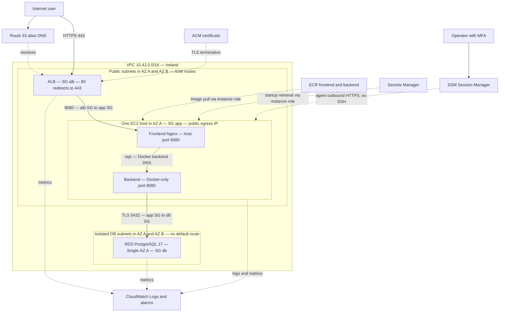

# TaskFlow AWS reference architecture — MS8.1

> **Scope: reference AWS architecture / hypothetical production target.**
> This document describes the production AWS architecture represented by
> TaskFlow's completed reference IaC. The project does not provision this infrastructure.
> All cloud resources, prices, domains and operational workflows are reference
> designs, deployment-ready in principle, never a planned live environment.

## Hard project execution policy

AWS work demonstrates portfolio architecture, Terraform, CloudFormation,
deployment/runbook design and production-readiness reasoning only. This constraint
applies to every later milestone: no AWS hosting, mutation or billable resources.
TaskFlow will never execute `terraform apply`, `terraform destroy` against real
AWS, CloudFormation stack create/update/delete, `aws cloudformation deploy`, or
AWS-backed change sets as part of this project. It will never create EC2,
RDS, ECS/Fargate, ALB, NAT Gateway, ECR repositories, Route 53 hosted zones/records,
ACM certificate requests, Secrets Manager, SSM, CloudWatch or IAM resources,
nor push images to ECR. This also excludes state and billing infrastructure.

MacroStep 8 and all subsequent work must be completable without AWS credentials,
access keys, authenticated provider API calls, real account IDs, hosted zone IDs,
or domains. Examples and inputs use placeholders; secret population is never a
validation prerequisite. Operational instructions below describe what a real
operator **would** do outside this project's execution scope.

Decision date and public-source check: **2026-09-18**. Status: architecture
selected; nothing provisioned. [ADR 002](ADR/002-aws-deployment-architecture.md)
records the lasting rationale. This document records sizing assumptions, current
evidence and the IaC and deployment-design handoff, not a deployed system.

## Selected architecture

Use **eu-west-1 (Ireland)**, an Internet-facing ALB with ACM TLS, one EC2 Linux
application host running frontend/backend with Docker Compose, and **RDS
PostgreSQL 17 Single-AZ** in isolated database subnets. Use ECR, Secrets Manager,
SSM Session Manager and CloudWatch. No NAT Gateway, bastion, Kubernetes or
CloudFront initially. This models a small public application for portfolio analysis, not an HA service.

Initial sizing intent: x86_64 `t3.medium` (2 vCPU/4 GiB), encrypted 30 GiB gp3
root disk, and `db.t4g.micro` RDS with encrypted 20 GiB gp3. These are starting
assumptions, not measured capacity guarantees. A real operator would verify instance/engine orderability
and memory/CPU-credit headroom; MS9 documents those checks without executing them.
RDS ARM hardware does not require ARM application images. Build release images
for the EC2 architecture; do not assume a developer-machine image matches it.

DNS resolves names; it is not an HTTP proxy. The request path is
`HTTPS user → ALB → HTTP Nginx → /api backend → TLS RDS`. Static Angular assets
and API share `https://taskflow.example.com` (placeholder only). The backend
port is never an ALB target or host-published application port.

## Region and service evidence

| Criterion | Milan `eu-south-1` | Ireland `eu-west-1` |
| --- | --- | --- |
| AZs / activation | 3; account opt-in required | 3; enabled by default |
| Required service coverage | Required regional endpoints present | Required regional endpoints present |
| Italy latency | Geographically closer; likely lower RTT, unmeasured | Longer path; reference assumption; MS9 documents a measurement plan |
| Maturity / tooling | Supports this ordinary architecture; no identified blocker | Supports this ordinary architecture; no opt-in bootstrap dependency |
| Regional price comparison | Exact matching regional quote unresolved | Exact matching regional quote unresolved |
| Portfolio relevance | Italian locality is useful if residency/latency becomes a requirement | Same core AWS skills, simpler account setup for reproducibility |

Choose Ireland because the required services are supported without region
activation and there is no Italy-residency or measured latency requirement.
Do not claim Ireland is cheaper or that Milan lacks services: the dynamic price
tables did not provide a reliable like-for-like regional export in this review.
Modest price changes do not change this decision; a real operator could compare regional estimates
if cost became decisive. No estimate approval or apply is a project milestone. Use one future `aws_region` input with
default `eu-west-1`, not literals throughout resources. AZs are selected within
that region; letter names are account-relative.

The following official endpoint/feature pages were checked on **2026-09-18**.
Both regions are listed unless the service is global. This establishes service
coverage, not account quotas, instance capacity or every optional feature.

| Service / capability | Evidence and scope |
| --- | --- |
| Regions, AZ count, opt-in | [AWS region table](https://docs.aws.amazon.com/global-infrastructure/latest/regions/aws-regions.html) |
| EC2 | [EC2 endpoints](https://docs.aws.amazon.com/general/latest/gr/ec2-service.html): both regions |
| ALB | [ELB endpoints](https://docs.aws.amazon.com/general/latest/gr/elb.html): both with ALB support |
| RDS PostgreSQL | [RDS endpoints](https://docs.aws.amazon.com/general/latest/gr/rds-service.html), [PostgreSQL 17 release](https://aws.amazon.com/about-aws/whats-new/2024/11/amazon-rds-postgresql-supports-version-17/); select available supported 17.x minor in MS8.6, not the local image patch by assumption |
| ECR | [ECR endpoints](https://docs.aws.amazon.com/general/latest/gr/ecr.html): both |
| ACM | [ACM endpoints](https://docs.aws.amazon.com/general/latest/gr/acm.html): both |
| Route 53 | Global authoritative DNS; [ALB alias routing](https://docs.aws.amazon.com/Route53/latest/DeveloperGuide/routing-to-elb-load-balancer.html) applies to the regional ALB |
| CloudWatch / Logs | [Metrics endpoints](https://docs.aws.amazon.com/general/latest/gr/cw_region.html), [Logs endpoints](https://docs.aws.amazon.com/general/latest/gr/cwl_region.html): both |
| SSM / Parameter Store | [Systems Manager endpoints](https://docs.aws.amazon.com/general/latest/gr/ssm.html): both; SSM Agent also needs messaging endpoints |
| Secrets Manager | [Secrets endpoints](https://docs.aws.amazon.com/general/latest/gr/asm.html): both |
| CloudFormation / alternative ECS | [CloudFormation](https://docs.aws.amazon.com/general/latest/gr/cfn.html), [ECS](https://docs.aws.amazon.com/general/latest/gr/ecs-service.html): both |

Terraform uses regional AWS APIs; exact provider versions/resource schemas belong
to MS8.2. CloudFormation resource validation belongs to MS8.8–8.9. No account
credentials or private account information were used to establish availability.

## Coherent alternatives

Monthly ranges below are **planning allowances**, not saved Calculator quotes;
the assumptions and pricing limitations are detailed below. All are low-traffic,
one-instance/task designs with no HA promise.

| Option | Always-on USD/month | Security / operations | Fit, learning and scaling | Terraform / CloudFormation burden |
| --- | --- | --- | --- | --- |
| **A: ALB + EC2 Compose + RDS (selected)** | **90–130**; host, RDS, ALB and IPv4 dominate | Managed DB backups/patching; operator patches OS/Docker; instance role and strict SGs | Most direct image/Docker-DNS reuse; demonstrates networking, IAM, TLS and managed DB; later multiple hosts or ECS | Moderate in both; straightforward resource parity, separate runtime bootstrap |
| B: ALB + ECS Fargate + RDS | 95–150; assume one x86 task 1 vCPU/4 GiB, public task IP, no NAT | No host patching; task execution/task roles, service health/deployment configuration | Strong container-platform learning and scaling; Compose is replaced by task/service definitions | Higher in both: cluster, task, roles, service and ALB integration |
| C: EC2 Compose including PostgreSQL, direct TLS proxy | 40–70; host, disk, IPv4, backup/log allowance | Operator owns DB backups, restore drills, updates and TLS renewal; shared host failure | Maximum reuse/lowest bill; weaker managed-database learning and failure isolation | Lowest resource count, highest operational runbook burden |
| D: ALB + ECS on EC2 + RDS | 90–140; similar host infrastructure to A | Host patching plus ECS agent/capacity management; instance and task roles | Scheduling benefits without eliminating host work; worthwhile with more services | Highest complexity for one host: capacity provider/ASG plus ECS resources |

Fargate is credible, but for the current single host it adds deployment/IAM work
without a necessary scaling benefit. Its containers in one `awsvpc` task share
networking: both current images listen on 8080, so co-location needs a port change
and localhost upstream instead of Docker DNS. Separate tasks avoid the port
collision but need service discovery and more task overhead. Private tasks also
need NAT or suitable endpoints. [AWS task networking](https://docs.aws.amazon.com/AmazonECS/latest/developerguide/fargate-task-networking.html)
and [migration constraints](https://aws.amazon.com/blogs/compute/migrating-your-amazon-ecs-containers-to-aws-fargate/)
support this assessment. These changes are not required by selected option A.

Direct EC2 TLS removes ALB fixed cost but transfers certificate/proxy lifecycle
and public ingress responsibility to the host. Choose ALB for managed ACM
attachment, health checks, SG-based target ingress and an upgrade path. CloudFront
adds no necessary caching/global-delivery capability for this initial workload.
EKS is disproportionate; Lightsail and managed application abstractions offer less
of the explicit VPC/IAM/RDS/IaC learning targeted here.

Container PostgreSQL can persist on EBS, but volume persistence alone provides
neither backups nor independent recovery. RDS separates host/database failures,
offers automated backups and managed maintenance at a real recurring cost.
Choose Single-AZ, seven-day automated backup retention/PITR, encryption at rest,
deletion protection and a final snapshot for retained environments. MS9 documents a hypothetical restore procedure without creating or restoring RDS. Multi-AZ DB instance deployment is the upgrade when recovery objectives
justify standby cost; it is not needed just because the network spans two AZs.
See [RDS availability model](https://docs.aws.amazon.com/AmazonRDS/latest/UserGuide/Welcome.html).

## Exact network and security contract

VPC `10.42.0.0/16`, IPv4 initially, DNS support/hostnames enabled:

| Subnet | CIDR | Placement / routing |
| --- | --- | --- |
| public-a | `10.42.0.0/24` | AZ A; ALB node and application EC2; local routes + `0.0.0.0/0 → IGW` |
| public-b | `10.42.1.0/24` | AZ B; ALB node; same public route table |
| database-a | `10.42.10.0/24` | AZ A; RDS primary initially; local route only |
| database-b | `10.42.11.0/24` | AZ B; DB subnet group / future standby; local route only |

Two ALB subnets satisfy its [AZ/subnet requirements](https://docs.aws.amazon.com/elasticloadbalancing/latest/application/application-load-balancers.html).
The [DB subnet group](https://docs.aws.amazon.com/AmazonRDS/latest/UserGuide/USER_VPC.WorkingWithRDSInstanceinaVPC.html)
spans both isolated subnets even for Single-AZ. No NAT, static private IP, bastion
or VPC endpoints initially. Use ordinary stateful SGs and default NACLs; do not
invent NACL rules that break ephemeral return traffic. Check CIDR overlap before
future VPN/peering. No other VPC connectivity is assumed.

| Boundary | Allowed ingress / egress intent |
| --- | --- |
| ALB SG | Internet TCP 80/443 only; 80 redirects to HTTPS; egress 8080 to app SG |
| App SG | TCP 8080 **only from ALB SG**; no 22, no direct backend port; egress 5432 to DB SG and HTTPS 443 for AWS APIs/image pulls/updates |
| DB SG | TCP 5432 **only from app SG**; no Internet ingress; no application-initiated outbound need |
| Docker | Host 8080 maps only frontend; backend 8080 remains bridge-only. No DB container in cloud runtime |

EC2 has an auto-assigned public IPv4 for outbound access, not a public application
endpoint. ALB targets its private address. SG enforcement is essential: the public
IP is not equivalent to a private subnet, and HTTPS egress still permits data
exfiltration if the host is compromised. Use IMDSv2, encrypted EBS, patched OS,
no Docker socket in containers, and prevent application containers reaching host
metadata; the host alone retrieves AWS credentials/secrets. Preserve non-root,
read-only application containers with writable tmpfs. Host-root compromise remains
inside the trusted administration boundary.

Private compute with NAT improves address isolation but adds a fixed hourly and
per-GB charge. Endpoints avoid NAT for AWS APIs, but ECR API/DKR, SSM messaging,
Secrets and Logs need several interface endpoints (and S3 access for image layers);
they do not solve arbitrary OS update egress. Their per-AZ costs/maintenance are
not justified here. Revisit when egress policy or additional workloads require it.

## Entry, DNS and production runtime handoff

ALB HTTPS listener uses a regional **non-exportable ACM public certificate**;
HTTP redirects to HTTPS. DNS-validated certificates renew while in use and their
validation records remain. See [ACM DNS validation](https://docs.aws.amazon.com/acm/latest/userguide/dns-validation.html)
and [renewal](https://docs.aws.amazon.com/acm/latest/userguide/renew-publicly-trusted.html).
The audited listener policy remains `ELBSecurityPolicy-TLS13-1-2-Res-PQ-2025-09`. ALB→frontend HTTP within the restricted VPC is an accepted
initial trust boundary; end-to-end TLS is a future compliance upgrade.

The final Terraform/CloudFormation implementations accept a required external
regional ACM certificate ARN and public hostname. They define no ACM or Route 53
resources. MS9.5 defines their external consistency checks in [edge security](EDGE_SECURITY.md).
HTTPS defaults to 404; only the configured host forwards after operational-path
blocks. Both implementations explicitly select XFF append mode.
`taskflow.example.com` remains the placeholder. No real domain will be purchased;
no real hosted zone, certificate request or DNS validation is required. Locally
verifiable examples must not resolve real zone IDs or require account access.

MS9 designs runtime artifacts and runbooks for the following hypothetical
production path, with static/local checks only. These are reference requirements
if provisioned, not instructions to execute against AWS:

1. Pull digest-pinned release images from ECR; run only frontend/backend on EC2,
   preserving service alias `backend` and Docker DNS `127.0.0.11`.
2. Replace local loopback host binding with ALB-reachable host/private-interface
   port 8080, guarded by app SG. Do not reuse local DB service/dependencies or
   `TASKFLOW_COOKIE_SECURE=false`; production sets it to **true**.
3. MS9.5 normalizes HTTPS/443 only from approved ALB peers and derives one client
   IP through RealIP; Spring production NATIVE forwarding consumes sanitized headers.
4. Exact internal Nginx health proxies backend health for ALB target checks, with
   public listener blocking and direct-peer restrictions. Health is availability,
   not authorization: ALB can fail open when all targets are unhealthy.
5. Use the RDS DNS endpoint and TLS `sslmode=verify-full` with the AWS CA bundle
   available read-only to JDBC. Never disable certificate verification. See
   [RDS PostgreSQL TLS](https://docs.aws.amazon.com/us_en/AmazonRDS/latest/UserGuide/PostgreSQL.Concepts.General.SSL.html).
6. MS9.5 supplies per-client login/register limits (30/minute, burst 20, 429), HSTS
   for trusted HTTPS and operational/documentation-path blocks. This is modest
   abuse protection, not account lockout/DDoS protection. Strict Angular CSP needs
   future nonce/hash integration; no WAF or permissive placeholder CSP is added.
7. Document a static production smoke-test plan for HTTPS login/refresh/logout/
   XSRF, Secure cookies, migrations, backup restore and logging. No live cloud
   smoke test or public production URL is a project acceptance criterion.

## Registry, secrets and administration

Two private ECR repositories: `taskflow-<environment>-frontend` and
`taskflow-<environment>-backend`. Immutable release tags, deployment by digest,
scan/review findings before promotion, retain the active and rollback releases.
Expire untagged artifacts after seven days; any release-retention policy must
protect deployed/rollback digests. No repositories or image pushes will occur in this project.

MS8.9 replaces deprecated repository scan settings with BASIC registry scanning.
Regional registry ownership is explicitly opt-in and default-off in both IaC
forms; otherwise the registry owner must provide scan-on-push for the reserved
`<project>-<environment>-*` prefix. Matching is narrow, but configuration ownership
is registry-wide and unmatched repositories become manual-scan. Shared registries
retain their existing owner rather than granting an application stack control.
See the [final scanning ownership decision](../infra/terraform/README.md#runtime-iam-and-ecr).

**Choose Secrets Manager** for DB/JWT values. Standard Parameter Store SecureString
is a valid cheaper option with familiar IAM/KMS APIs, but application/database
rotation coordination would still be ours. Secrets Manager gives a coherent DB
secret/rotation lifecycle for a small additional storage charge. Automatic rotation
is not enabled blindly: production reads mounted configtree files at startup and
uses one JWT key. Coordinate DB password change and backend recreation; JWT rotation
invalidates outstanding access tokens until a future key-ring design exists.

MS9.4 resolves the initial shared-role DDL trade-off: the RDS-managed administrator
is bootstrap-only, `taskflow_migrator` owns migrations, and `taskflow_app` has
runtime DML only. The existing app/JWT secret resources remain; migration
credentials are operator-controlled and unavailable to the long-running backend.
[Database operations](RDS_DATABASE_OPERATIONS.md) defines verify-full/regional CA
trust, pre-start migrations and Hibernate validation. No IAM or DB resource changes
are required. MS9.3's file-backed secret/configtree contract supersedes the initial
environment-file design.

The deployment-time host materializer retrieves only app DB/JWT secrets using
the instance role and atomically publishes protected files under `/run` (tmpfs).
Backend alone mounts them through Compose secrets/configtree; user data never
retrieves values. Secrets remain observable to host root/Docker
administrators; they are not written to Git, user data, images, logs or durable
disk. IaC defines secret metadata/resources and access references, not plaintext secret values
or outputs. Avoid generating/reading app secret values into Terraform state;
RDS-managed master credentials and secure secret population are reference runtime
concerns. No real AWS secret is created or populated; validation requires no
secret values, and IaC must contain no real or sample working credentials.

Instance profile grants repository-scoped ECR pull, the required ECR authorization
token call, exact app secret ARNs, log-stream writes to designated groups, metrics
publication and SSM agent permissions. No ECR push, database administrator-secret
read or broad infrastructure mutation. KMS decrypt only for keys actually used.
Provisioner/deployer roles are separate; operator sessions require MFA/federated
identity and scoped permissions. SSM Agent initiates outbound HTTPS; no SSH keys
or inbound management ports. [Session Manager](https://docs.aws.amazon.com/systems-manager/latest/userguide/session-manager.html)
and [endpoint requirements](https://docs.aws.amazon.com/systems-manager/latest/userguide/setup-create-vpc.html)
describe that model. Host patching/replacement remains the operator's responsibility.

## Logs, monitoring and availability

MS9.6 defines non-blocking Docker awslogs for backend/Nginx stdout/stderr and a
host-only CloudWatch Agent config for selected journals/cloud-init plus memory/root
disk metrics. Four IaC-owned log groups retain 14 days; RDS export remains native.
The existing six native alarms are preserved, with two guest warnings at >=85%
over three 5-minute periods. An optional external SNS ARN enables ALARM/OK actions;
empty input leaves alarms silent. No SNS resource or telemetry is created/sent.

See [observability](OBSERVABILITY.md) for exact dimensions, IAM, local log-cache and
log-loss limits, sensitive-log review, costs and triage. Nginx does not see listener
rejections: ALB access logs need a separate S3 ownership/cost decision. No tracing,
dashboard or enhanced database telemetry is added. MS9.7 owns activation and response;
real threshold calibration remains an independent operator task.

| Accepted trade-off | Reason and risk | Upgrade trigger / path |
| --- | --- | --- |
| One EC2, no autoscaling | Simple operation; host/AZ failure or deployment interrupts service | Reliability/traffic need → multiple hosts/ASG or ECS service |
| Single-AZ RDS | Lower steady cost; maintenance/failure causes outage and restore takes time | Recovery objective → Multi-AZ DB instance and restore drills |
| Two-AZ network is not HA | ALB spans AZs but application and DB do not | Add actual redundant compute/DB, not just subnets |
| Public egress IP, no NAT | Avoid fixed egress appliance bill; SG/host security must remain correct | Restrictive egress/compliance → private compute + costed NAT/endpoints |
| ALB fixed cost | Managed TLS/entry and learning justify it at low traffic | If budget is unacceptable, revisit ADR rather than hide the cost |
| HTTP ALB-to-host, shared host/DB role | Small trusted boundary; compromise can reach app data/schema | TLS targets, separate runtime/migration roles |
| Short logs/manual operations | Costs bounded; limited forensics/history and operator dependency | Incident/support needs → longer retention, tested automation |

Backups do not make the service HA. No zero-downtime, automatic failover for the
whole application, or numeric recovery SLA is claimed.

## Estimated cost if this reference architecture were provisioned

**Reference deployment cost: approximately $90–130/month if provisioned.**
**Actual planned TaskFlow AWS project cost: $0 infrastructure spend**, because
no resources will be provisioned. The following dated analysis is illustrative
(USD, checked 2026-09-18), not a future spending commitment.

Assume 730 hours/month, on-demand Linux, one host, one small RDS, two ALB AZs,
three public IPv4 addresses initially (one host, at least two ALB), low traffic,
about 1 GB logs/month, a few GB images and no free-tier credits/commitment discounts.
Taxes, domain registration, support plans and exceptional traffic are excluded.
ALB address count may grow. These ranges are engineering allowances; **regional
EC2/RDS/ALB/Fargate SKU quotes would need verification by a real operator**. Dynamic regional
tables were not reliably extractable; US examples below are not Ireland prices.

| Selected design component | Approximate monthly allowance | Evidence / uncertainty |
| --- | --- | --- |
| EC2 t3.medium, fixed hours | $30–45 | [EC2 on-demand pricing](https://aws.amazon.com/ec2/pricing/on-demand/); Ireland quote and CPU-credit charges to verify |
| RDS db.t4g.micro, fixed hours | $15–25 | [RDS PostgreSQL pricing](https://aws.amazon.com/rds/postgresql/pricing/); Single-AZ regional quote/credits to verify |
| ALB hours | $18–25 | [ALB pricing](https://aws.amazon.com/elasticloadbalancing/pricing/); hourly + LCU dimensions; published US example $0.0225/hour is not a regional quote |
| ALB LCU usage | $0–7 | Low traffic allowance, not zero-cost guarantee; same ALB source |
| Public IPv4 | $10.95 baseline | [VPC pricing](https://aws.amazon.com/vpc/pricing/): verified $0.005/address-hour × 3 × 730 |
| EBS 30 GiB + RDS gp3 20 GiB | $5–8 | [EBS pricing](https://aws.amazon.com/ebs/pricing/) and RDS source; regional storage rates to verify |
| Secrets Manager, 3 secrets | about $1.20 + API usage | [Secrets pricing](https://aws.amazon.com/secrets-manager/pricing/): $0.40/secret-month, $0.05/10,000 calls published |
| DNS | $0.50 hosted zone + applicable queries | [Route 53 pricing](https://aws.amazon.com/route53/pricing/); existing shared zone may have no incremental zone cost; ALB alias queries exempt |
| ACM certificate on ALB | $0 certificate charge | [ACM pricing](https://aws.amazon.com/certificate-manager/pricing/): non-exportable public certificate, not exportable/private CA products |
| ECR, logs, metrics/alarms, transfer/backups | $3–10 allowance | [ECR](https://aws.amazon.com/ecr/pricing/), [CloudWatch](https://aws.amazon.com/cloudwatch/pricing/), EC2/RDS pricing; volume/retention driven, excess traffic extra |

Round the selected total to **$90–130/month**, not a price guarantee or spending
cap. Host/DB/ALB fixed costs dominate a quiet demo. Standard Parameter Store has
no storage charge at standard throughput ([SSM pricing](https://aws.amazon.com/systems-manager/pricing/));
its small savings do not outweigh the selected secret lifecycle consistency.

Fargate alternative assumes 1 vCPU/4 GiB continuously plus the same ALB/RDS and
support services: plan $95–150/month. [Fargate pricing](https://aws.amazon.com/fargate/pricing/)
uses CPU/memory duration; its published US example implies about $43/month for
that task size before regional differences. Two separate tasks may cost more.
ECS/EC2 retains host costs and adds management complexity rather than a second
Fargate task bill. Direct-host/container-DB option removes RDS/ALB and two ALB IPs
but needs its own backup storage/restore/TLS operation; allow $40–70/month.

One NAT Gateway could add roughly **$35–50/month plus processing/IPv4**, before
regional confirmation. AWS's Ohio example is $0.045/hour + $0.045/GB; this is
an illustration, not an Ireland rate. Two-AZ NAT doubles much of the fixed bill.
Interface endpoint charges multiply by service and AZ; obtain an explicit quote
before choosing them. Neither is in the selected baseline.

As an **illustrative hypothetical 40-hour demo only**, deleting compute/ALB/RDS afterward
reduces hourly components to roughly 40/730: budget **$8–20 per demo month**,
including modest retained snapshots/images/logs/secrets/DNS. This is not the cost
of merely stopping EC2: ALB, disks, snapshots, IPs and other retained resources
can continue billing. Retained data needs snapshots and later restore; deleting
RDS without a snapshot deliberately loses demo data. DNS zone fees are not
generally prorated. Domain registration and large retained datasets remain extra.

Reference-production recommendations, not TaskFlow execution or acceptance criteria: Project/Environment cost tags, a proposed
$130 monthly budget with 50/80/100% actual and forecast alerts, review before
exceeding the estimate, no NAT or Multi-AZ upgrades by default, small initial
sizes, 14-day logs, ECR cleanup and bounded storage growth. Budgets alert rather
than guarantee a spending stop ([AWS Budgets](https://aws.amazon.com/aws-cost-management/aws-budgets/pricing/)).
A real operator would review a fresh regional Calculator estimate. TaskFlow has
no estimate-approval gate and no apply. AWS Budget resources are not planned
implementation; any future budget example could only be static reference IaC.

## IaC ownership and completed verification

Names follow `taskflow-<environment>-<resource>`, with an `environment` input
(reference environment `prod`; no actual dev/prod stacks).
Tags: variable-derived `Project=taskflow` by default, `Environment`,
`ManagedBy=Terraform` or `CloudFormation`, and resource-specific `Component`.
No personal/account details.

Terraform is primary in MS8.2–8.7. CloudFormation in MS8.8 expresses the same core:
VPC/subnets/routes/IGW, three SG boundaries, EC2/EBS/instance role, ALB/listeners/
target group, RDS/subnet group/protection, ECR, secret metadata/permissions,
CloudWatch groups/alarms and an external certificate input. No ACM/DNS resources
or notification subscriptions are implemented. MS8.4 owns network security;
MS8.5 compute/IAM/ALB/ECR/observability; MS8.6 DB/secret metadata and scoped reads;
MS8.7 non-secret outputs; MS8.8 parity;
MS8.9 static/local validation and review. MS9 designs runtime artifacts, conceptual
ECR workflows, bootstrap, secret retrieval and HTTPS/observability runbooks only.

Terraform and CloudFormation are genuine, un-applied resource definitions, not
pseudocode. Terraform includes providers, variables, locals, resources and outputs.
They model equivalent alternatives; a real operator would choose one resource
owner rather than let both tools manage the same resources. Placeholder inputs
must support local validation without real account, domain or secret information.

Allowed Terraform verification: `terraform fmt`, `terraform fmt -check`,
`terraform init -backend=false` only without credentials or API mutation,
`terraform validate`, static inspection, dependency/reference review and provider
schema validation where possible without AWS credentials. Provider downloads may
require network access, but authenticated AWS calls are not acceptance criteria.
Do not run `terraform plan`, apply or destroy. MS8.9 explicitly supersedes the
original live-plan/stack-diff expectation with comprehensive local/static checks.
MS8.8 implements a genuine CloudFormation equivalent, checked with local/static
tooling; no stack, AWS-backed change set or deployment is created for validation.

MS8.2 may design state conventions, but no real remote-state bucket or state
infrastructure will be provisioned, and no S3 backend dependency may be required
for repository validation. Local/static validation does not require applied state.
`.tfstate` remains ignored and sensitive. For an independently operated production
deployment, private encrypted/versioned S3 state with least-privilege access would
be recommended. S3 `use_lockfile` and deprecated DynamoDB locking are documented
in the [HashiCorp S3 backend reference](https://developer.hashicorp.com/terraform/language/backend/s3).
That production recommendation is not TaskFlow infrastructure to create. Avoid
plaintext credentials in any state or generated artifacts, even sensitive outputs.

Completion means an implemented, semantically aligned reference design passing
local/static checks, with explicit pricing/orderability uncertainty. It does not
mean a live AWS environment, tested cloud latency/capacity or runtime security
acceptance. Final evidence is recorded in [ARCHITECTURE.md](ARCHITECTURE.md).
MS9 Deployment Design & Production Readiness remains unstarted and non-provisioning.
