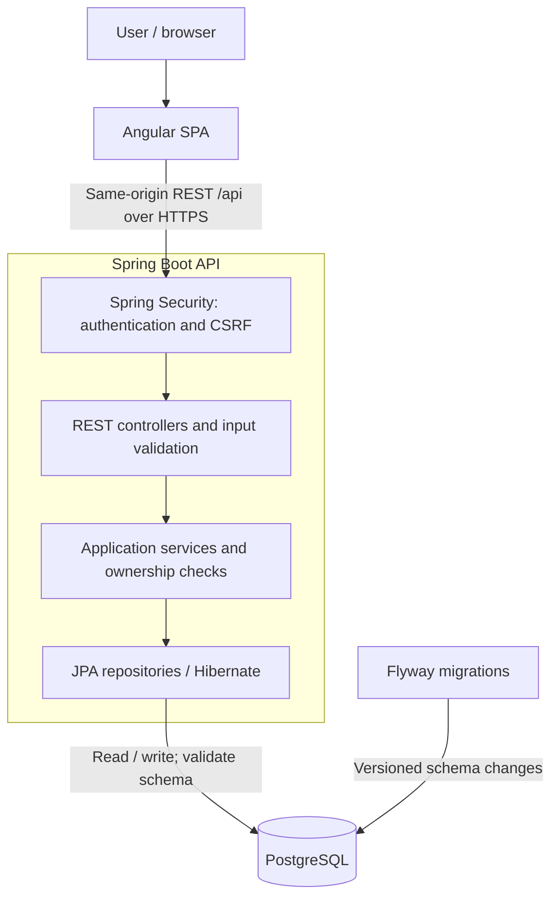
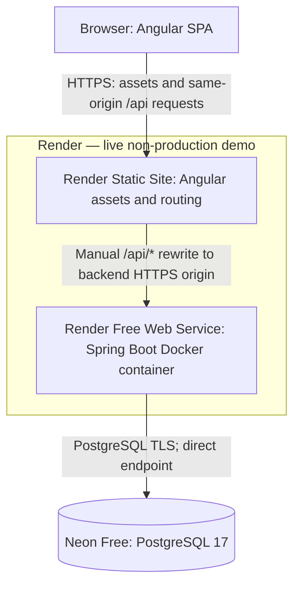
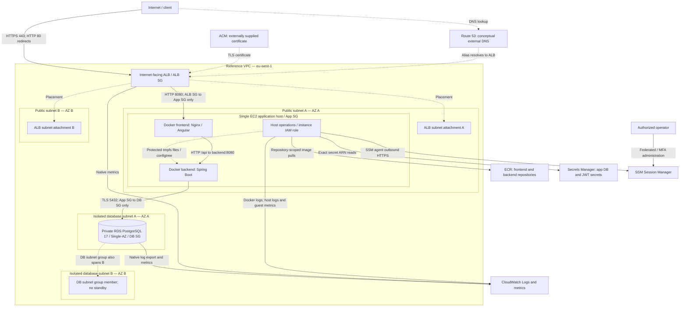
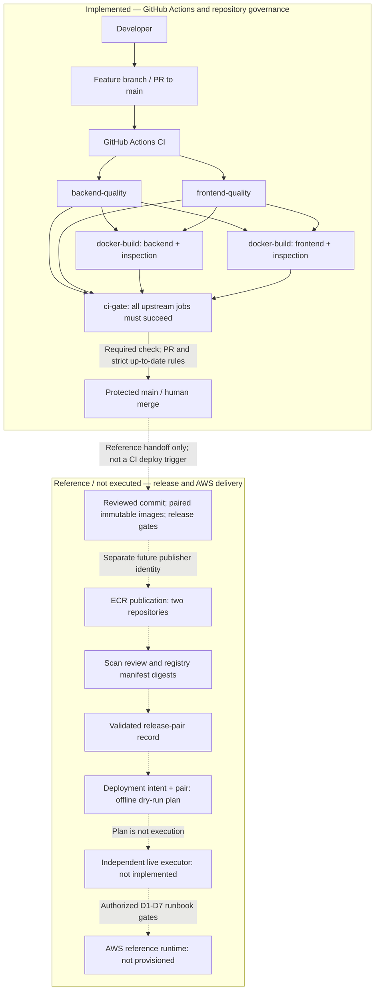

# TaskFlow architecture diagrams

These source-controlled Mermaid diagrams summarize the application, live demo,
AWS reference infrastructure, and delivery model. The linked specifications remain
authoritative; these views do not replace their security or operational contracts.
Solid arrows show the labelled flow or dependency. Dotted arrows show associations
or explicitly labelled reference handoffs, not additional network ingress.

## 1. Logical application architecture

This view is provider-independent. HTTPS describes the deployed browser boundary;
local Compose uses loopback HTTP. Hosting proxies and TLS termination are omitted
here and shown in the deployment views below.

Authentication uses bearer access tokens and rotating HttpOnly refresh cookies;
service-level ownership checks protect private resources. Flyway runs at startup
for local/demo profiles. The AWS reference instead requires a separate pre-start
migration as `taskflow_migrator`; its long-running backend uses `taskflow_app`,
Flyway disabled, and Hibernate validation only.

Sources: [application architecture](ARCHITECTURE.md),
[production runtime](PRODUCTION_RUNTIME.md), [database operations](RDS_DATABASE_OPERATIONS.md).

## 2. Live portfolio demo — non-production

[Try the live frontend](https://taskflow-demo-frontend-bod0.onrender.com).
Core browser flows were validated on 2026-09-27; this is the Render/Neon portfolio
demo, not the AWS reference environment.

The API rewrite precedes the `/*` → `/index.html` SPA fallback. The browser keeps
the frontend origin; there is no hardcoded backend URL in Angular. The backend
uses the existing `backend/Dockerfile`, the `demo` profile, and Render's `PORT`.
The backend and Neon PostgreSQL 17.11 are in Frankfurt. Database TLS uses
`sslmode=require` with `channelBinding=require`; this is distinct from AWS RDS
`verify-full` and its CA contract.

Credentials are provider-managed and supplied through backend environment values;
none belong in diagrams, frontend assets, or Git. Free-tier sleep, cold starts,
quotas, and provider availability remain limitations. No keep-alive workaround or
availability guarantee is provided. Auto-deploy is off; the temporary feature
branch must return to `main` after MacroStep 10 merges.

Sources: [live evidence and manual routing](PORTFOLIO_DEMO.md),
[Render Blueprint](../render.yaml), [backend Dockerfile](../backend/Dockerfile).

## 3. AWS reference architecture — intentionally not provisioned

**This is a deployable reference architecture expressed in Terraform and CloudFormation. It is intentionally not provisioned by this project.**

The reference region is Ireland (`eu-west-1`). The €0 project policy forbids AWS
provisioning or publication; the live portfolio demo above is independent.
Dotted ALB links below describe subnet placement of one ALB, not extra load balancers.

- Public application ingress terminates at the ALB. Its target is the EC2 private
  address on port 8080, published only by frontend Nginx. The backend has no
  host-published port. App SG accepts 8080 only from ALB SG; DB SG accepts 5432
  only from App SG. ALB-to-Nginx HTTP is an explicit restricted-VPC trust boundary.
- Both public subnets route through an Internet Gateway. EC2 has a public IPv4
  for outbound HTTPS to AWS APIs and image/update dependencies, not direct public
  application ingress. Database subnets have local routes only. There is no NAT
  Gateway, SSH ingress, bastion, or inbound management port; SSM is the management path.
- The host instance role permits scoped ECR pulls, exact app secret reads, SSM,
  and telemetry. Host materialization supplies protected ephemeral files to the
  backend; containers receive neither AWS credentials nor access to instance
  metadata. Frontend receives no secrets. Runtime IAM cannot push images or read
  administrator/migrator secrets; migration credentials have a separate boundary.
- Database TLS requires `verify-full` and the AWS CA bundle. Production uses
  pre-start migrations and runtime DML credentials. Two-AZ subnet coverage does
  not make the single EC2 host or Single-AZ RDS highly available.
- CloudWatch paths represent designed Docker/host logs, guest metrics, native
  ALB/RDS metrics, and RDS log export. ALB access logging is not configured.
  No telemetry or cloud resource has been created by this milestone.

Sources: [AWS network and security contract](AWS_ARCHITECTURE.md),
[production runtime](PRODUCTION_RUNTIME.md), [host secret delivery](EC2_BOOTSTRAP_SECRETS.md),
[observability](OBSERVABILITY.md), [Terraform](../infra/terraform/),
[CloudFormation](../infra/cloudformation/).

## 4. CI/CD and reference delivery model

CI is implemented and executable. The second boundary describes release and
runtime design only: its offline validators/planner are implemented, but registry
publication and live deployment are not executed.

Both quality jobs must pass before either Docker matrix build starts. `ci-gate`
directly depends on both quality jobs and the entire Docker matrix, and fails
closed for unsuccessful results. A green gate permits a policy-compliant PR merge;
it does not merge automatically. CI also runs on `main`/`feature/**` pushes and
manual dispatch, beyond the PR path shown.

Current CI uses `contents: read`, needs no AWS authentication, builds/loads images
locally, and never logs in to ECR, publishes images, or deploys AWS. CI image IDs
are not registry manifest digests or evidence of an eligible release.

The reference path preserves a frontend/backend pair from one reviewed commit,
immutable tags, scan-review evidence, and digest-qualified runtime identities.
The offline release validator and deployment planner make no cloud calls. A plan
leaves D1–D7 unexecuted; its live executor and constrained migration-credential
path remain unresolved. Publisher, deployment/operator, runtime host, and
infrastructure provisioner identities remain separate. The live Render demo is
manually deployed and is not an output of this AWS reference path.

Sources: [CI workflow](../.github/workflows/ci.yml), [CI/CD](CI_CD.md),
[repository governance](REPOSITORY_GOVERNANCE.md), [registry delivery](REGISTRY_DELIVERY.md),
[offline deployment contract](DEPLOYMENT_AUTOMATION.md), [identity boundaries](CI_CD_SECURITY.md).
